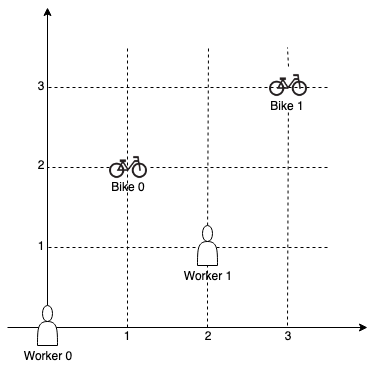
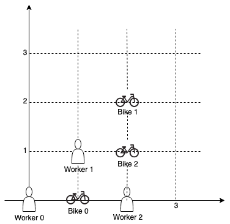

# 1066. Campus Bikes II

## Problem Description

On a campus represented as a 2D grid, there are **n workers** and **m bikes**, with `n <= m`.
Each worker and bike is a 2D coordinate on this grid.

We assign **one unique bike to each worker** so that the **sum of the Manhattan distances**
between each worker and their assigned bike is **minimized**.

Return the **minimum possible sum of Manhattan distances** between each worker and their assigned bike.

The Manhattan distance between two points `p1` and `p2` is:

```
Manhattan(p1, p2) = |p1.x - p2.x| + |p1.y - p2.y|
```

---

## Examples

### Example 1



**Input**

```
workers = [[0,0],[2,1]]
bikes = [[1,2],[3,3]]
```

**Output**

```
6
```

**Explanation**

Assign:

- Bike 0 → Worker 0
- Bike 1 → Worker 1

Distances:

- Worker 0 → Bike 0 = 3
- Worker 1 → Bike 1 = 3

Total distance = **6**.

---

### Example 2



**Input**

```
workers = [[0,0],[1,1],[2,0]]
bikes = [[1,0],[2,2],[2,1]]
```

**Output**

```
4
```

**Explanation**

One optimal assignment:

- Bike 0 → Worker 0
- Bike 1 → Worker 1
- Bike 2 → Worker 2

or

- Bike 0 → Worker 0
- Bike 1 → Worker 2
- Bike 2 → Worker 1

Both give a **minimum total Manhattan distance of 4**.

---

### Example 3

**Input**

```
workers = [[0,0],[1,0],[2,0],[3,0],[4,0]]
bikes = [[0,999],[1,999],[2,999],[3,999],[4,999]]
```

**Output**

```
4995
```

---

## Constraints

- `n == workers.length`
- `m == bikes.length`
- `1 <= n <= m <= 10`
- `workers[i].length == 2`
- `bikes[i].length == 2`
- `0 <= workers[i][0], workers[i][1] < 1000`
- `0 <= bikes[i][0], bikes[i][1] < 1000`
- All worker and bike locations are **unique**.
