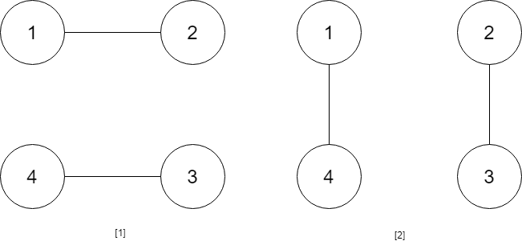
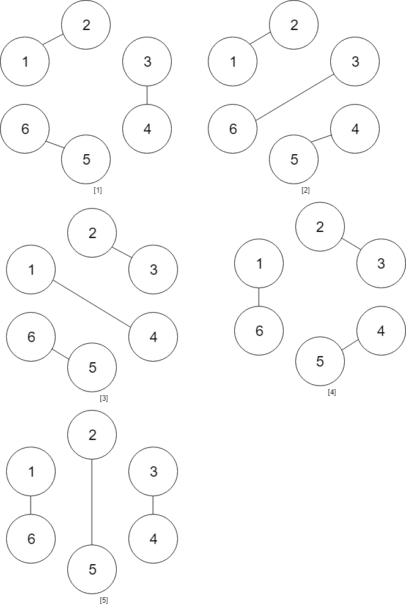

# 1259. Handshakes That Don't Cross

## Problem Description

You are given an **even number of people** `numPeople` standing around a **circle**.

Each person must shake hands with **exactly one other person**, forming:

```
numPeople / 2
```

handshakes in total.

Your task is to determine **how many ways these handshakes can occur such that no two handshakes cross**.

Since the answer may be very large, return it modulo:

```
10^9 + 7
```

---

# Examples

## Example 1



**Input**

```
numPeople = 4
```

**Output**

```
2
```

**Explanation**

There are two valid non‑crossing handshake arrangements:

```
(1,2) (3,4)
(2,3) (4,1)
```

Both arrangements avoid crossing handshakes.

---

## Example 2



**Input**

```
numPeople = 6
```

**Output**

```
5
```

---

# Constraints

```
2 <= numPeople <= 1000
numPeople is even
```

---

# Observations

- Every person must participate in exactly **one handshake**.
- Handshakes must form **non‑crossing pairs** when drawn as chords inside the circle.
- The number of valid arrangements corresponds to the **Catalan numbers**.

If:

```
numPeople = 2n
```

then the answer equals:

```
Catalan(n)
```

which can be computed using dynamic programming or combinatorics.
