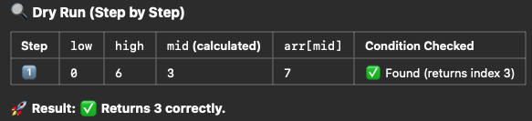
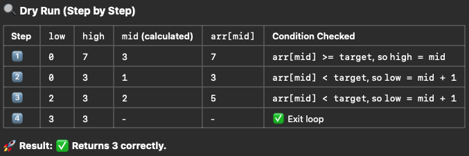

# Binary Search

Binary Search can be implemented in two common ways:

1. Using while (low <= high)
2. Using while (low < high)

Both approaches efficiently search for a target in a sorted array, but they differ slightly in termination conditions and handling of mid-points.

```txt
test case:
arr = [1, 3, 5, 7, 9, 11, 13]
target = 7
```

## Binary Search using while (low <= high)

```js
function binarySearch(arr, target) {
  let low = 0,
    high = arr.length - 1;

  while (low <= high) {
    let mid = Math.floor((low + high) / 2);

    if (arr[mid] === target) return mid;
    else if (arr[mid] < target) low = mid + 1;
    else high = mid - 1;
  }

  return -1; // Not found
}
```



🔹 Key Observations:

- The loop runs only once because arr[mid] === target immediately.
- Since low <= high includes the entire search space, mid is always checked.

- Ensures mid is always checked, including when low == high.
- Works well when searching for an exact match.
- Stops when low > high, meaning the search space is fully exhausted.

## Binary Search using while (low < high)

This version avoids checking when low == high, making it useful for searching bounds (lower/upper).

```js
function binarySearch(arr, target) {
  let low = 0,
    high = arr.length;

  while (low < high) {
    // Notice no "="
    let mid = Math.floor((low + high) / 2);

    if (arr[mid] < target) low = mid + 1;
    else high = mid;
  }

  return low < arr.length && arr[low] === target ? low : -1;
}
```



🔹 Key Observations:

- The loop terminates at low == high.
- mid is not checked after low == high, so a final verification (low < arr.length && arr[low] === target) is needed.
- More iterations (4 vs 1 in this case), but useful for range searches (e.g., lower bounds).

- Better suited for range searches, like lower bound (first occurrence) or upper bound (last occurrence).
- Stops when low == high, meaning mid is never rechecked after narrowing down to a single index.
- Prevents infinite loops in some floating-point applications (due to division precision).

## Lower Bound

The lower bound of a target x is the first index where arr[i] >= x.

- If x exists, it returns the first occurrence of x.
- If x doesn’t exist, it returns the index where x should be inserted.

```js
function lowerBound(arr, target) {
  let low = 0,
    high = arr.length;

  while (low < high) {
    let mid = Math.floor((low + high) / 2);
    if (arr[mid] < target) low = mid + 1; // Move right
    else high = mid; // Keep mid in search space
  }

  return low; // First occurrence or insertion position
}
```

## Upper Bound

The upper bound of x is the first index where arr[i] > x.

- If x exists, it returns the index of the first element greater than x.
- If x doesn’t exist, it returns the index where x should be inserted.

```js
function upperBound(arr, target) {
  let low = 0,
    high = arr.length;

  while (low < high) {
    let mid = Math.floor((low + high) / 2);
    if (arr[mid] <= target) low = mid + 1; // Move right
    else high = mid; // Keep mid in search space
  }

  return low; // First index where arr[i] > target
}
```
