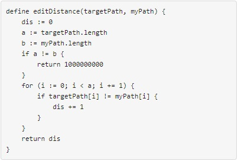
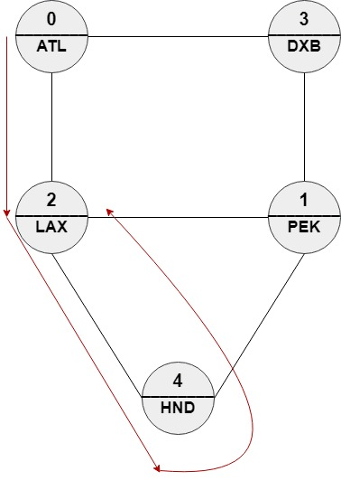
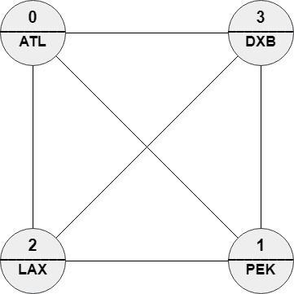
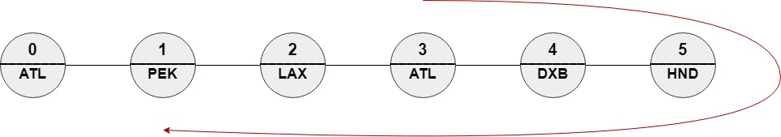

# 1548. The Most Similar Path in a Graph

## Problem Description

We have **n cities** and **m bi-directional roads** where:

```
roads[i] = [a_i, b_i]
```

connects city `a_i` with city `b_i`.

Each city has a **name consisting of exactly three uppercase English letters**, given in the array:

```
names[i]
```

The graph is **connected**, meaning starting from any city `x`, you can reach any other city `y`.

You are given a **target path**:

```
targetPath
```

You must find a **valid path in the graph** with:

- the **same length** as `targetPath`
- the **minimum edit distance** to `targetPath`

A path is valid if:

```
there exists a direct road between ans[i] and ans[i+1]
```

If multiple answers exist, **return any one of them**.

---

## Edit Distance Definition

For a path `ans`, the edit distance is:

```
number of indices i where names[ans[i]] != targetPath[i]
```

In other words, it counts how many positions in the path have **city names different from the target path names**.



---

# Examples

## Example 1



Input

```
n = 5
roads = [[0,2],[0,3],[1,2],[1,3],[1,4],[2,4]]
names = ["ATL","PEK","LAX","DXB","HND"]
targetPath = ["ATL","DXB","HND","LAX"]
```

Output

```
[0,2,4,2]
```

Explanation

Accepted answers include:

```
[0,2,4,2]
[0,3,0,2]
[0,3,1,2]
```

Example path:

```
[0,2,4,2]
→ ["ATL","LAX","HND","LAX"]
```

Edit distance:

```
1
```

---

## Example 2



Input

```
n = 4
roads = [[1,0],[2,0],[3,0],[2,1],[3,1],[3,2]]
names = ["ATL","PEK","LAX","DXB"]
targetPath = ["ABC","DEF","GHI","JKL","MNO","PQR","STU","VWX"]
```

Output

```
[0,1,0,1,0,1,0,1]
```

Explanation

Since none of the names match the target path values, **every position mismatches**, giving:

```
edit distance = 8
```

Any valid alternating path works.

---

## Example 3



Input

```
n = 6
roads = [[0,1],[1,2],[2,3],[3,4],[4,5]]
names = ["ATL","PEK","LAX","ATL","DXB","HND"]
targetPath = ["ATL","DXB","HND","DXB","ATL","LAX","PEK"]
```

Output

```
[3,4,5,4,3,2,1]
```

Explanation

This path corresponds to:

```
["ATL","DXB","HND","DXB","ATL","LAX","PEK"]
```

which **exactly matches** the target path.

```
edit distance = 0
```

---

# Constraints

```
2 ≤ n ≤ 100
m == roads.length
n - 1 ≤ m ≤ n * (n - 1) / 2
0 ≤ a_i, b_i ≤ n - 1
a_i ≠ b_i
```

Additional constraints:

- The graph is **connected**
- At most **one road** between any pair of cities
- `names.length == n`
- `names[i].length == 3`
- `names[i]` consists of **uppercase English letters**
- Multiple cities may share the same name

Target path:

```
1 ≤ targetPath.length ≤ 100
targetPath[i].length == 3
targetPath[i] consists of uppercase English letters
```

---

# Follow-up

If **each node can be visited only once** in the path:

- the problem becomes significantly harder
- the DP approach must track **visited nodes**
- this turns the state into:

```
(position, currentNode, visitedMask)
```

which resembles a **Hamiltonian path style dynamic programming / bitmask DP problem**.
