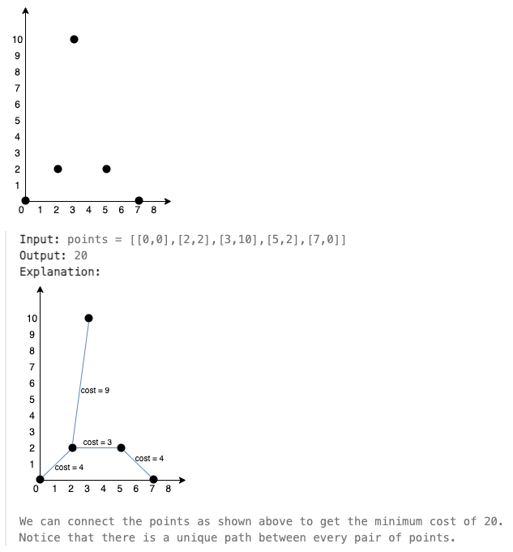

# 1584. Min Cost to Connect All Points

`Medium`

You are given an array points representing integer coordinates of some points on a 2D-plane, where points[i] = [xi, yi].

The cost of connecting two points [xi, yi] and [xj, yj] is the manhattan distance between them: |xi - xj| + |yi - yj|, where |val| denotes the absolute value of val.

Return the minimum cost to make all points connected. All points are connected if there is exactly one simple path between any two points.

Example 1:



Example 2:

```note
Input: points = [[3,12],[-2,5],[-4,1]]
Output: 18
```

Constraints:

```note
1 <= points.length <= 1000
-106 <= xi, yi <= 106
All pairs (xi, yi) are distinct.
```
