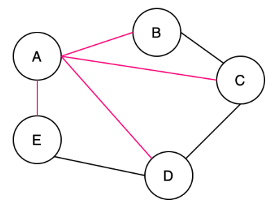
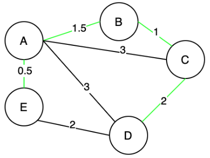
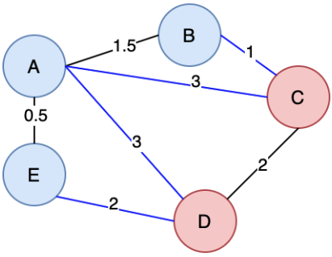

# Overvieww of Minimum Spanning Tree

what is a spanning tree? A spanning tree is a connected subgraph in an undirected graph where all vertices are connected with the minimum number of edges.

all pink edges [(A, B), (A, C), (A, D), (A, E)] form a tree, which is a spanning tree of this undirected graph. Note that [(A, E), (A, B), (B, C), (C, D)] is also a spanning tree of the undirected graph. Thus, an “undirected graph” can have multiple spanning trees.



what is a minimum spanning tree? A minimum spanning tree is a spanning tree with the minimum possible total edge weight in a “weighted undirected graph”.

a spanning tree formed by green edges [(A, E), (A, B), (B, C), (C, D)] is one of the minimum spanning trees in this weighted undirected graph. Actually, [(A, E), (E, D), (A, B), (B, C)] forms another minimum spanning tree of the weighted undirected graph. Thus, a “weighted undirected graph” can have multiple minimum spanning trees.



## Cut Property

What is a “cut”? Although many theorems are named after people’s names, “cut” is not one of them. To understand the “cut property”, we need to understand two basic concepts.

1. First, in Graph theory, a “cut” is a partition of vertices in a “graph” into two disjoint subsets. Figure 11 illustrates a “cut”, where (B, A, E) forms one subset, and (C, D) forms the other subset.

2. Second, a crossing edge is an edge that connects a vertex in one set with a vertex in the other set. In Figure 11, (B, C), (A, C), (A, D), (E, D) are all “crossing edges”.



```note
For any cut C of the graph, if the weight of an edge E in the cut-set of C is strictly smaller than the weights of all other edges of the cut-set of C, then this edge belongs to all MSTs of the graph.
```

## Kruskal’s Algorithm

“Kruskal’s algorithm” is an algorithm to construct a “minimum spanning tree” of a “weighted undirected graph”.

Kruskal's algorithm grows the minimum spanning tree by adding edges. In this example, the distance between two vertices is the edge weight. We try adding each edge, one at a time, from the lowest weight edge up to the highest weight edge. If either of the edges' vertices is not already part of the MST, then the edge is added to the MST.

Time Complexity:
O(E \* logE)
Here, E represents the number of edges.

Space Complexity:
O(E)
Here, E represents the number of edges.

## Prim’s Algorithm

After learning about Kruskal's Algorithm, let's look at another algorithm, "Prim's algorithm", that can be used to construct a “minimum spanning tree” of a “weighted undirected graph”.

The above illustration demonstrates how Prim's algorithm works by adding vertices. In this example, the distance between two vertices is the edge weight. Starting from an arbitrary vertex, Prim's algorithm grows the minimum spanning tree by adding one vertex at a time to the tree. The choice of a vertex is based on the greedy strategy, i.e., the addition of the new vertex incurs the minimum cost.

### The difference between the “Kruskal’s algorithm” and the “Prim’s algorithm”

“Kruskal’s algorithm” expands the “minimum spanning tree” by adding edges. Whereas “Prim’s algorithm” expands the “minimum spanning tree” by adding vertices.

Time Complexity:
O(E \* logV) for Binary heap, and
O(E + V \* logV) for Fibonacci heap.

Space Complexity:
O(E)
Here, E represents the number of edges.
