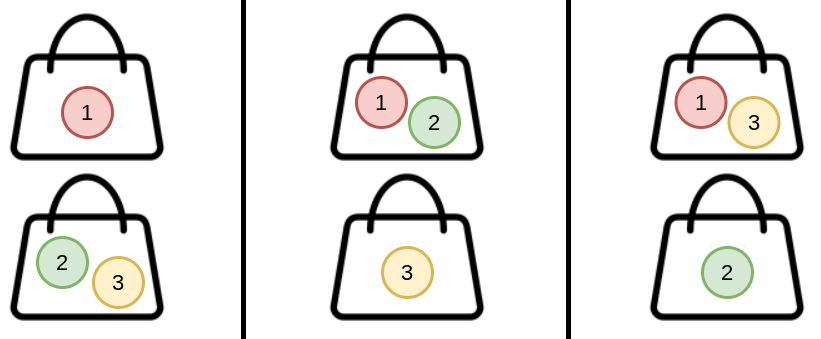

# 1692. Count Ways to Distribute Candies

## Problem Description

There are **n unique candies** labeled from `1` to `n` and **k bags**.

You must distribute all the candies into the bags such that:

- Every bag has **at least one candy**.
- The **order of the bags does not matter**.
- The **order of candies within each bag does not matter**.

Two distributions are considered **different** if the candies that appear together in a bag in one distribution are **not all together in the same bag** in another distribution.

### Example of difference

- `(1), (2,3)` and `(2), (1,3)` are **different** because candies `2` and `3` are together in the first distribution but not in the second.

### Example of same distribution

- `(1), (2,3)` and `(3,2), (1)` are considered the **same** because each group of candies stays in the same bag.

Your task is to return the **number of ways to distribute the candies**.

Since the answer may be large, return it **modulo 10^9 + 7**.

---

# Examples

## Example 1



**Input**

```
n = 3
k = 2
```

**Output**

```
3
```

**Explanation**

Possible distributions:

```
(1), (2,3)
(1,2), (3)
(1,3), (2)
```

---

## Example 2

**Input**

```
n = 4
k = 2
```

**Output**

```
7
```

**Explanation**

Possible distributions:

```
(1), (2,3,4)
(1,2), (3,4)
(1,3), (2,4)
(1,4), (2,3)
(1,2,3), (4)
(1,2,4), (3)
(1,3,4), (2)
```

---

## Example 3

**Input**

```
n = 20
k = 5
```

**Output**

```
206085257
```

**Explanation**

Total distributions:

```
1881780996
```

After applying modulo:

```
1881780996 mod (10^9 + 7) = 206085257
```

---

# Constraints

```
1 <= k <= n <= 1000
```

---

# Key Idea

This problem asks for the number of ways to partition `n` **distinct elements** into `k` **non‑empty unlabeled groups**.

This is known as the **Stirling Number of the Second Kind**:

```
S(n, k)
```
