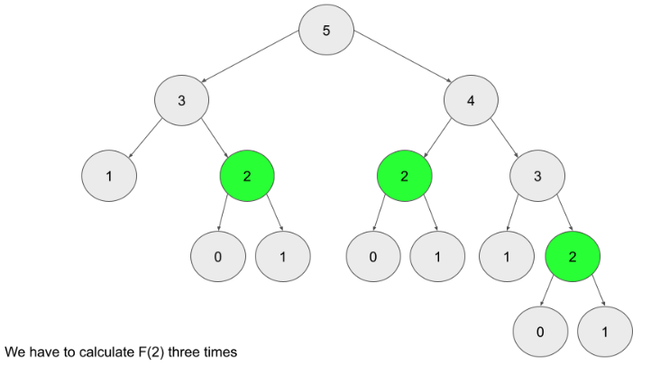

# What is Dynamic Programming?

Dynamic Programming (DP) is a programming paradigm that can systematically and efficiently explore all possible solutions to a problem. As such, it is capable of solving a wide variety of problems that often have the following characteristics:

- The problem can be broken down into "overlapping subproblems" - smaller versions of the original problem that are re-used multiple times.

- The problem has an "optimal substructure" - an optimal solution can be formed from optimal solutions to the overlapping subproblems of the original problem.

There are two ways to implement a DP algorithm:

- Bottom-up, also known as tabulation.
- Top-down, also known as memoization.

Let's take a quick look at each method.

## Bottom-up (Tabulation)

Bottom-up is implemented with iteration and starts at the base cases. Let's use the Fibonacci sequence as an example again. The base cases for the Fibonacci sequence are F(0)=0 and F(1)=1. With bottom-up, we would use these base cases to calculate F(2), and then use that result to calculate F(3), and so on all the way up to F(n).

```note
// Pseudocode example for bottom-up

F = array of length (n + 1)
F[0] = 0
F[1] = 1
for i from 2 to n:
    F[i] = F[i - 1] + F[i - 2]
```

## Top-down (Memoization)

Top-down is implemented with recursion and made efficient with memoization. If we wanted to find the n t h n th Fibonacci number F(n), we try to compute this by finding F(n−1) and F(n−2). This defines a recursive pattern that will continue on until we reach the base cases F(0)=F(1)=1. The problem with just implementing it recursively is that there is a ton of unnecessary repeated computation. Take a look at the recursion tree if we were to find F(5):

```note
// Pseudocode example for top-down

memo = hashmap
Function F(integer i):
    if i is 0 or 1:
        return i
    if i doesn't exist in memo:
        memo[i] = F(i - 1) + F(i - 2)
    return memo[i]
```



```note
memoizing a result means to store the result of a function call, usually in a hashmap or an array, so that when the same function call is made again, we can simply return the memoized result instead of recalculating the result.
```

## Which is better?

Any DP algorithm can be implemented with either method, and there are reasons for choosing either over the other. However, each method has one main advantage that stands out:

- A bottom-up implementation's runtime is usually faster, as iteration does not have the overhead that recursion does.

- A top-down implementation is usually much easier to write. This is because with recursion, the ordering of subproblems does not matter, whereas with tabulation, we need to go through a logical ordering of solving subproblems.

## When to Use DP

When it comes to solving an algorithm problem, especially in a high-pressure scenario such as an interview, half the battle is figuring out how to even approach the problem. In the first section, we defined what makes a problem a good candidate for dynamic programming. Recall:

- The problem can be broken down into "overlapping subproblems" - smaller versions of the original problem that are re-used multiple times

- The problem has an "optimal substructure" - an optimal solution can be formed from optimal solutions to the overlapping subproblems of the original problem

Unfortunately, it is hard to identify when a problem fits into these definitions. Instead, let's discuss some common characteristics of DP problems that are easy to identify.

The first characteristic that is common in DP problems is that the problem will ask for the optimum value (maximum or minimum) of something, or the number of ways there are to do something. For example:

- What is the minimum cost of doing...
- What is the maximum profit from...
- How many ways are there to do...
- What is the longest possible...
- Is it possible to reach a certain point...

```note
Note: Not all DP problems follow this format, and not all problems that follow these formats should be solved using DP. However, these formats are very common for DP problems and are generally a hint that you should consider using dynamic programming.
```

When it comes to identifying if a problem should be solved with DP, this first characteristic is not sufficient. Sometimes, a problem in this format (asking for the max/min/longest etc.) is meant to be solved with a greedy algorithm. The next characteristic will help us determine whether a problem should be solved using a greedy algorithm or dynamic programming.

The second characteristic that is common in DP problems is that future "decisions" depend on earlier decisions. Deciding to do something at one step may affect the ability to do something in a later step. This characteristic is what makes a greedy algorithm invalid for a DP problem - we need to factor in results from previous decisions. Admittedly, this characteristic is not as well defined as the first one, and the best way to identify it is to go through some examples.

House Robber is an excellent example of a dynamic programming problem. The problem description is:

```note
You are a professional robber planning to rob houses along a street. Each house has a certain amount of money stashed, the only constraint stopping you from robbing each of them is that adjacent houses have security systems connected and it will automatically contact the police if two adjacent houses were broken into on the same night.

Given an integer array nums representing the amount of money of each house, return the maximum amount of money you can rob tonight without alerting the police.
```

In this problem, each decision will affect what options are available to the robber in the future. For example, with the test case nums = [2, 7, 9, 3, 1], the optimal solution is to rob the houses with 2, 9, and 1 money. However, if we were to iterate from left to right in a greedy manner, our first decision would be whether to rob the first or second house. 7 is way more money than 2, so if we were greedy, we would choose to rob house 7. However, this prevents us from robbing the house with 9 money. As you can see, our decision between robbing the first or second house affects which options are available for future decisions.

```note
When you're solving a problem on your own and trying to decide if the second characteristic is applicable, assume it isn't, then try to think of a counterexample that proves a greedy algorithm won't work. If you can think of an example where earlier decisions affect future decisions, then DP is applicable.
```

To summarize: if a problem is asking for the maximum/minimum/longest/shortest of something, the number of ways to do something, or if it is possible to reach a certain point, it is probably greedy or DP. With time and practice, it will become easier to identify which is the better approach for a given problem. Although, in general, if the problem has constraints that cause decisions to affect other decisions, such as using one element prevents the usage of other elements, then we should consider using dynamic programming to solve the problem. These two characteristics can be used to identify if a problem should be solved with DP.

```note
Note: these characteristics should only be used as guidelines - while they are extremely common in DP problems, at the end of the day DP is a very broad topic.
```

## Framework for DP Problems

Before we start, we need to first define a term: state. In a DP problem, a state is a set of variables that can sufficiently describe a scenario. These variables are called state variables, and we only care about relevant ones. For example, to describe every scenario in Climbing Stairs, there is only 1 relevant state variable, the current step we are on. We can denote this with an integer i. If i = 6, that means that we are describing the state of being on the 6th step. Every unique value of i represents a unique state.

```note
You might be wondering what "relevant" means here. Picture this problem in real life: you are on a set of stairs, and you want to know how many ways there are to climb to say, the 10th step. We're definitely interested in what step you're currently standing on. However, we aren't interested in what color your socks are. You could certainly include sock color as a state variable. Standing on the 8th step wearing green socks is a different state than standing on the 8th step wearing red socks. However, changing the color of your socks will not change the number of ways to reach the 10th step from your current position. Thus the color of your socks is an irrelevant variable. In terms of figuring out how many ways there are to climb the set of stairs, the only relevant variable is what stair you are currently on.
```

## The Framework

To solve a DP problem, we need to combine 3 things:

### A function or data structure that will compute/contain the answer to the problem for every given state

For Climbing Stairs, let's say we have an function dp where dp(i) returns the number of ways to climb to the ith step. Solving the original problem would be as easy as return dp(n).

How did we decide on the design of the function? The problem is asking "How many distinct ways can you climb to the top?", so we decide that the function will represent how many distinct ways you can climb to a certain step - literally the original problem, but generalized for a given state.

```note
Typically, top-down is implemented with a recursive function and hash map, whereas bottom-up is implemented with nested for loops and an array. When designing this function or array, we also need to decide on state variables to pass as arguments. This problem is very simple, so all we need to describe a state is to know what step we are currently on i. We'll see later that other problems have more complex states.
```

### A recurrence relation to transition between states.

A recurrence relation is an equation that relates different states with each other. Let's say that we needed to find how many ways we can climb to the 30th stair. Well, the problem states that we are allowed to take either 1 or 2 steps at a time. Logically, that means to climb to the 30th stair, we arrived from either the 28th or 29th stair. Therefore, the number of ways we can climb to the 30th stair is equal to the number of ways we can climb to the 28th stair plus the number of ways we can climb to the 29th stair.

The problem is, we don't know how many ways there are to climb to the 28th or 29th stair. However, we can use the logic from above to define a recurrence relation. In this case, dp(i) = dp(i - 1) + dp(i - 2). As you can see, information about some states gives us information about other states.

```note
Upon careful inspection, we can see that this problem is actually the Fibonacci sequence in disguise! This is a very simple recurrence relation - typically, finding the recurrence relation is the most difficult part of solving a DP problem. We'll see later how some recurrence relations are much more complicated, and talk through how to derive them.
```

### Base cases, so that our recurrence relation doesn't go on infinitely

The equation dp(i) = dp(i - 1) + dp(i - 2) on its own will continue forever to negative infinity. We need base cases so that the function will eventually return an actual number.

Finding the base cases is often the easiest part of solving a DP problem, and just involves a little bit of logical thinking. When coming up with the base case(s) ask yourself: What state(s) can I find the answer to without using dynamic programming? In this example, we can reason that there is only 1 way to climb to the first stair (1 step once), and there are 2 ways to climb to the second stair (1 step twice and 2 steps once). Therefore, our base cases are dp(1) = 1 and dp(2) = 2.

```note
We said above that we don't know how many ways there are to climb to the 28th and 29th stairs. However, using these base cases and the recurrence relation from step 2, we can figure out how many ways there are to climb to the 3rd stair. With that information, we can find out how many ways there are to climb to the 4th stair, and so on. Eventually, we will know how many ways there are to climb to the 28th and 29th stairs.
```

## Multidimensional DP

The dimensions of a DP algorithm refer to the number of state variables used to define each state. So far in this explore card, all the algorithms we have looked at required only one state variable - therefore they are one-dimensional. In this section, we're going to talk about problems that require multiple dimensions.

Typically, the more dimensions a DP problem has, the more difficult it is to solve. Two-dimensional problems are common, and sometimes a problem might even require five dimensions. The good news is, the framework works regardless of the number of dimensions.

## Top-down to Bottom-up

As we've said in the previous chapter, usually a top-down algorithm is easier to implement than the equivalent bottom-up algorithm. With that being said, it is useful to know how to take a completed top-down algorithm and convert it to bottom-up. There's a number of reasons for this: first, in an interview, if you solve a problem with top-down, you may be asked to rewrite your solution in an iterative manner (using bottom-up) instead. Second, as we mentioned before, bottom-up usually is more efficient than top-down in terms of runtime.

### Steps to convert top-down into bottom-up

- Start with a completed top-down implementation.

- Initialize an array dp that is sized according to your state variables. For example, let's say the input to the problem was an array nums nums and an integer k that represents the maximum number of actions allowed. Your array dp would be 2D with one dimension of length nums.length and the other of length k. The values should be initialized as some default value opposite of what the problem is asking for. For example, if the problem is asking for the maximum of something, set the values to negative infinity. If it is asking for the minimum of something, set the values to infinity.

- Set your base cases, same as the ones you are using in your top-down function.

- Write a for-loop(s) that iterate over your state variables. If you have multiple state variables, you will need nested for-loops. These loops should start iterating from the base cases.

- Now, each iteration of the inner-most loop represents a given state, and is equivalent to a function call to the same state in top-down. Copy the logic from your function into the for-loop and change the function calls to accessing your array.

- We're done! dp is now an array populated with the answer to the original problem for all possible states. Return the answer to the original problem.

### State Reduction

we mentioned that we could use 2 state variables instead of 3 because we could derive the information the 3rd one would have given us from the other 2. By doing this, we greatly reduced the number of states (as we learned earlier, the number of states is the product of the number of values each state variable can take). In most cases, reducing the number of states will reduce the time and space complexity of the algorithm.

This is called state reduction, and it is applicable for many DP problems, including a few that we have already looked at. State reduction usually comes from a clever trick or observation
