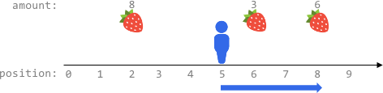
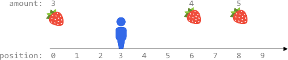

# 2106. Maximum Fruits Harvested After at Most K Steps

`Hard`

Fruits are available at some positions on an infinite x-axis. You are given a 2D integer array fruits where fruits[i] = [positioni, amounti] depicts amounti fruits at the position positioni. fruits is already sorted by positioni in ascending order, and each positioni is unique.

You are also given an integer startPos and an integer k. Initially, you are at the position startPos. From any position, you can either walk to the left or right. It takes one step to move one unit on the x-axis, and you can walk at most k steps in total. For every position you reach, you harvest all the fruits at that position, and the fruits will disappear from that position.

Return the maximum total number of fruits you can harvest.

Example 1:



```note
Input: fruits = [[2,8],[6,3],[8,6]], startPos = 5, k = 4
Output: 9
Explanation:
The optimal way is to:

- Move right to position 6 and harvest 3 fruits
- Move right to position 8 and harvest 6 fruits
You moved 3 steps and harvested 3 + 6 = 9 fruits in total.
```

Example 2:



```note
Input: fruits = [[0,3],[6,4],[8,5]], startPos = 3, k = 2
Output: 0
Explanation:
You can move at most k = 2 steps and cannot reach any position with fruits.
```

Constraints:

```note
1 <= fruits.length <= 105
fruits[i].length == 2
0 <= startPos, positioni <= 2 * 105
positioni-1 < positioni for any i > 0 (0-indexed)
1 <= amounti <= 104
0 <= k <= 2 * 105
```
