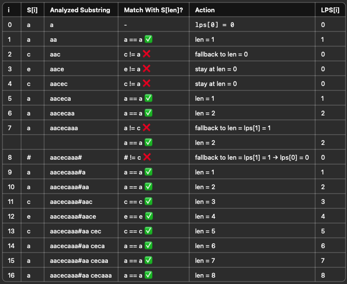

# KMP

```java
int[] prefixTable = new int[s.length()];
int length = 0;
for (int i = 1; i < s.length(); i++) {
  while (length > 0 && s.charAt(i) != s.charAt(length)) {
    length = prefixTable[length - 1];
  }
  if (s.charAt(i) == s.charAt(length)) {
    length++;
  }
  prefixTable[i] = length;
}
```


