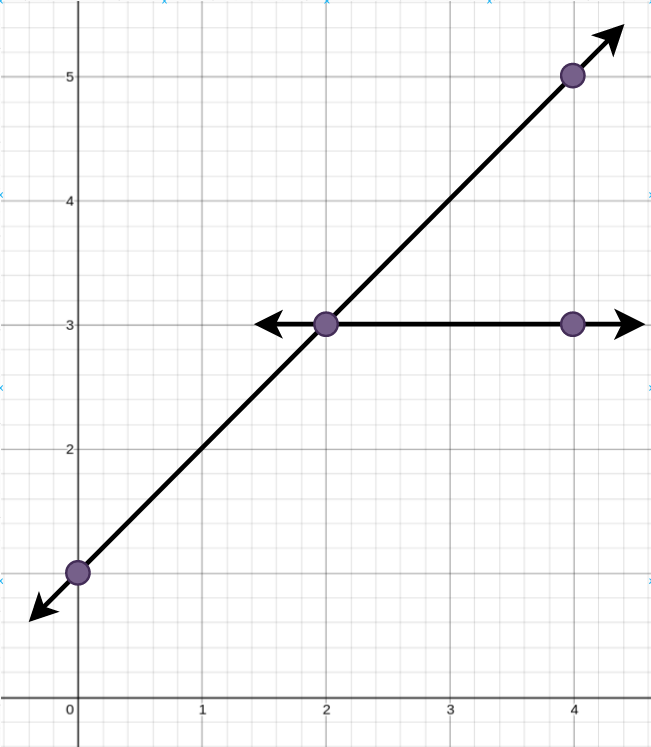
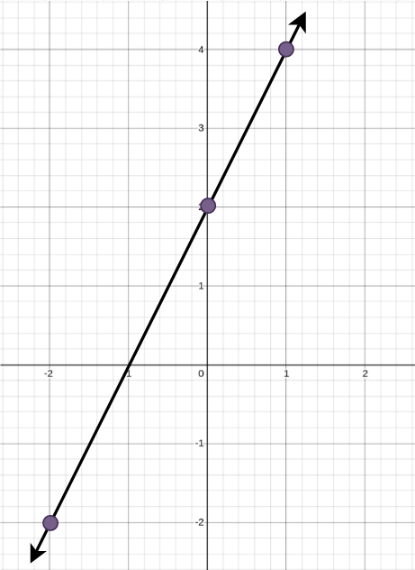

# 2152. Minimum Number of Lines to Cover Points

## Problem Description

You are given an array `points` where:

```
points[i] = [xi, yi]
```

represents a point on an **X-Y plane**.

Straight lines are going to be added to the plane such that **every point is covered by at least one line**.

Return the **minimum number of straight lines** needed to cover all the points.

---

# Examples

## Example 1



**Input**

```
points = [[0,1],[2,3],[4,5],[4,3]]
```

**Output**

```
2
```

**Explanation**

The minimum number of straight lines needed is **two**.

One possible solution:

- One line connecting the point **(0, 1)** to the point **(4, 5)**.
- Another line connecting the point **(2, 3)** to the point **(4, 3)**.

---

## Example 2



**Input**

```
points = [[0,2],[-2,-2],[1,4]]
```

**Output**

```
1
```

**Explanation**

The minimum number of straight lines needed is **one**.

The only solution:

- One line connecting the point **(-2, -2)** to the point **(1, 4)**.

---

# Constraints

```
1 <= points.length <= 10
points[i].length == 2
-100 <= xi, yi <= 100
```

Additional Notes:

- All points are **unique**.
