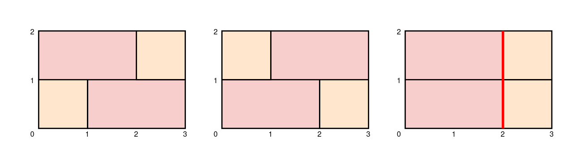

# 2184. Number of Ways to Build Sturdy Brick Wall

## Problem Description

You are given integers **height** and **width** which specify the dimensions of a brick wall you are building.
You are also given a **0-indexed array of unique integers `bricks`**, where the `i-th` brick has:

- **height = 1**
- **width = bricks[i]**

You have an **infinite supply** of each type of brick and **bricks may not be rotated**.

### Wall Requirements

1. Each row in the wall must be **exactly `width` units long**.
2. The wall has **`height` rows**.
3. For the wall to be **sturdy**, adjacent rows must **not join bricks at the same location**, except at the **ends of the wall**.
4. Return the number of ways to build a sturdy wall.
5. Since the answer may be very large, return it **modulo `10^9 + 7`**.

---

# Examples

## Example 1



**Input**

```
height = 2
width = 3
bricks = [1,2]
```

**Output**

```
2
```

**Explanation**

The first two walls in the diagram show the only two ways to build a sturdy brick wall.

The third wall is **not sturdy** because adjacent rows join bricks **2 units from the left**, creating a vertical crack alignment.

---

## Example 2

**Input**

```
height = 1
width = 1
bricks = [5]
```

**Output**

```
0
```

**Explanation**

There are **no valid ways** to build the wall because the only brick available has width **5**, which is larger than the wall width **1**.

---

# Constraints

```
1 <= height <= 100
1 <= width <= 10
1 <= bricks.length <= 10
1 <= bricks[i] <= 10
```

Additional notes:

- All values in `bricks` are **unique**.
- Each brick has **height 1**.
- You have **infinite supply** of each brick type.
