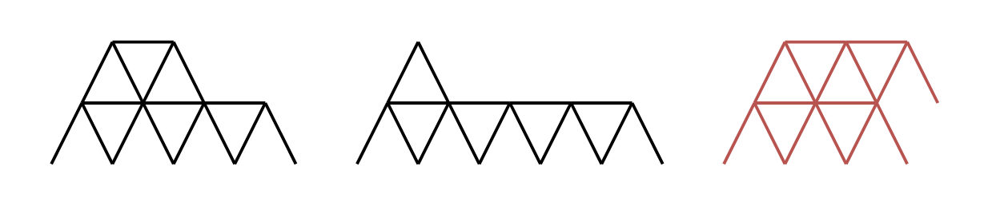
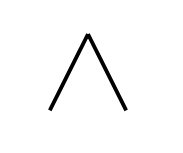

# 2189. Number of Ways to Build House of Cards

## Problem Description

You are given an integer **n** representing the number of playing cards you have.

A **house of cards** must follow these rules:

1. A house of cards consists of **one or more rows** of triangles and horizontal cards.
2. **Triangles** are created by leaning **two cards** against each other.
3. **One horizontal card** must be placed **between all adjacent triangles** in a row.
4. Any triangle in a **higher row** must be placed **on top of a horizontal card** from the previous row.
5. Each triangle is placed in the **leftmost available position** in the row.
6. You must use **exactly `n` cards**.

Two houses are considered **distinct** if there exists a row where the number of triangles differs.

Your task is to **return the number of distinct houses of cards** that can be built using all `n` cards.

---

# Examples

## Example 1



Input

```
n = 16
```

Output

```
2
```

Explanation

Two valid houses can be constructed using 16 cards.

A third configuration is invalid because the rightmost triangle in the top row is **not placed on top of a horizontal card**.

---

## Example 2



Input

```
n = 2
```

Output

```
1
```

Explanation

Only **one valid house** can be built with 2 cards (a single triangle).

---

## Example 3


Input

```
n = 4
```

Output

```
0
```

Explanation

All possible arrangements violate the rules:

- One arrangement requires a **horizontal card between triangles** but it is missing.
- Another arrangement uses **5 cards**, exceeding the limit.
- Another arrangement uses **2 cards**, not all cards.

Therefore no valid house exists.

---

# Constraints

```
1 <= n <= 500
```

---

# Observations

If a row contains **t triangles**:

- Each triangle uses **2 cards**
- Between triangles we need **(t − 1) horizontal cards**

Total cards used in a row:

```
2t + (t - 1) = 3t - 1
```

So a row with `t` triangles requires:

```
3t - 1 cards
```

If a house contains rows:

```
t1, t2, t3, ..., tk
```

Total cards used:

```
(3t1 - 1) + (3t2 - 1) + ... + (3tk - 1)
```

Additionally, due to structural constraints:

```
t1 > t2 > t3 > ... > tk >= 1
```

Each row must contain **strictly fewer triangles** than the row below.

---

# Key Insight

The problem becomes:

Count the number of ways to represent **n** as a sum of numbers of the form

```
3t - 1
```

where each `t` can be used **at most once**.

This is equivalent to a **subset sum counting problem**.

---

# Dynamic Programming Approach

Let

```
dp[i]
```

represent the number of ways to build houses using **exactly i cards**.

Base case

```
dp[0] = 1
```

For each possible row size `t`:

```
cost = 3t - 1
```

Update the DP array backwards:

```
dp[i] += dp[i - cost]
```

This ensures each row size is used **only once**.

---

# Java Implementation

```java
class Solution {
    public int houseOfCards(int n) {
        int[] dp = new int[n + 1];
        dp[0] = 1;

        for (int t = 1; 3 * t - 1 <= n; t++) {
            int cost = 3 * t - 1;

            for (int i = n; i >= cost; i--) {
                dp[i] += dp[i - cost];
            }
        }

        return dp[n];
    }
}
```

---

# Complexity Analysis

Let

```
3t - 1 <= n
```

Then

```
t ≈ n / 3
```

### Time Complexity

```
O(n^2)
```

### Space Complexity

```
O(n)
```

---

# Summary

- Each row with `t` triangles requires **3t − 1 cards**
- Row sizes must be **strictly decreasing**
- The problem reduces to **counting subsets** of row costs
- Solve using **0/1 knapsack dynamic programming**
