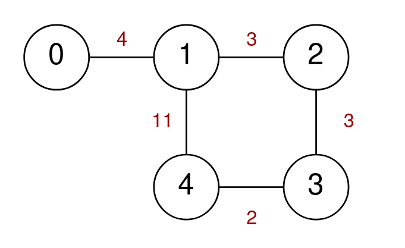
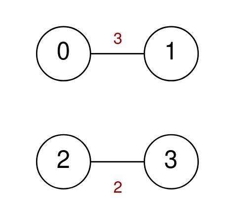

# 2247. Maximum Cost of Trip With K Highways

## Problem Description

A series of highways connect `n` cities numbered from `0` to `n - 1`.

You are given a **2D integer array `highways`** where:

```
highways[i] = [city1_i, city2_i, toll_i]
```

This indicates that there is a **highway connecting `city1_i` and `city2_i`**, and a car can travel in **both directions** between them for a cost of `toll_i`.

You are also given an integer:

```
k
```

You are planning a **trip that crosses exactly `k` highways**.

### Rules

- You may **start at any city**.
- You may **visit each city at most once** during the trip.

### Goal

Return the **maximum cost of the trip**.

If **no trip exists** that uses exactly `k` highways without revisiting cities, return:

```
-1
```

---

# Example 1



### Input

```
n = 5
highways = [[0,1,4],[2,1,3],[1,4,11],[3,2,3],[3,4,2]]
k = 3
```

### Output

```
17
```

### Explanation

One possible trip:

```
0 -> 1 -> 4 -> 3
```

Cost:

```
4 + 11 + 2 = 17
```

Another valid trip:

```
4 -> 1 -> 2 -> 3
```

Cost:

```
11 + 3 + 3 = 17
```

It can be proven that **17 is the maximum possible cost**.

Note that the trip:

```
4 -> 1 -> 0 -> 1
```

is **not allowed**, because city `1` is visited twice.

---

# Example 2



### Input

```
n = 4
highways = [[0,1,3],[2,3,2]]
k = 2
```

### Output

```
-1
```

### Explanation

There are **no valid trips of length 2**, so the answer is `-1`.

---

# Constraints

```
2 <= n <= 15
1 <= highways.length <= 50
highways[i].length == 3
0 <= city1_i, city2_i <= n - 1
city1_i != city2_i
0 <= toll_i <= 100
1 <= k <= 50
```

Additional conditions:

- There are **no duplicate highways**.
