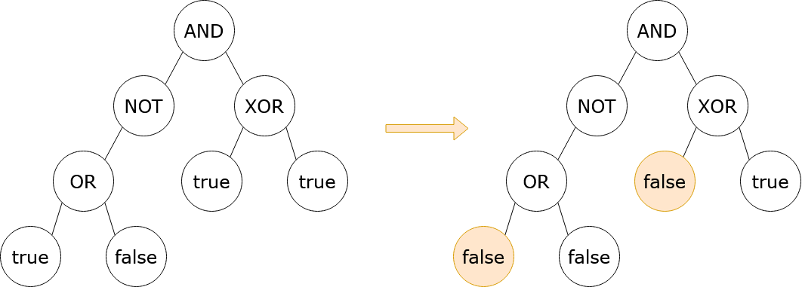

# 2313. Minimum Flips in Binary Tree to Get Result

## Problem Description

You are given the **root of a binary tree** with the following properties:

### Leaf Nodes

Leaf nodes contain either:

- `0` representing **false**
- `1` representing **true**

### Non-Leaf Nodes

Non-leaf nodes represent boolean operations:

- `2` → **OR**
- `3` → **AND**
- `4` → **XOR**
- `5` → **NOT**

You are also given a boolean value `result`, which represents the **desired evaluation result of the root node**.

---

# Evaluation Rules

The evaluation of each node works as follows:

### 1. Leaf Node

If the node is a leaf node:

```
evaluation = node value
```

So:

- `0 → false`
- `1 → true`

### 2. Non-Leaf Node

If the node is not a leaf:

1. Evaluate its child nodes.
2. Apply the boolean operation stored in the node.

---

# Allowed Operation

In one operation, you may **flip a leaf node**.

Flipping means:

```
0 → 1
1 → 0
```

Your goal is to perform the **minimum number of flips** so that the evaluation of the **root node equals the given `result`**.

It is guaranteed that **there is always a way to achieve the desired result**.

---

# Additional Notes

- A **leaf node** has **zero children**.
- **NOT nodes** have **only one child** (either left or right).
- **OR, AND, XOR nodes** have **two children**.

---

# Example 1



### Input

```
root = [3,5,4,2,null,1,1,1,0]
result = true
```

### Output

```
2
```

### Explanation

It can be shown that **at least 2 leaf nodes must be flipped** so that the evaluation of the root becomes `true`.

One valid configuration is illustrated in the problem diagram.

---

# Example 2

### Input

```
root = [0]
result = false
```

### Output

```
0
```

### Explanation

The tree already evaluates to `false`, so **no flips are required**.

---

# Constraints

```
1 ≤ number of nodes ≤ 10^5
0 ≤ Node.val ≤ 5
```

Additional guarantees:

- **OR, AND, XOR nodes have exactly 2 children**
- **NOT nodes have exactly 1 child**
- **Leaf nodes contain values 0 or 1**
- **Non-leaf nodes contain values 2, 3, 4, or 5**
