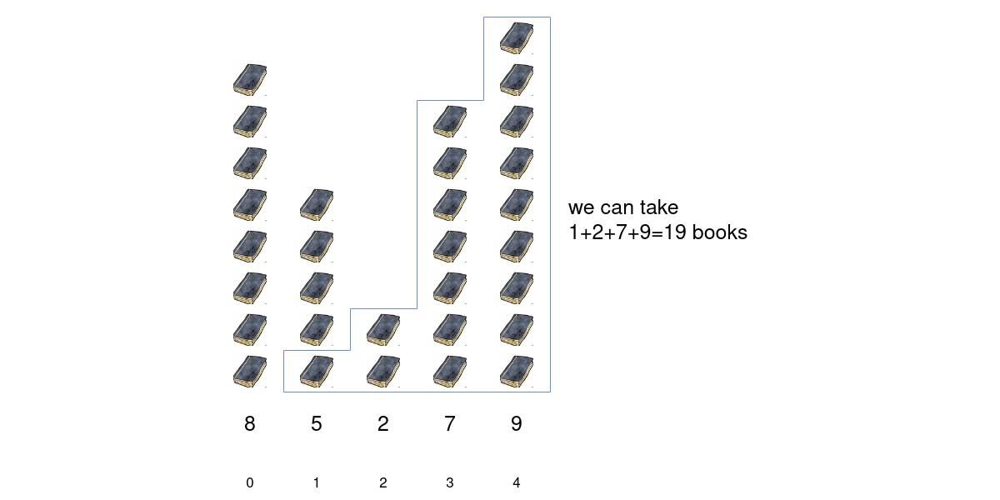
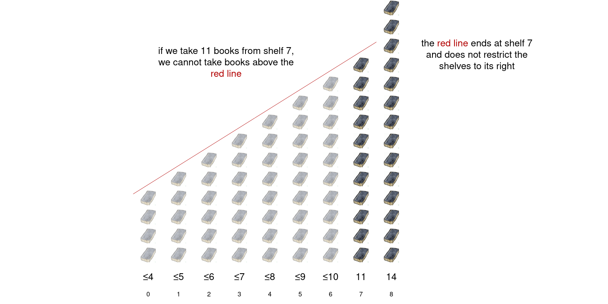
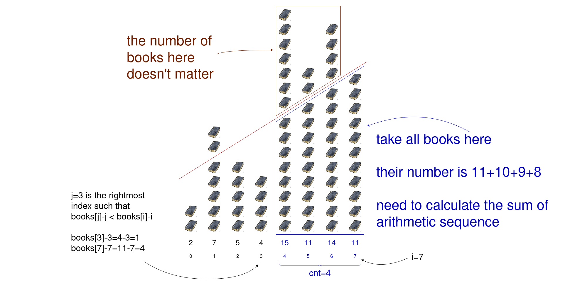
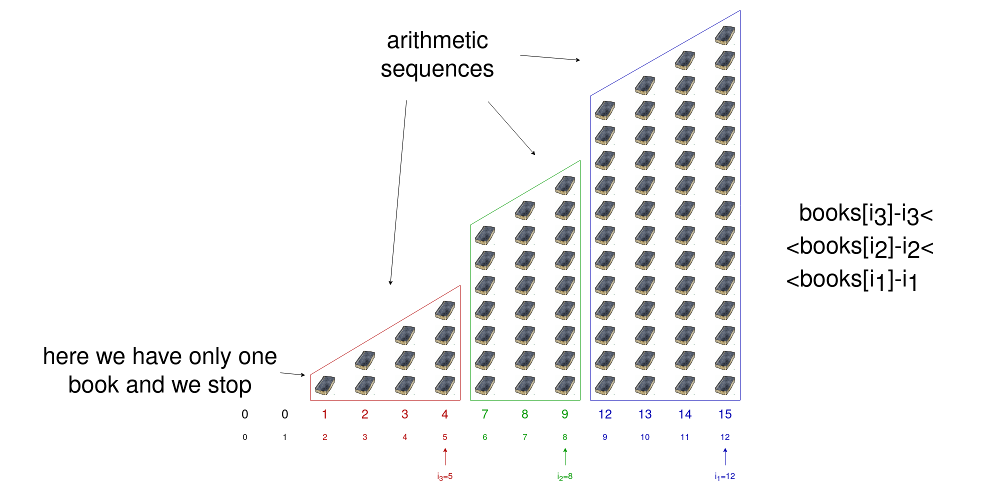

# 2355. Maximum Number of Books You Can Take — Exhaustive Summary

## Approach 1: Dynamic Programming with Monotonic Stack

## Intuition

Consider the first example from the problem statement.



### Example 1

```text
books = [8, 5, 2, 7, 9]
```

One optimal way is:

- take `1` book from shelf `1`
- take `2` books from shelf `2`
- take `7` books from shelf `3`
- take `9` books from shelf `4`

Total:

```text
1 + 2 + 7 + 9 = 19
```

Let:

```text
a[i]
```

be the number of books we take from shelf `i`.

We must satisfy two constraints:

### 1. Shelf capacity constraint

```text
a[i] <= books[i]
```

We cannot take more books from a shelf than it contains.



### 2. Strictly increasing condition across the chosen subarray

If we take books from a contiguous segment `[l, r]`, then for every:

```text
l <= i < r
```

we need:

```text
a[i] < a[i + 1]
```

That can be rewritten as:

```text
a[i] <= a[i + 1] - 1
```



---

## Understanding the second constraint geometrically

Suppose we decide to take exactly:

```text
books[i]
```

books from shelf `i`.

Then, to keep the sequence strictly increasing from left to right, the most we can take from earlier shelves is:

- from shelf `i - 1`: at most `books[i] - 1`
- from shelf `i - 2`: at most `books[i] - 2`
- from shelf `i - 3`: at most `books[i] - 3`
- and so on

So the ideal pattern going left from `i` is:

```text
books[i], books[i] - 1, books[i] - 2, ...
```

This is an arithmetic progression with common difference `-1`.

But this progression can continue only as long as each shelf actually has enough books.

At some earlier index `j`, we may hit a shelf where:

```text
books[j] < books[i] - (i - j)
```

Rearranging:

```text
books[j] - j < books[i] - i
```

This is the key inequality.

When that happens, the progression cannot extend through index `j`.

So the valid arithmetic progression stops at `j + 1`, and the shelves in the range:

```text
[j + 1, i]
```

form a valid segment.

---

## Example of where the progression stops

Suppose at shelf `7` we take `11` books.

Then the maximum feasible decreasing sequence going left would be:

- shelf `7`: `11`
- shelf `6`: `10`
- shelf `5`: `9`
- shelf `4`: `8`

If shelf `3` has only `4` books, then we cannot continue with `7` at shelf `3`, because:

```text
4 < 7
```

So the arithmetic progression must stop before shelf `3`.

That means the range:

```text
[4, 7]
```

is the maximal valid block ending at `7`.

---

## Sum of books in such a block

Suppose the valid range is `[l, r]`.

If we take `books[r]` books from shelf `r`, then moving left we take:

```text
books[r], books[r] - 1, books[r] - 2, ...
```

This is a finite arithmetic progression.

The number of terms is limited by two conditions:

### Condition 1: We cannot use more shelves than exist in the range

There are:

```text
r - l + 1
```

shelves available.

### Condition 2: The final term must remain positive

We cannot take zero or negative books from a shelf, so the number of terms cannot exceed:

```text
books[r]
```

Therefore:

```text
cnt = min(books[r], r - l + 1)
```

The sequence has:

- first term = `books[r]`
- last term = `books[r] - (cnt - 1)`

So the sum is:

```text
(first + last) * cnt / 2
```

Substituting:

```text
(books[r] + (books[r] - (cnt - 1))) * cnt / 2
= (2 * books[r] - (cnt - 1)) * cnt / 2
```

This formula will be used in a helper function.



---

## Dynamic Programming State

Let:

```text
dp[i]
```

be the maximum number of books we can take from shelves in the range:

```text
[0, i]
```

under the condition that we take exactly:

```text
books[i]
```

books from shelf `i`.

This is a carefully chosen state.

Why is it useful?

Because once shelf `i` is fixed as the rightmost shelf, the block ending at `i` becomes an arithmetic progression over some suffix `[j + 1, i]`.

Then the best contribution before that suffix is just another smaller subproblem, namely `dp[j]`.

---

## DP Transition

Suppose `j` is the nearest index to the left such that:

```text
books[j] - j < books[i] - i
```

Then the range:

```text
[j + 1, i]
```

forms the final arithmetic progression block ending at `i`.

So:

```text
dp[i] = dp[j] + calculateSum(j + 1, i)
```

If no such `j` exists, then the whole range `[0, i]` forms one valid block, so:

```text
dp[i] = calculateSum(0, i)
```

The answer to the full problem is:

```text
max(dp[i]) for all i
```

because the optimal segment may end at any shelf.

---

## The real challenge: how to find `j` efficiently

For each `i`, we need the nearest previous index `j` satisfying:

```text
books[j] - j < books[i] - i
```

This suggests looking at the values:

```text
books[k] - k
```

If we process shelves from left to right, we want to maintain candidate indices in increasing order of these values.

That is exactly what a **monotonic stack** can do.

---

## Why a monotonic stack works

We maintain a stack of indices such that:

```text
books[stack[0]] - stack[0] < books[stack[1]] - stack[1] < ...
```

So the values:

```text
books[i] - i
```

are strictly increasing along the stack.

Now when a new index `i` arrives:

- while the top of the stack has value greater than or equal to `books[i] - i`, it cannot serve as the previous smaller boundary for future elements in a better way, so we pop it
- after popping, the top of the stack is the nearest previous index `j` such that:

```text
books[j] - j < books[i] - i
```

That is exactly the boundary we need for the DP transition.

Then we push `i`.

Each index is pushed once and popped at most once, so the total work remains linear.

---

## Algorithm

Let `n` be the number of shelves.

1. Create:
   - a stack `s`
   - a DP array `dp`
2. Iterate `i` from `0` to `n - 1`
3. While the stack is not empty and:

```text
books[s.top()] - s.top() >= books[i] - i
```

pop the stack

4. If the stack is empty:
   - set:

```text
dp[i] = calculateSum(0, i)
```

5. Otherwise:
   - let `j = s.top()`
   - set:

```text
dp[i] = dp[j] + calculateSum(j + 1, i)
```

6. Push `i` onto the stack
7. Return the maximum value in `dp`

The helper `calculateSum(l, r)` computes the sum of the arithmetic progression over the range `[l, r]`.

---

## Java Implementation

```java
class Solution {
    public long maximumBooks(int[] books) {
        int n = books.length;

        Stack<Integer> s = new Stack<>();
        long[] dp = new long[n];

        for (int i = 0; i < n; i++) {
            // While we cannot push i, we pop from the stack
            while (!s.isEmpty() && books[s.peek()] - s.peek() >= books[i] - i) {
                s.pop();
            }

            // Compute dp[i]
            if (s.isEmpty()) {
                dp[i] = calculateSum(books, 0, i);
            } else {
                int j = s.peek();
                dp[i] = dp[j] + calculateSum(books, j + 1, i);
            }

            // Push the current index onto the stack
            s.push(i);
        }

        // Return the maximum element in dp array
        return Arrays.stream(dp).max().getAsLong();
    }

    // Helper function to calculate the sum of books in a given range [l, r]
    private long calculateSum(int[] books, int l, int r) {
        long cnt = Math.min(books[r], r - l + 1);
        return (2 * books[r] - (cnt - 1)) * cnt / 2;
    }
}
```

---

## Detailed Explanation of `calculateSum`

The helper function:

```java
private long calculateSum(int[] books, int l, int r) {
    long cnt = Math.min(books[r], r - l + 1);
    return (2 * books[r] - (cnt - 1)) * cnt / 2;
}
```

computes the best possible contribution of the final arithmetic block ending at `r`.

### Why `cnt = min(books[r], r - l + 1)`?

Because:

- we cannot use more shelves than the block length
- we cannot let the progression drop to zero or below

So `cnt` is the number of positive terms in the progression.

### What progression is being summed?

If we end at shelf `r` and take `books[r]` books there, then moving left we ideally take:

```text
books[r], books[r] - 1, books[r] - 2, ...
```

for `cnt` terms.

That is an arithmetic progression with:

- first term = `books[r]`
- last term = `books[r] - (cnt - 1)`

The arithmetic progression sum formula gives:

```text
(first + last) * cnt / 2
```

which becomes:

```text
(2 * books[r] - (cnt - 1)) * cnt / 2
```

---

## Example Walkthrough

Consider:

```text
books = [8, 5, 2, 7, 9]
```

We compute `books[i] - i`:

- `i = 0` → `8 - 0 = 8`
- `i = 1` → `5 - 1 = 4`
- `i = 2` → `2 - 2 = 0`
- `i = 3` → `7 - 3 = 4`
- `i = 4` → `9 - 4 = 5`

Now process from left to right.

### i = 0

Stack is empty.

So:

```text
dp[0] = calculateSum(0, 0) = 8
```

Push `0`.

---

### i = 1

Compare with stack top:

```text
books[0] - 0 = 8 >= 4
```

Pop `0`.

Stack becomes empty.

So:

```text
dp[1] = calculateSum(0, 1)
```

The progression ending at shelf `1` can only use at most:

```text
cnt = min(5, 2) = 2
```

So take:

```text
5 + 4 = 9
```

Hence:

```text
dp[1] = 9
```

Push `1`.

---

### i = 2

Compare:

```text
books[1] - 1 = 4 >= 0
```

Pop `1`.

Stack empty again.

So:

```text
dp[2] = calculateSum(0, 2)
```

Here:

```text
cnt = min(2, 3) = 2
```

So sum is:

```text
2 + 1 = 3
```

Thus:

```text
dp[2] = 3
```

Push `2`.

---

### i = 3

Compare with top:

```text
books[2] - 2 = 0 < 4
```

No pop.

So `j = 2`.

Then:

```text
dp[3] = dp[2] + calculateSum(3, 3)
```

Since `calculateSum(3, 3) = 7`, we get:

```text
dp[3] = 3 + 7 = 10
```

Push `3`.

---

### i = 4

Compare with top:

```text
books[3] - 3 = 4 < 5
```

No pop.

So `j = 3`.

Then:

```text
dp[4] = dp[3] + calculateSum(4, 4)
      = 10 + 9
      = 19
```

This is the maximum.

So answer is:

```text
19
```

---

## Why the DP is correct

The logic works because every optimal solution ending at shelf `i` can be split into two parts:

### Part 1: a previous optimal prefix

Some earlier index `j` ends the previous valid structure.

The best value for that prefix is exactly `dp[j]`.

### Part 2: the final arithmetic progression block

The shelves from `j + 1` to `i` must follow the strict increasing rule, and the optimal way to maximize books in that block is to take the largest valid decreasing-by-1 sequence when viewed from right to left.

That block sum is exactly `calculateSum(j + 1, i)`.

Therefore:

```text
dp[i] = dp[j] + calculateSum(j + 1, i)
```

If no such `j` exists, the entire prefix `[0, i]` is one arithmetic block.

That covers all cases.

---

## Time Complexity

### `O(n)`

We iterate through all shelves once.

Inside the loop, there is a while-loop for popping from the stack, but each index is:

- pushed at most once
- popped at most once

So the total number of stack operations over the entire run is linear.

Everything else inside the loop is constant work.

Therefore, total time complexity is:

```text
O(n)
```

---

## Space Complexity

### `O(n)`

We use:

- a stack that may hold up to `n` indices
- a DP array of size `n`

So total auxiliary space is:

```text
O(n)
```

---

## Key Insights to Remember

### 1. The chosen segment always behaves like an arithmetic progression near its right end

If we take `x` books at the rightmost shelf, the optimal amounts to the left are:

```text
x - 1, x - 2, x - 3, ...
```

until the shelf capacities prevent continuing.

### 2. The expression `books[i] - i` is the structural key

It tells us where one arithmetic block can connect to another.

### 3. The monotonic stack finds the previous valid boundary efficiently

Without it, finding `j` for each `i` would be too slow.

### 4. DP stitches together optimal blocks

Each `dp[i]` combines:

- a previous optimal result
- the best arithmetic block ending at `i`

---

## Final Takeaway

This problem looks difficult at first because the chosen values do not have to equal the original shelf values, and the strictly increasing condition applies only inside a contiguous chosen segment.

The breakthrough is recognizing that if shelf `i` is the right end of the chosen segment, then the optimal books taken from shelves ending at `i` form a descending arithmetic progression when viewed from right to left.

That turns the problem into:

- finding valid arithmetic blocks
- summing them quickly
- linking them with DP
- finding the correct previous boundary using a monotonic stack

This combination yields a clean and efficient `O(n)` solution.

---

## Full Code Reference

```java
class Solution {
    public long maximumBooks(int[] books) {
        int n = books.length;

        Stack<Integer> s = new Stack<>();
        long[] dp = new long[n];

        for (int i = 0; i < n; i++) {
            while (!s.isEmpty() && books[s.peek()] - s.peek() >= books[i] - i) {
                s.pop();
            }

            if (s.isEmpty()) {
                dp[i] = calculateSum(books, 0, i);
            } else {
                int j = s.peek();
                dp[i] = dp[j] + calculateSum(books, j + 1, i);
            }

            s.push(i);
        }

        return Arrays.stream(dp).max().getAsLong();
    }

    private long calculateSum(int[] books, int l, int r) {
        long cnt = Math.min(books[r], r - l + 1);
        return (2 * books[r] - (cnt - 1)) * cnt / 2;
    }
}
```
