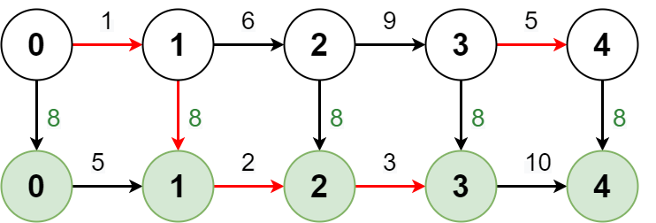
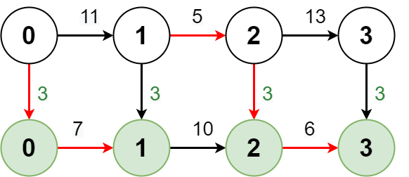

# 2361. Minimum Costs Using the Train Line

## Problem Description

A train line going through a city has **two routes**:

- **Regular route**
- **Express route**

Both routes pass through the same **n + 1 stops**, labeled from:

```
0 → 1 → 2 → ... → n
```

You **start at stop 0 on the regular route**.

---

## Input

You are given:

### 1. `regular`

A **1-indexed integer array** of length `n`.

```
regular[i]
```

Represents the **cost of traveling from stop (i-1) → stop i using the regular route**.

---

### 2. `express`

A **1-indexed integer array** of length `n`.

```
express[i]
```

Represents the **cost of traveling from stop (i-1) → stop i using the express route**.

---

### 3. `expressCost`

```
expressCost
```

Represents the **cost to transfer from the regular route to the express route**.

---

## Transfer Rules

- You **start on the regular route** at stop `0`.
- You may switch between routes while traveling.

### Switching Costs

| Transfer          | Cost          |
| ----------------- | ------------- |
| Regular → Express | `expressCost` |
| Express → Regular | `0`           |
| Stay on Express   | `0`           |
| Stay on Regular   | `0`           |

**Important:**
Every time you move **from regular → express**, you must pay `expressCost` again.

---

## Goal

Return a **1-indexed array `costs` of length `n`**, where:

```
costs[i]
```

represents the **minimum cost required to reach stop `i` from stop `0`**.

A stop is considered **reached if you arrive via either route**.

---

# Example 1



## Input

```
regular = [1,6,9,5]
express = [5,2,3,10]
expressCost = 8
```

## Output

```
[1,7,14,19]
```

## Explanation

To reach **stop 4** optimally:

1. Regular route:

   ```
   stop 0 → stop 1
   cost = 1
   ```

2. Switch to express and travel:

   ```
   stop 1 → stop 2
   cost = expressCost + express[2]
        = 8 + 2
        = 10
   ```

3. Continue express:

   ```
   stop 2 → stop 3
   cost = 3
   ```

4. Switch back to regular:
   ```
   stop 3 → stop 4
   cost = 5
   ```

### Total Cost

```
1 + 10 + 3 + 5 = 19
```

Different routes may produce the minimum costs for earlier stops.

---

# Example 2



## Input

```
regular = [11,5,13]
express = [7,10,6]
expressCost = 3
```

## Output

```
[10,15,24]
```

## Explanation

Optimal path to **stop 3**:

1. Switch to express immediately:

```
stop 0 → stop 1
cost = expressCost + express[1]
     = 3 + 7
     = 10
```

2. Switch to regular:

```
stop 1 → stop 2
cost = 5
```

3. Switch to express again:

```
stop 2 → stop 3
cost = expressCost + express[3]
     = 3 + 6
     = 9
```

### Total Cost

```
10 + 5 + 9 = 24
```

Note that **expressCost is paid again** when transferring back to the express route.

---

# Constraints

```
n == regular.length == express.length
1 ≤ n ≤ 10^5

1 ≤ regular[i], express[i], expressCost ≤ 10^5
```
