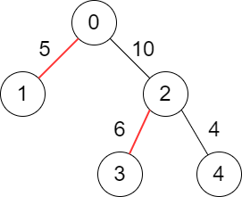
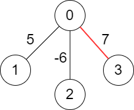

# 2378. Choose Edges to Maximize Score in a Tree

## Problem Description

You are given a **weighted tree** consisting of `n` nodes numbered from `0` to `n - 1`.

The tree is **rooted at node `0`** and represented with a **2D array `edges` of size `n`** where:

- `edges[i] = [pari, weighti]`
- `pari` indicates the **parent of node `i`**
- `weighti` indicates the **weight of the edge between `i` and `pari`**

Since the root does not have a parent:

```
edges[0] = [-1, -1]
```

### Goal

Choose a subset of edges such that:

- **No two chosen edges are adjacent**
- The **sum of the weights** of the chosen edges is **maximized**

### Definition of Adjacent Edges

Two edges are **adjacent** if they share a **common node**.

For example:

- Edge1 connects `(a, b)`
- Edge2 connects `(b, c)`

These two edges are **adjacent** because they share node `b`.

### Return

Return the **maximum possible sum of weights** of the chosen edges.

### Additional Notes

- You are allowed to **choose no edges**, in which case the score is **0**.

---

# Example 1



**Input**

```
edges = [[-1,-1],[0,5],[0,10],[2,6],[2,4]]
```

**Output**

```
11
```

**Explanation**

The optimal selection of edges gives:

```
5 + 6 = 11
```

It can be shown that **no larger score is possible**.

---

# Example 2



**Input**

```
edges = [[-1,-1],[0,5],[0,-6],[0,7]]
```

**Output**

```
7
```

**Explanation**

We select the edge with weight `7`.

All edges share the same parent (`0`), so **only one edge can be selected**.

---

# Constraints

- `n == edges.length`
- `1 ≤ n ≤ 10^5`
- `edges[i].length == 2`
- `par0 == weight0 == -1`
- `0 ≤ pari ≤ n - 1` for all `i ≥ 1`
- `pari != i`
- `-10^6 ≤ weighti ≤ 10^6` for all `i ≥ 1`
- `edges` represents a **valid tree**
