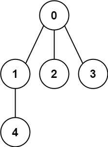

# 261. Graph Valid Tree

You are given a graph with `n` nodes labeled from `0` to `n - 1`. The graph is represented by an integer `n` and a list of edges, where `edges[i] = [aᵢ, bᵢ]` indicates an undirected edge between nodes `aᵢ` and `bᵢ`.

Your task is to determine if the graph forms a valid tree. Return `true` if it does, and `false` otherwise.

## Examples

### Example 1:

**Input:**
`n = 5`, `edges = [[0,1],[0,2],[0,3],[1,4]]`
**Output:**
`true`

### Example 2:

**Input:**
`n = 5`, `edges = [[0,1],[1,2],[2,3],[1,3],[1,4]]`
**Output:**
`false`

## Constraints

- `1 <= n <= 2000`
- `0 <= edges.length <= 5000`
- `edges[i].length == 2`
- `0 <= aᵢ, bᵢ < n`
- `aᵢ != bᵢ`
- No self-loops or repeated edges are allowed.
