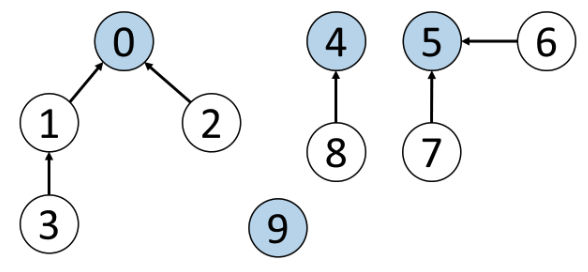

# Union-Find Data Structure

## The Problem

Given a graph with vertices and edges, how can we efficiently determine if two vertices are connected?

### Example

Consider the following graph:

```text
0---1   2---3
|   | / | / |
4   5---6---7
```

We want to quickly answer queries like:

- Is 0 connected to 3?
- Is 1 connected to 5?
- Is 7 connected to 8?

## The Solution: Union-Find

To solve this, we use the **Disjoint Set** data structure, commonly known as **Union-Find**.

### Key Points

- Also called a "disjoint-set" or "merge-find" set
- Specialized data structure for tracking elements partitioned into disjoint subsets
- Optimized for two main operations:
  1. **Find**: Determine which subset an element is in
  2. **Union**: Join two subsets into a single subset

> **Note**: While sometimes referred to as an algorithm, Union-Find is fundamentally a data structure that efficiently handles dynamic connectivity problems.

The primary use of disjoint sets is to address the connectivity between the components of a network, such as:

- Computer networks: routers, switches, and nodes
- Social networks: people, friends, and followers

For instance, we can use a disjoint set to determine if two people share a common ancestor.



## Terminology

### Parent Node

The direct parent node of a vertex. For example, in Figure 5:

- The parent node of vertex 3 is 1.
- The parent node of vertex 2 is 0.
- The parent node of vertex 9 is 9 itself.

### Root Node

A node without a parent node. It is its own parent node. For example, in Figure 5:

- The root node of vertices 3 and 2 is 0.
- The root node and parent node of vertex 9 is 9 itself.

### Find Operation

The find function finds the root node of a given vertex. For example, in Figure 5, the output of the find function for vertex 3 is 0.

### Union Operation

The union function unions two vertices and makes their root nodes the same. In Figure 5, if we union vertex 4 and vertex 5, their root node will become the same, which means the union function will modify the root node of vertex 4 or vertex 5 to the same root node.

## There are two ways to implement a “disjoint set”

## Implementation with Quick Find

In this case, the time complexity of the find function will be O(1).
However, the union function will take more time with the time complexity of O(N).

```java
class UnionFind {
    private int[] root;

    public UnionFind(int size) {
        root = new int[size];
        for (int i = 0; i < size; i++) {
            root[i] = i;
        }
    }

    public int find(int x) {
        return root[x];
    }

    public void union(int x, int y) {
        int rootX = find(x);
        int rootY = find(y);
        if (rootX != rootY) {
            for (int i = 0; i < root.length; i++) {
                if (root[i] == rootY) {
                    root[i] = rootX;
                }
            }
        }
    }

    public boolean connected(int x, int y) {
        return find(x) == find(y);
    }
}
```

## Implementation with Quick Union

Compared with the Quick Find implementation, the time complexity of the union function is better.
Meanwhile, the find function will take more time in this case.

```java
class UnionFind {
    private int[] root;

    public UnionFind(int size) {
        root = new int[size];
        for (int i = 0; i < size; i++) {
            root[i] = i;
        }
    }

    public int find(int x) {
        while (x != root[x]) {
            x = root[x];
        }
        return x;
    }

    public void union(int x, int y) {
        int rootX = find(x);
        int rootY = find(y);
        if (rootX != rootY) {
            root[rootY] = rootX;
        }
    }

    public boolean connected(int x, int y) {
        return find(x) == find(y);
    }
}
```

### Quick Union Time Complexity

| Operation              | Time Complexity |
| ---------------------- | --------------- |
| Union-find Constructor | O(N)            |
| Find                   | O(N)            |
| Union                  | O(N)            |
| Connected              | O(N)            |

Note:
N is the number of vertices in the graph. In the worst-case scenario, the number of operations to get the root vertex will be H, where H is the height of the tree. Because this implementation does not always point the root of the shorter tree to the root of the taller tree, H can be at most N when the tree forms a linked list.

### Quick Union Space Complexity

We need O(N) space to store the array of size N.

## Union by Rank - Disjoint Set

The word "rank" means ordering by specific criteria. By choosing the parent node based on certain criteria (by rank), we can limit the maximum height of each vertex.

```java
class UnionFind {
    private int[] root;
    private int[] rank;

    public UnionFind(int size) {
        root = new int[size];
        rank = new int[size];
        for (int i = 0; i < size; i++) {
            root[i] = i;
            rank[i] = 1;
        }
    }

    public int find(int x) {
        while (x != root[x]) {
            x = root[x];
        }
        return x;
    }

    public void union(int x, int y) {
        int rootX = find(x);
        int rootY = find(y);
        if (rootX != rootY) {
            if (rank[rootX] > rank[rootY]) {
                root[rootY] = rootX;
            } else if (rank[rootX] < rank[rootY]) {
                root[rootX] = rootY;
            } else {
                root[rootY] = rootX;
                rank[rootX] += 1;
            }
        }
    }

    public boolean connected(int x, int y) {
        return find(x) == find(y);
    }
}
```

### Time and Space Complexity Analysis

#### Time Complexity

| Operation              | Time Complexity |
| ---------------------- | --------------- |
| Union-find Constructor | O(N)            |
| Find                   | O(log N)        |
| Union                  | O(log N)        |
| Connected              | O(log N)        |

#### Space Complexity

O(N)

#### Implementation Notes

- **N** is the number of vertices in the graph
- The union-find constructor creates two arrays of size N each
- For the find operation, the tree height is at most log(N) + 1 when using union by rank, resulting in O(log N) time complexity
- Both union and connected operations are dominated by the find operation, hence they also have O(log N) time complexity

## Path Compression Optimization - Disjoint Set

We can optimize the find function by updating the parent node of all traversed elements to their root node. When searching for the root node of the same element again, we only need to traverse two elements to find its root node, which is highly efficient. To update the parent nodes of all traversed elements to the root node, we can use "recursion". This optimization is called "path compression".

```java
class UnionFind {
    private int[] root;

    public UnionFind(int size) {
        root = new int[size];
        for (int i = 0; i < size; i++) {
            root[i] = i;
        }
    }

    public int find(int x) {
        if (x == root[x]) {
            return x;
        }
        return root[x] = find(root[x]);
    }

    public void union(int x, int y) {
        int rootX = find(x);
        int rootY = find(y);
        if (rootX != rootY) {
            root[rootY] = rootX;
        }
    }

    public boolean connected(int x, int y) {
        return find(x) == find(y);
    }
}
```

### Path Compression Time and Space Complexity Analysis

The time complexities shown below are for the average case, since the worst-case scenario is rare in practice.

| Operation              | Time Complexity |
| ---------------------- | --------------- |
| Union-find Constructor | O(N)            |
| Find                   | O(log N)        |
| Union                  | O(log N)        |
| Connected              | O(log N)        |

## Optimized “disjoint set” with Path Compression and Union by Rank

```java
class UnionFind {
    private int[] root;
    // Use a rank array to record the height of each vertex, i.e., the "rank" of each vertex.
    private int[] rank;

    public UnionFind(int size) {
        root = new int[size];
        rank = new int[size];
        for (int i = 0; i < size; i++) {
            root[i] = i;
            rank[i] = 1; // The initial "rank" of each vertex is 1, because each of them is
                         // a standalone vertex with no connection to other vertices.
        }
    }

	// The find function here is the same as that in the disjoint set with path compression.
    public int find(int x) {
        if (x == root[x]) {
            return x;
        }
	// Some ranks may become obsolete so they are not updated
        return root[x] = find(root[x]);
    }

	// The union function with union by rank
    public void union(int x, int y) {
        int rootX = find(x);
        int rootY = find(y);
        if (rootX != rootY) {
            if (rank[rootX] > rank[rootY]) {
                root[rootY] = rootX;
            } else if (rank[rootX] < rank[rootY]) {
                root[rootX] = rootY;
            } else {
                root[rootY] = rootX;
                rank[rootX] += 1;
            }
        }
    }

    public boolean connected(int x, int y) {
        return find(x) == find(y);
    }
}
```

### Path Compression Time Complexity

The time complexity of the optimized "disjoint set" with path compression and union by rank is as follows:

| Operation              | Time Complexity |
| ---------------------- | --------------- |
| Union-find Constructor | O(N)            |
| Find                   | O(α(N))         |
| Union                  | O(α(N))         |
| Connected              | O(α(N))         |

Note:
N is the number of vertices in the graph.
α refers to the Inverse Ackermann function. In practice, we assume it's a constant. In other words,
O(α(N)) is regarded as O(1) on average.

For the union-find constructor, we need to create two arrays of size N each.
When using the combination of union by rank and the path compression optimization, the find operation will take O(α(N)) time on average. Since union and connected both make calls to find and all other operations require constant time, union and connected functions will also take O(α(N)) time on average.
