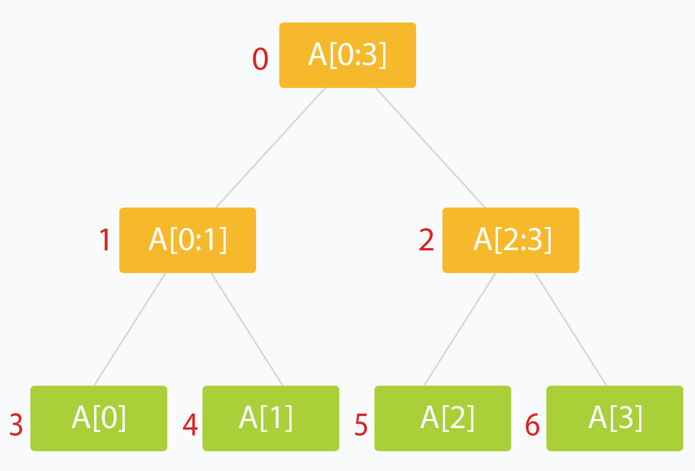
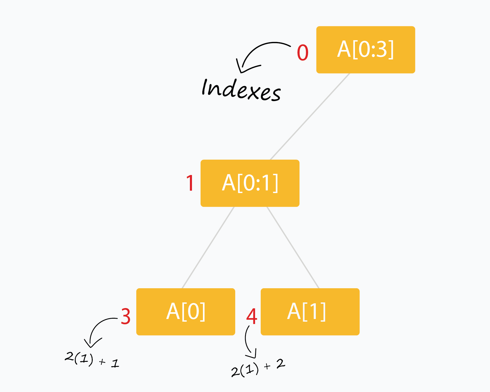
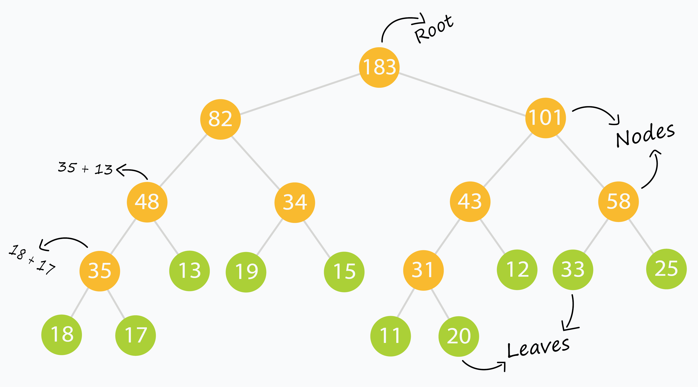
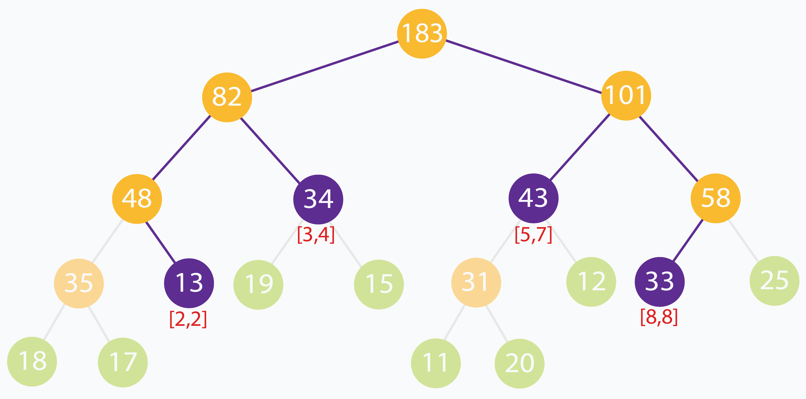
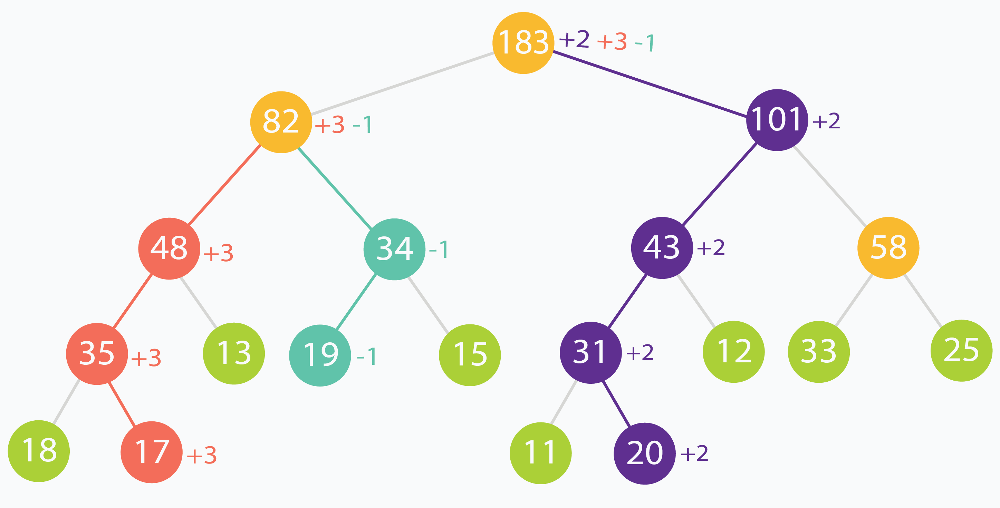
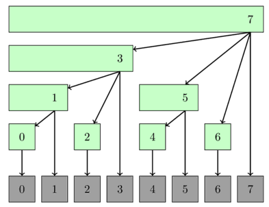

# Segment Trees

A segment tree is a binary tree data structure where each node represents a segment (interval) of an array. This structure allows us to efficiently answer range queries and perform updates.



## Why use Segment Trees?

Many problems require querying or updating values over a range, such as finding the sum or minimum in a subarray. Doing this naively can be slow, especially with many queries. Segment trees let us process these queries in $O(\log n)$ time.

Segment trees are widely used in computational geometry and [geographic information systems](https://en.wikipedia.org/wiki/Geographic_information_system). For example, they help answer range queries like finding all points within a certain distance from a reference point—this is called [Planar Range Searching](https://en.wikipedia.org/wiki/Range_searching). Segment trees are especially useful when the data changes frequently, such as in radar systems for air traffic control.

## How to build a Segment Tree

Suppose we have an array `arr[]` of size $n$:

1. The root node represents the entire range: `arr[0...n-1]`.
2. Each leaf node represents a single element: `arr[0]`, `arr[1]`, ..., `arr[n-1]`.
3. Each internal node stores a value (like sum or min) based on its children's intervals.
4. Each child node covers about half the range of its parent.

A segment tree for $n$ elements can be stored in an array of size about $4n$.

The structure is simple: a node at index $i$ has two children at indexes $(2i+1)$ and $(2i+2)$.



Segment trees are very intuitive and easy to use when built recursively.

## Recursive methods for Segment Trees

We will use the array tree[] to store the nodes of our segment tree (initialized to all zeros). The following scheme (0 - based indexing) is used:

The root of the tree is at index 0, so `tree[0]` is the root.

The children of `tree[i]` are stored at `tree[2*i+1]` and `tree[2*i+2]`.

We will pad our `arr[]` with extra 0 or null values so that `n` is a power of 2, that is, `n = 2^k` (where `n` is the final length of `arr[]` and `k` is a non-negative integer).

## 1. Build the tree from the original data.

```cpp
void buildSegTree(vector<int>& arr, int treeIndex, int lo, int hi)
{
    if (lo == hi) {                 // leaf node. store value in node.
        tree[treeIndex] = arr[lo];
        return;
    }

    int mid = lo + (hi - lo) / 2;   // recurse deeper for children.
    buildSegTree(arr, 2 * treeIndex + 1, lo, mid);
    buildSegTree(arr, 2 * treeIndex + 2, mid + 1, hi);

    // merge build results
    tree[treeIndex] = merge(tree[2 * treeIndex + 1], tree[2 * treeIndex + 2]);
}

// call this method as buildSegTree(arr, 0, 0, n-1);
// Here arr[] is input array and n is its size.
```

The method builds the entire `tree` in a bottom up fashion.

When the condition `lo == hi` is satisfied, we are left with a range comprising of just a single element (which happens to be `arr[lo]`). This constitutes a leaf of the tree.

The rest of the nodes are built by merging the results of their two children. `treeIndex` is the index of the current node of the segment tree which is being processed.



## 2. Read/Query on an interval or segment of the data

```cpp
int querySegTree(int treeIndex, int lo, int hi, int i, int j)
{
    // query for arr[i..j]

    if (lo > j || hi < i)               // segment completely outside range
        return 0;                       // represents a null node

    if (i <= lo && j >= hi)             // segment completely inside range
        return tree[treeIndex];

    int mid = lo + (hi - lo) / 2;       // partial overlap of current segment and queried range. Recurse deeper.

    if (i > mid)
        return querySegTree(2 * treeIndex + 2, mid + 1, hi, i, j);
    else if (j <= mid)
        return querySegTree(2 * treeIndex + 1, lo, mid, i, j);

    int leftQuery = querySegTree(2 * treeIndex + 1, lo, mid, i, mid);
    int rightQuery = querySegTree(2 * treeIndex + 2, mid + 1, hi, mid + 1, j);

    // merge query results
    return merge(leftQuery, rightQuery);
}

// call this method as querySegTree(0, 0, n-1, i, j);
// Here [i,j] is the range/interval you are querying.
// This method relies on "null" nodes being equivalent to storing zero.
```

The method returns a result when the queried range matches exactly with the range represented by a current node. Else it digs deeper into the tree to find nodes which match a portion of the node exactly.



## 3. Update the value of an element

```cpp
void updateValSegTree(int treeIndex, int lo, int hi, int arrIndex, int val)
{
    if (lo == hi) {                 // leaf node. update element.
        tree[treeIndex] = val;
        return;
    }

    int mid = lo + (hi - lo) / 2;   // recurse deeper for appropriate child

    if (arrIndex > mid)
        updateValSegTree(2 * treeIndex + 2, mid + 1, hi, arrIndex, val);
    else if (arrIndex <= mid)
        updateValSegTree(2 * treeIndex + 1, lo, mid, arrIndex, val);

    // merge updates
    tree[treeIndex] = merge(tree[2 * treeIndex + 1], tree[2 * treeIndex + 2]);
}

// call this method as updateValSegTree(0, 0, n-1, i, val);
// Here you want to update the value at index i with value val.
```

## Lazy Propagation

### Motivation

Till now we have been updating single elements only. That happens in logarithmic time and it's pretty efficient.

But what if we had to update a range of elements? By our current method, each of the elements would have to be updated independently, each incurring some run time cost.

The construction of a tree poses another issue called ancestral locality. Ancestors of adjacent leaves are guaranteed to be common at some levels of the tree. Updating each of these leaves individually would mean that we process their common ancestors multiple times. What if we could reduce this repetitive computation?



In the above example, the root is updated three times and the node numbered 82 is updated twice. This is because, at some level of the tree, the changes propagated from different leaves will meet.

A third kind of problem is when queried ranges do not contain frequently updated elements. We might be wasting valuable time updating nodes which are rarely going to be accessed/read.

Using Lazy Propagation allows us to overcome all of these problems by reducing wasteful computations and processing nodes on-demand.

### How do we use it?

As the name suggests, we update nodes lazily. In short, we try to postpone updating descendants of a node, until the descendants themselves need to be accessed.

For the purpose of applying it to the Range Sum Query problem, we assume that the update operation on a range, increments each element in the range by some amount val.

We use another array lazy[] which is the same size as our segment tree array tree[] to represent a lazy node. lazy[i] holds the amount by which the node tree[i] needs to be incremented, when that node is finally accessed or queried. When lazy[i] is zero, it means that node tree[i] is not lazy and has no pending updates.

### 1. Updating a range lazily

This is a three step process:

1. Normalize the current node. This is done by removing laziness. We simple increment the current node by appropriate amount to remove it's laziness. Then we mark its children to be lazy as the descendants haven't been processed yet.
2. Apply the current update operation to the current node if the current segment lies inside the update range.
3. Recurse for the children as you would normally to find appropriate segments to update.

```cpp
void updateLazySegTree(int treeIndex, int lo, int hi, int i, int j, int val)
{
    if (lazy[treeIndex] != 0) {                             // this node is lazy
        tree[treeIndex] += (hi - lo + 1) * lazy[treeIndex]; // normalize current node by removing laziness

        if (lo != hi) {                                     // update lazy[] for children nodes
            lazy[2 * treeIndex + 1] += lazy[treeIndex];
            lazy[2 * treeIndex + 2] += lazy[treeIndex];
        }

        lazy[treeIndex] = 0;                                // current node processed. No longer lazy
    }

    if (lo > hi || lo > j || hi < i)
        return;                                             // out of range. escape.

    if (i <= lo && hi <= j) {                               // segment is fully within update range
        tree[treeIndex] += (hi - lo + 1) * val;             // update segment

        if (lo != hi) {                                     // update lazy[] for children
            lazy[2 * treeIndex + 1] += val;
            lazy[2 * treeIndex + 2] += val;
        }

        return;
    }

    int mid = lo + (hi - lo) / 2;                             // recurse deeper for appropriate child

    updateLazySegTree(2 * treeIndex + 1, lo, mid, i, j, val);
    updateLazySegTree(2 * treeIndex + 2, mid + 1, hi, i, j, val);

    // merge updates
    tree[treeIndex] = tree[2 * treeIndex + 1] + tree[2 * treeIndex + 2];
}
// call this method as updateLazySegTree(0, 0, n-1, i, j, val);
// Here you want to update the range [i, j] with value val.
```

### 2. Querying a lazily propagated tree

This is a two step process:

1. Normalize the current node by removing laziness. This step is the same as the update step.
2. Recurse for the children as you would normally to find appropriate segments which fit in queried range.

```cpp
int queryLazySegTree(int treeIndex, int lo, int hi, int i, int j)
{
    // query for arr[i..j]

    if (lo > j || hi < i)                                   // segment completely outside range
        return 0;                                           // represents a null node

    if (lazy[treeIndex] != 0) {                             // this node is lazy
        tree[treeIndex] += (hi - lo + 1) * lazy[treeIndex]; // normalize current node by removing laziness

        if (lo != hi) {                                     // update lazy[] for children nodes
            lazy[2 * treeIndex + 1] += lazy[treeIndex];
            lazy[2 * treeIndex + 2] += lazy[treeIndex];
        }

        lazy[treeIndex] = 0;                                // current node processed. No longer lazy
    }

    if (i <= lo && j >= hi)                                 // segment completely inside range
        return tree[treeIndex];

    int mid = lo + (hi - lo) / 2;                           // partial overlap of current segment and queried range. Recurse deeper.

    if (i > mid)
        return queryLazySegTree(2 * treeIndex + 2, mid + 1, hi, i, j);
    else if (j <= mid)
        return queryLazySegTree(2 * treeIndex + 1, lo, mid, i, j);

    int leftQuery = queryLazySegTree(2 * treeIndex + 1, lo, mid, i, mid);
    int rightQuery = queryLazySegTree(2 * treeIndex + 2, mid + 1, hi, mid + 1, j);

    // merge query results
    return leftQuery + rightQuery;
}
// call this method as queryLazySegTree(0, 0, n-1, i, j);
// Here [i,j] is the range/interval you are querying.
// This method relies on "null" nodes being equivalent to storing zero.
```

## Fenwick Tree



Take index i = 12, which is 1100 in binary.

```note
i      =  1100   (12)
-i     =  0100   (Two’s complement)
-------------------
i & -i =  0100 = 4
```

This tells us:
bit[12] stores the sum of 4 elements, ending at index 12.
