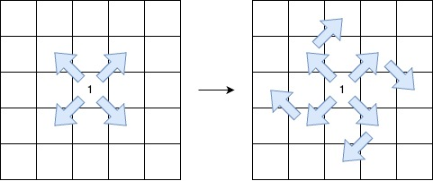
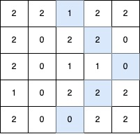
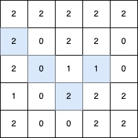
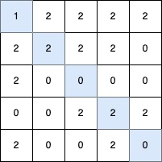

# 3459. Length of Longest V-Shaped Diagonal Segment

`Hard`

You are given a 2D integer matrix `grid` of size `n x m`, where each element is `0`, `1`, or `2`.

A **V-shaped diagonal segment** is defined as follows:

- The segment starts with a `1`.
- The subsequent elements follow this infinite sequence: `2, 0, 2, 0, ...`.
- The segment:
  - Proceeds along a diagonal direction (one of: top-left to bottom-right, bottom-right to top-left, top-right to bottom-left, or bottom-left to top-right).
  - Continues the sequence in the same diagonal direction.
  - Makes at most one clockwise 90-degree turn to another diagonal direction, while maintaining the sequence.



Return the length of the longest V-shaped diagonal segment. If no valid segment exists, return `0`.

---

## Examples

**Example 1:**

```note
Input: grid = [
  [2,2,1,2,2],
  [2,0,2,2,0],
  [2,0,1,1,0],
  [1,0,2,2,2],
  [2,0,0,2,2]
]
Output: 5
```



The longest V-shaped diagonal segment has length 5 and follows these coordinates:
`(0,2) → (1,3) → (2,4)`, takes a 90-degree clockwise turn at `(2,4)`, and continues as `(3,3) → (4,2)`.

---

**Example 2:**

```note
Input: grid = [
  [2,2,2,2,2],
  [2,0,2,2,0],
  [2,0,1,1,0],
  [1,0,2,2,2],
  [2,0,0,2,2]
]
Output: 4
```



The longest V-shaped diagonal segment has length 4 and follows these coordinates:
`(2,3) → (3,2)`, takes a 90-degree clockwise turn at `(3,2)`, and continues as `(2,1) → (1,0)`.

---

**Example 3:**

```note
Input: grid = [
  [1,2,2,2,2],
  [2,2,2,2,0],
  [2,0,0,0,0],
  [0,0,2,2,2],
  [2,0,0,2,0]
]
Output: 5
```



The longest V-shaped diagonal segment has length 5 and follows these coordinates:
`(0,0) → (1,1) → (2,2) → (3,3) → (4,4)`.

---

**Example 4:**

```note
Input: grid = [[1]]
Output: 1
```

The longest V-shaped diagonal segment has length 1 and follows coordinate `(0,0)`.

---

### Constraints

- `n == grid.length`
- `m == grid[i].length`
- `1 <= n, m <= 500`
- `grid[i][j]` is either `0`, `1`, or `2`.
