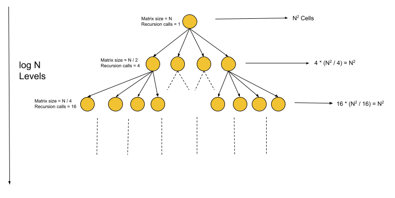

# Quad Tree Construction — Approach 1 (Recursion)

This summarizes the **recursive** approach for constructing a quad tree from an `N x N` binary grid (values `0/1`).

---

## Problem Core

Given a square matrix `grid`, build a **quad tree**:

- If a sub-square contains **all 0s** or **all 1s**, represent it as a **leaf** node.
- Otherwise, split into 4 equal quadrants and recursively build children:
  - topLeft, topRight, bottomLeft, bottomRight

A quad tree node typically includes:

- `val`: boolean value (meaningful mainly for leaves)
- `isLeaf`: boolean
- four child pointers

---

## Key Intuition

Represent the **current sub-square** using:

- `(x1, y1)` → the **top-left** corner
- `length` → the **side length** of the square

This representation is sufficient to derive all corners and to split into quadrants.

The algorithm follows the problem statement directly:

1. **Base condition**: If all values in the current square are the same → return leaf node.
2. **Recursive condition**: Otherwise, create an internal node and recursively build its 4 children.

---

## Quadrant Coordinates

For a square with top-left `(x1, y1)` and side `length`, define:

- `half = length / 2`

Quadrants:

1. **Top-Left**: `(x1, y1)`, size `half`
2. **Top-Right**: `(x1, y1 + half)`, size `half`
3. **Bottom-Left**: `(x1 + half, y1)`, size `half`
4. **Bottom-Right**: `(x1 + half, y1 + half)`, size `half`

---

## Algorithm (Step-by-step)

### Helper: Check if sub-square is uniform

- Iterate all cells inside the sub-square
- If any cell differs from `grid[x1][y1]`, it's **not uniform**

### Recursive builder `solve(grid, x1, y1, length)`

1. If uniform → return leaf node with that value.
2. Else:
   - create internal node `root`
   - recursively build four children with quadrant coordinates
   - attach children to `root`
   - return `root`

---

## Code Example (Java)

```java
/*
// Definition for a QuadTree node (typical LeetCode style).
class Node {
    public boolean val;
    public boolean isLeaf;
    public Node topLeft;
    public Node topRight;
    public Node bottomLeft;
    public Node bottomRight;

    public Node() {}

    public Node(boolean val, boolean isLeaf) {
        this.val = val;
        this.isLeaf = isLeaf;
    }

    public Node(boolean val, boolean isLeaf, Node topLeft, Node topRight,
                Node bottomLeft, Node bottomRight) {
        this.val = val;
        this.isLeaf = isLeaf;
        this.topLeft = topLeft;
        this.topRight = topRight;
        this.bottomLeft = bottomLeft;
        this.bottomRight = bottomRight;
    }
}
*/

class Solution {

    // Returns true if all values in the sub-square are identical.
    private boolean sameValue(int[][] grid, int x1, int y1, int length) {
        int v = grid[x1][y1];
        for (int i = x1; i < x1 + length; i++) {
            for (int j = y1; j < y1 + length; j++) {
                if (grid[i][j] != v) return false;
            }
        }
        return true;
    }

    private Node solve(int[][] grid, int x1, int y1, int length) {
        // Base case: uniform region -> leaf node
        if (sameValue(grid, x1, y1, length)) {
            return new Node(grid[x1][y1] == 1, true);
        }

        // Recursive case: split into 4 quadrants
        int half = length / 2;
        Node root = new Node(false, false);

        root.topLeft = solve(grid, x1, y1, half);
        root.topRight = solve(grid, x1, y1 + half, half);
        root.bottomLeft = solve(grid, x1 + half, y1, half);
        root.bottomRight = solve(grid, x1 + half, y1 + half, half);

        return root;
    }

    public Node construct(int[][] grid) {
        return solve(grid, 0, 0, grid.length);
    }
}
```

---

## Complexity Analysis

Let `N` be the side length of the matrix (`N x N`).

### Time Complexity: **O(N² log N)**

Reasoning:

- Depth of recursion: `log N` (side length halves each level until 1).
- At each level, across all subproblems, the total number of cells scanned
  by `sameValue(...)` sums up to `N²`.

So:

- `N²` work per level × `log N` levels → **O(N² log N)**

### Space Complexity: **O(log N)**

- Ignoring the output tree (standard convention),
- recursion depth is `log N`, so call stack is **O(log N)**.



---

## Notes / Practical Considerations

- This approach is easy to implement and reason about.
- The bottleneck is repeatedly scanning cells for uniformity (`sameValue`).
  Optimizations exist (prefix sums, preprocessing) that can reduce this
  in other approaches, but this recursion-first version matches the intended logic
  directly.
