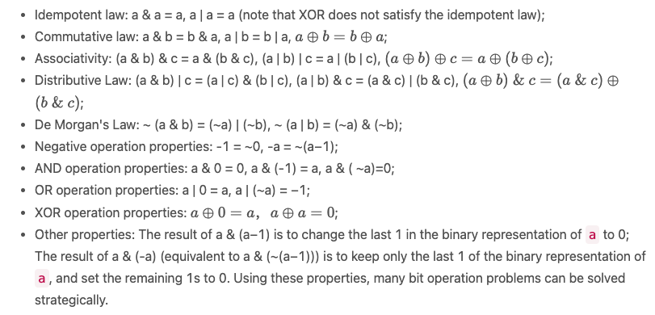

# Bit Manipulaton Concetps

## The original code, inverse code, and complement code

### Original code

The original code is the sign bit of the machine number plus the absolute value of the truth value of the machine number. The highest bit is the sign bit, and the remaining bits represent the value. Take 8-bit binary numbers as an example. The original code for +10 is 00001010, and the original code for −10 is 10001010. The maximum value represented by the original code of an 8-bit binary number is 01111111, which is +127 in decimal, and the minimum value is 11111111, which is −127 in decimal. Hence, the range of values represented by the original code of an 8-bit binary number is −127 to +127. The original code is the most straightforward representation to follow and calculate by the human brain.

### Inverse code

The inverse code is obtained from the original code. The inverse code of non-negative numbers is the same as the original code. The inverse of negative numbers is to flip every bit of the original code except the sign bit. Flip means changing 0 to 1 or changing 1 to 0 . Take 8-bit binary numbers as an example:

```note
The original code of +10 is 00001010 , and the inverse code is 00001010.
The original code of −10 is 10001010, and the inverse code is 11110101.
```

It is not intuitive to get the representation with inverse code directly, and it usually needs to be converted into the original code first to calculate its value.

### Complement code

The complement code is obtained from the inverse code. The complement code of non-negative numbers is the same as the original code and the inverse code. The complement of negative numbers is obtained by adding 1 to the inverse code. Take 8-bit binary numbers as an example. The original code of +10 is 00001010, the inverse code is 00001010, and the complement code is 00001010; The original code of −10 is 10001010, the inverse code is 11110101, and the complement code is 11110110 . It is not intuitive to get the representation with the complement code directly, and it usually needs to be converted into the original code to calculate its value.

### Representation in computer

So far, we have seen three representations of signed binary numbers in computers: original code, inverse code, and complement code. So, what are the advantages and disadvantages of these three representations? It is easy for the human brain to remember that the highest bit is the sign bit, but for a computer, finding the sign bit will make computations complicated. To simplify the calculations, people have developed a method to include the sign bit in calculations. The original code is the easiest way to follow and calculate by the human brain, but the original code has two problems:

- There are representations of +0 (the sign bit is 0 and the rest of the bits are 0) and −0 (the sign bit is 1, and the rest of the bits are 0). simultaneously. Both +0 and −0 can be viewed as the same number, but it isn’t meaningful to give a sign to 0 , and it will lead to two different original codes corresponding to 0.

- Performing subtractions with the original code will lead to incorrect results.

Introducing the inverse code solves the problem of subtraction errors, but the issue of dual representation of 0 remains. The complement code solves both the subtraction error and dual representation of 0 problem. Moreover, one more minimum value can be represented. In complement code, there is no −0. Taking an 8-bit binary number as an example, the complement code of 0 is 00000000, while 10000000 represents −128. −128 does not have any representation in the original code or the inverse code (the minimum value that can be represented by the original code and the inverse code with an 8-bit binary number is −127). Therefore, the complement code not only solves the problems of the original code and the inverse code, but can also represent one additional minimum value. Given these advantages of the complement code, the computer uses the complement code for calculations.

### Shift operation

The shift operation can be divided into the left shift and the right shift according to the shift direction and can be divided into arithmetic shift and logical shift according to whether it is signed.

The symbol for the left shift operation is <<. In a left shift operation, all binary bits are shifted to the left by several bits, the high bits are discarded, and the low bits are filled with 0. For left shift operations, arithmetic shift and logical shift are the same.

The symbol for the right shift operator is >>. In a right shift operation, all binary bits are shifted to the right by several bits, the low bits are discarded, and how the high bits get filled differs between arithmetic shift and logical shift:

- When shifting right arithmetically, the high bits are filled with the highest bit;

- When shifting right logically, the high bits are filled with 0.

The following example shows the results of shift operations. The numbers involved in the operations are all represented in signed 8-bit binary numbers.

The binary representation of 29 is 00011101. Left shift of 29 by 2 bits results in 116, and the corresponding binary representation is 01110100; Shifting 29 to the left by 3 bits results in −24, which corresponds to 11101000 in binary.

The binary representation of 50 is 00110010. The result of 1-bit right shift of 11 bits is 25, which corresponds to 00011001 in binary; Shifting 50 to the right by 2 bits is 12, which corresponds to 00001100. For non-negative numbers, the arithmetic right shift and logical right shift are identical.

The binary representation of −50 is 11001110. The result of an arithmetic right shift of −50 by 2 bits is −13, and the corresponding binary representation is 11110011; the result of a logical right shift of −50 by 2 bits is 51, and the corresponding binary representation is 00110011. Results of arithmetic right shift and logical right shift are different. Which one is the right shift operation used in computers?

In C/C++, there are both signed and unsigned data types, where signed types are declared using the keyword signed, and the unsigned types are declared using the keyword unsigned. When neither keyword is used, the default is a signed type. For signed types, the right shift operation is an arithmetic right shift; for unsigned types, the right shift operation is a logical right shift. In Java, there is no unsigned data type, integers are always represented as signed types, so it is necessary to distinguish between arithmetic right shift and logical right shift. In Java, the symbol for an arithmetic right shift is >>, and the symbol for a logical right shift is >>>.

### Properties of bitwise operations

Bit operations have many properties. Here, we will list common properties of AND, OR, XOR, and negation in bit operations. We assume that the variables below are all signed integers.



## State Compression via Bit Manipulation

### Definition of State Compression

State compression, as the name suggests, compresses the state of multiple values into a single number. Specifically, if there are n values, each with 2 possible states, the total number of possible states is 2^n . All possible combinations of the n states can be recorded with an n-bit binary number. For example, there are a total of n items, and each item corresponds to a value, which represents whether the item is taken or not. We can use an n-bit binary number to represent the state of each item. When n=5, we can assume the binary numbers from the lowest bit to the highest bit represent whether the 1st to the 5th item is taken or not, with 1 being taken, and 0 being not take. Then, 01011 ​ represents that items 1, 2, and 4 are taken, and items 3 and 5 are not taken.

### Application Scenarios for State Compression

If each value has 2 states, the total number of states corresponding to n values is 2^n . State compression only applies when n is small. In general, we may consider using state compression when n ≤ 20.

Although state compression only applies when the data range is small, simply using brute force solutions may still lead to too high time complexity. For instance, computing the same states repeatedly without memoization could exceed the required time limit. Therefore, state compression is commonly used in dynamic programming to avoid repeated calculations. Dynamic programming that uses state compression is called State Compression Dynamic Programming, and it is among the most challenging type of problems in dynamic programming. The three elements of dynamic programming are state definition, state transfer function, and base cases. Among them, state definition and state transfer function are the most difficult parts in solving.
