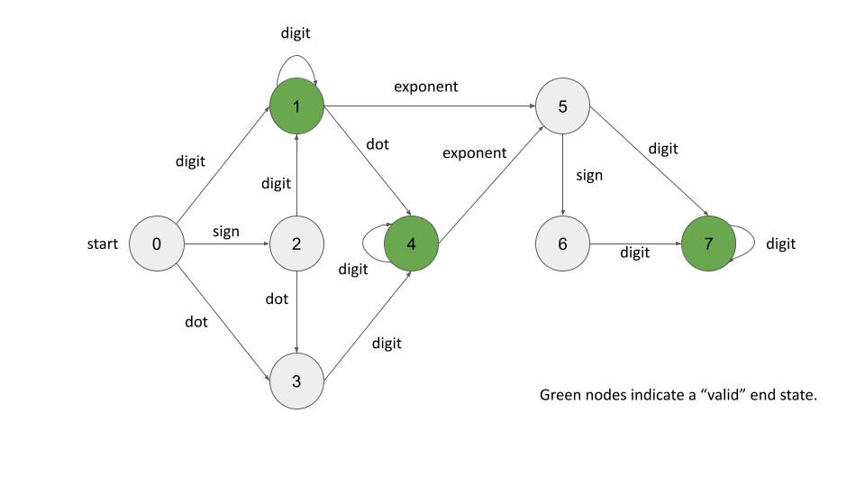

# Deterministic Finite Automata

DFAs share a lot of similarities with the trie data structure. Recall that a trie is used to represent a dictionary of words, in a space-efficient manner. To check whether or not a word is in the dictionary, we would simultaneously traverse through the word and the trie. If we end at a node that is marked as a valid end-point, then we would return true. Otherwise, if we get "stuck", or end at a node that is not an end-point, we would return false. It's the same for a DFA: we start at a "root" node, and then check each character one by one, checking whether or not there is a valid transition we can make.

There are a few key differences between DFA's and tries, so keep these in mind while reading through the remainder of this section.

1. While a trie can only represent a finite number of strings (the given dictionary), a DFA can represent an infinite number of different strings.
2. While a trie can only move down the implicit tree, a DFA can essentially "loopback" to a higher level, or stay on the same level, or even the same node.
3. A trie is a type of tree, and a DFA is a type of directed graph.

Other than that, you can lean on your existing knowledge of tries to wrap your head around this new data structure.

The first step is to design our DFA. Picture the DFA as a directed graph, where each node is a state, and each edge is a transition labeled with a character group (digit, exponent, sign, or dot). There are two key steps to designing it.

1. Identify all valid combinations that the aforementioned boolean variables can be in. Each combination is a state. Draw a circle for each state, and label what it means.
2. For each state, consider what a character from each group would mean in the context of that state. Each group will either cause a transition into another state, or it will signify that the string is invalid. For each valid transition, draw a directed arrow between the two states and write the group next to the arrow.

