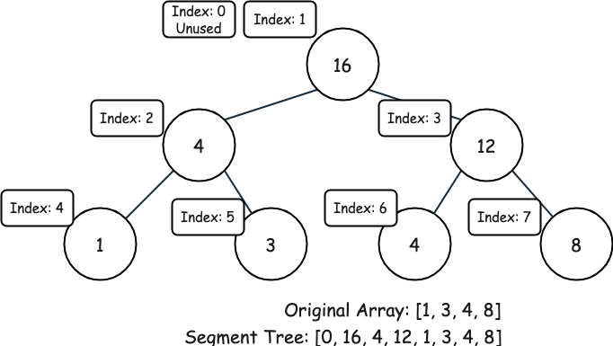
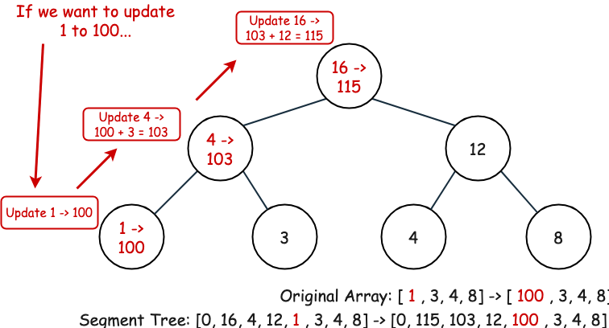
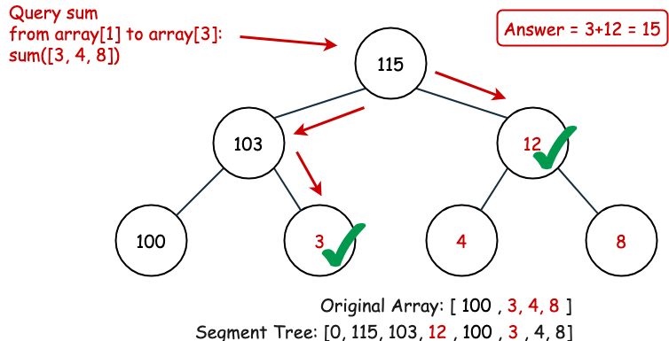
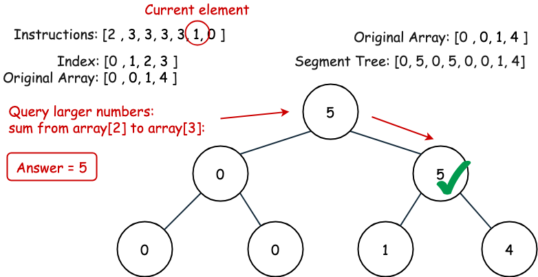
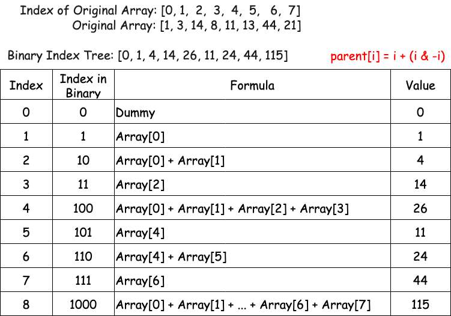
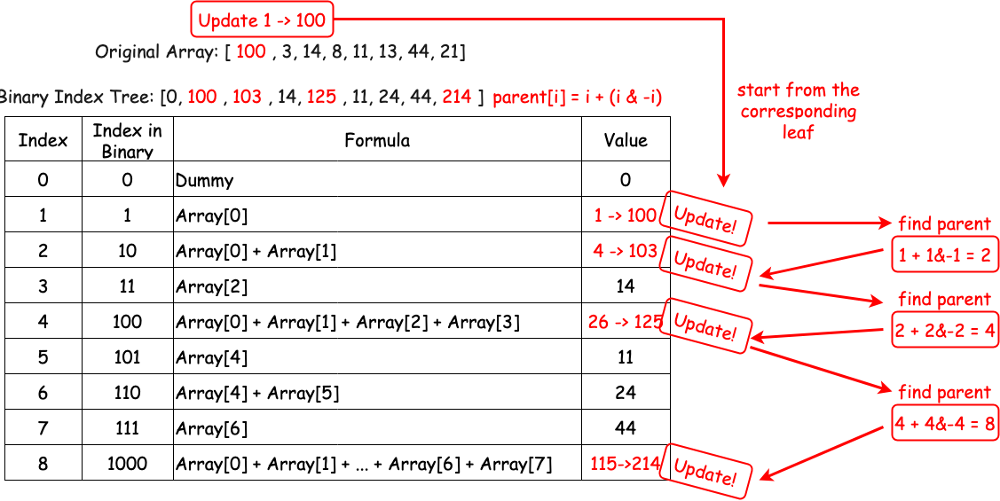
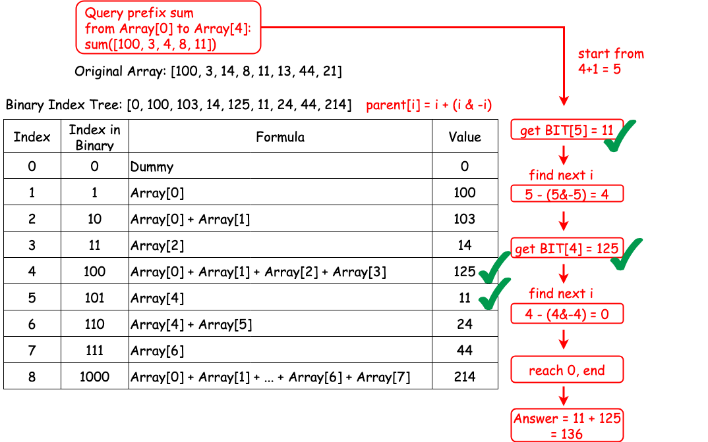
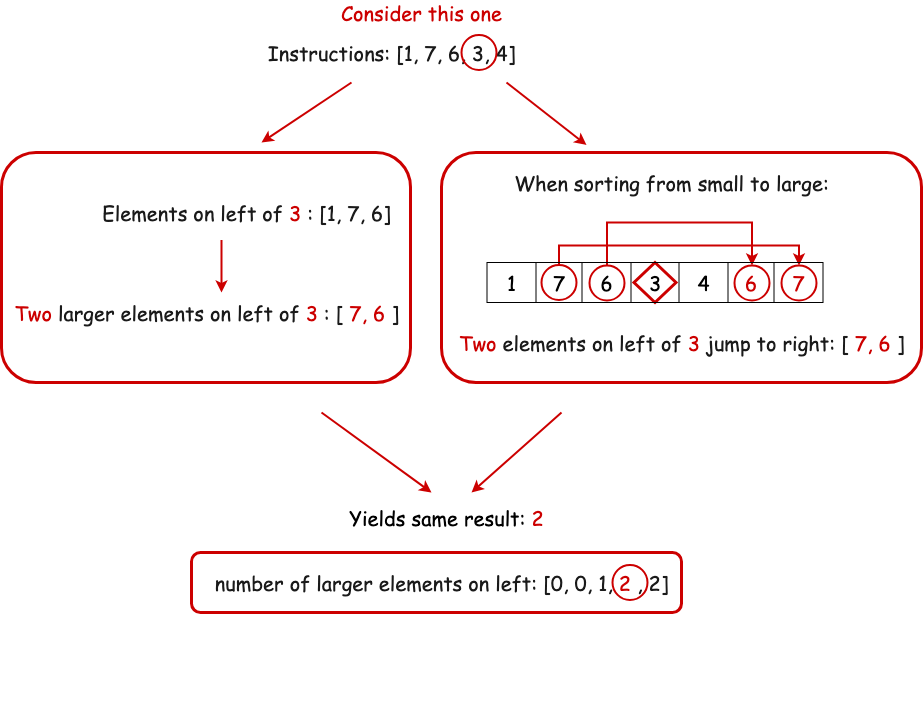

# Create Sorted Array Through Instructions — Detailed Approaches

## Overview

The problem is straightforward. We need to obtain the cost of inserting each element in sorted order and return the total cost.

How to determine the cost?

According to the description, we need to find:

- The number of elements on the left side **strictly less** than the current element.
- The number of elements on the left side **strictly greater** than the current element.

A natural idea is to maintain a **sorted array** and search using **Binary Search**. However, array insertion takes **O(M)** where `M` is the array size, which is too slow.

We need faster data structures.

Luckily, there are two helpful structures:

- **Segment Tree**
- **Binary Indexed Tree (Fenwick Tree)**

Additionally, a modified **Merge Sort** solution also works.

In this document we discuss:

1. Segment Tree
2. Binary Indexed Tree (BIT)
3. Merge Sort

At the end, some additional interesting approaches are also discussed.

---

# Approach 1: Segment Tree



## Intuition

Segment Tree is a data structure used for storing information about intervals.

Given size `M`, this structure supports:

- **Query interval sum**
- **Update element values**

Both in **O(log M)** time.

A segment tree is typically stored in an array.

If `m` is the size of the original array:

- nodes `m` to `2m−1` store the original values
- other nodes store the sum of their children

Left child of node `i` → `2*i`
Right child → `2*i+1`

---



## Using Segment Tree for This Problem

We maintain a **frequency bucket** of values.

Then:

- Query `[0, x)` → number of elements smaller than `x`
- Query `(x, max]` → number of elements larger than `x`

Example:

```
instructions = [2,3,3,3,3,1,0]
```

When processing value `1`, the larger elements are those in range `[2,3]`.





---

## Algorithm

1. Build a segment tree initialized with zeros.
2. Iterate over `instructions`.
3. For each element:
   - Query count of smaller elements.
   - Query count of larger elements.
   - Add `min(leftCost, rightCost)` to total cost.
   - Update the tree with the current value.

4. Return total cost modulo `10^9 + 7`.

---

## Java Implementation

```java
class Solution {
    public int createSortedArray(int[] instructions) {
        int m = (int)1e5 + 1;
        int[] tree = new int[m * 2];

        long cost = 0;
        long MOD = (int)1e9 + 7;

        for (int x : instructions) {
            cost += Math.min(query(0, x, tree, m), query(x + 1, m, tree, m));
            update(x, 1, tree, m);
        }

        return (int)(cost % MOD);
    }

    private void update(int index, int value, int[] tree, int m) {
        index += m;
        tree[index] += value;

        for (index >>= 1; index > 0; index >>= 1)
            tree[index] = tree[index << 1] + tree[(index << 1) + 1];
    }

    private int query(int left, int right, int[] tree, int m) {
        int result = 0;

        for (left += m, right += m; left < right; left >>= 1, right >>= 1) {
            if ((left & 1) == 1)
                result += tree[left++];
            if ((right & 1) == 1)
                result += tree[--right];
        }

        return result;
    }
}
```

---

## Complexity Analysis

Let:

```
N = instructions length
M = maximum value
```

### Time Complexity

```
O(N log M)
```

### Space Complexity

```
O(M)
```

---

# Approach 2: Binary Indexed Tree (Fenwick Tree)

## Intuition

Binary Indexed Tree maintains **prefix sums** efficiently.

Compared with Segment Tree:

| Feature     | BIT             | Segment Tree    |
| ----------- | --------------- | --------------- |
| Space       | smaller         | larger          |
| Speed       | slightly faster | slightly slower |
| Flexibility | limited         | very flexible   |

BIT supports:

- Update value
- Query prefix sum

Both in **O(log M)**.

---

## BIT Structure



Parent relationship:

```
parent(i) = i + (i & -i)
```

The expression `(i & -i)` extracts the lowest set bit.

Example:

```
6 = 110
6 & -6 = 2
```

---

## Querying Prefix Sum



To compute prefix sum up to `i`:

```
sum += BIT[i]
i -= i & -i
```

Repeat until `i == 0`.

---

## Using BIT for This Problem



For each instruction value `x`:

```
leftCost  = query(x-1)
rightCost = i - query(x)
```

Then:

```
cost += min(leftCost, rightCost)
```

Finally update:

```
update(x)
```

---

## Java Implementation

```java
class Solution {
    public int createSortedArray(int[] instructions) {
        int m = 100002;
        int[] bit = new int[m];

        long cost = 0;
        long MOD = 1000000007;

        for (int i = 0; i < instructions.length; i++) {
            int leftCost = query(instructions[i] - 1, bit);
            int rightCost = i - query(instructions[i], bit);

            cost += Math.min(leftCost, rightCost);
            update(instructions[i], 1, bit, m);
        }

        return (int)(cost % MOD);
    }

    private void update(int index, int value, int[] bit, int m) {
        index++;

        while (index < m) {
            bit[index] += value;
            index += index & -index;
        }
    }

    private int query(int index, int[] bit) {
        index++;
        int result = 0;

        while (index >= 1) {
            result += bit[index];
            index -= index & -index;
        }

        return result;
    }
}
```

---

## Complexity Analysis

```
Time:  O(N log M)
Space: O(M)
```

---

# Approach 3: Merge Sort

## Intuition



This problem is related to:

```
Count of Smaller Numbers After Self
```

Observation:

During sorting, **larger elements on the left "jump" past smaller elements on the right**.

We can record these jumps.

Merge Sort naturally exposes these relationships.

We perform:

- one merge sort to count **larger elements on the left**
- one merge sort to count **smaller elements on the left**

Finally compute:

```
cost += min(smaller[i], larger[i])
```

---

## Java Implementation

```java
class Solution {
    int[] smaller;
    int[] larger;
    int[][] temp;

    public int createSortedArray(int[] instructions) {
        int n = instructions.length;

        smaller = new int[n];
        larger = new int[n];
        temp = new int[n][];

        long cost = 0;
        long MOD = 1000000007;

        int[][] arrSmaller = new int[n][];
        int[][] arrLarger = new int[n][];

        for (int i = 0; i < n; i++) {
            arrSmaller[i] = new int[]{instructions[i], i};
            arrLarger[i] = new int[]{instructions[i], i};
        }

        sortSmaller(arrSmaller, 0, n-1);
        sortLarger(arrLarger, 0, n-1);

        for (int i = 0; i < n; i++)
            cost += Math.min(smaller[i], larger[i]);

        return (int)(cost % MOD);
    }

    private void sortSmaller(int[][] arr, int left, int right) {
        if (left == right) return;

        int mid = (left + right) / 2;

        sortSmaller(arr, left, mid);
        sortSmaller(arr, mid+1, right);

        mergeSmaller(arr, left, right, mid);
    }

    private void mergeSmaller(int[][] arr, int left, int right, int mid) {
        int i = left;
        int j = mid + 1;
        int k = left;

        while (i <= mid && j <= right) {
            if (arr[i][0] < arr[j][0]) {
                temp[k++] = arr[i++];
            } else {
                temp[k++] = arr[j];
                smaller[arr[j][1]] += i - left;
                j++;
            }
        }

        while (i <= mid) temp[k++] = arr[i++];

        while (j <= right) {
            temp[k++] = arr[j];
            smaller[arr[j][1]] += i - left;
            j++;
        }

        for (i = left; i <= right; i++)
            arr[i] = temp[i];
    }

    private void sortLarger(int[][] arr, int left, int right) {
        if (left == right) return;

        int mid = (left + right) / 2;

        sortLarger(arr, left, mid);
        sortLarger(arr, mid+1, right);

        mergeLarger(arr, left, right, mid);
    }

    private void mergeLarger(int[][] arr, int left, int right, int mid) {
        int i = left;
        int j = mid + 1;
        int k = left;

        while (i <= mid && j <= right) {
            if (arr[i][0] <= arr[j][0]) {
                temp[k++] = arr[i++];
            } else {
                temp[k++] = arr[j];
                larger[arr[j][1]] += mid - i + 1;
                j++;
            }
        }

        while (i <= mid) temp[k++] = arr[i++];
        while (j <= right) temp[k++] = arr[j++];

        for (i = left; i <= right; i++)
            arr[i] = temp[i];
    }
}
```

---

## Complexity Analysis

```
Time:  O(N log N)
Space: O(N)
```

---

# Extra Approaches

## 1. Order Statistic Tree

Segment Tree and BIT essentially implement an **Order Statistic Tree interface**.

Other implementations exist but are rarely used in interviews.

---

## 2. Python O(N²) Approach Using Bisect

Python's `bisect` sometimes works due to fast C implementations.

```python
class Solution:
    def createSortedArray(self, instructions):
        from bisect import bisect_left, bisect_right, insort

        MOD = 10**9 + 7
        arr = []
        cost = 0

        for x in instructions:
            left = bisect_left(arr, x)
            right = len(arr) - bisect_right(arr, x)

            cost += min(left, right)
            insort(arr, x)
            cost %= MOD

        return cost
```

---

## 3. SortedContainers Library

Using `SortedList`:

```python
from sortedcontainers import SortedList

class Solution:
    def createSortedArray(self, instructions):
        MOD = 10**9 + 7
        sl = SortedList()
        cost = 0

        for i,x in enumerate(instructions):
            left = sl.bisect_left(x)
            right = i - sl.bisect_right(x)

            cost += min(left, right)
            sl.add(x)

        return cost % MOD
```

---

## 4. Sqrt Decomposition (Theoretical)

Split the list into √N blocks.

Insertion cost becomes **O(√N)**.

Overall complexity:

```
O(N√N)
```

However this is too slow for the problem constraints.

---

# Final Recommendation

For interviews and competitive programming:

```
Best Solution → Binary Indexed Tree
```

because it provides:

- O(N log M)
- simple implementation
- minimal memory
