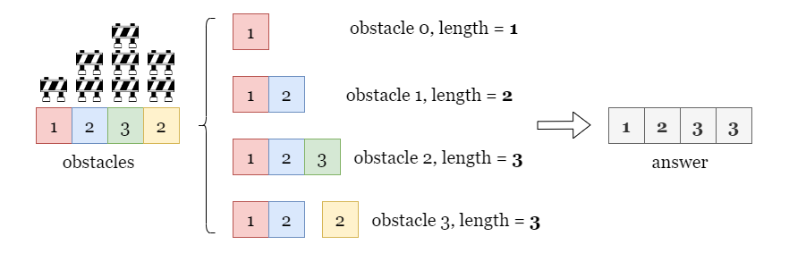
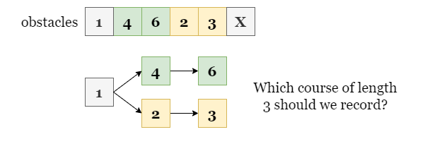
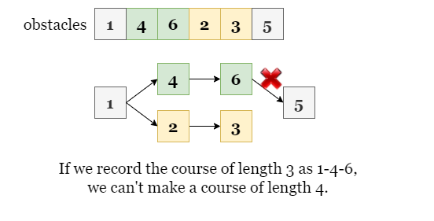
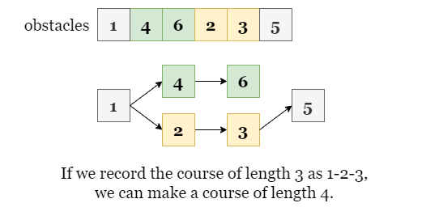
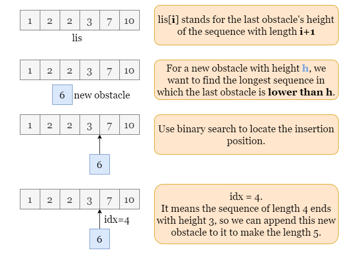
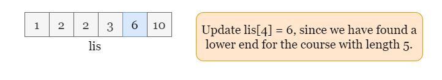

# Longest Valid Obstacle Course at Each Position — Greedy + Binary Search

## Overview

Consider the example with 4 obstacles.

The longest course ending at each index:

- obstacles[0] → `[1]` → length **1**
- obstacles[1] → `[1,2]` → length **2**
- obstacles[2] → `[1,2,3]` → length **3**
- obstacles[3] → `[1,2,2]` → length **3**

The sequence must be **non‑decreasing**, therefore `[1,2,3,2]` cannot include `3` before `2`.

So the answer becomes:

```
[1, 2, 3, 3]
```

We must compute:

```
answer[i] = length of longest valid obstacle course ending at obstacles[i]
```



---

# Approach: Greedy + Binary Search

## Intuition

This problem is closely related to the classic **Longest Increasing Subsequence (LIS)** problem.

However, here the sequence is **non‑decreasing** rather than strictly increasing.

The longest course ending at index `i` depends on:

1. The obstacle `obstacles[i]`
2. The longest previous course whose last obstacle height ≤ `obstacles[i]`

Thus:

```
longest[i] = 1 + longest valid course ending before i
             whose last value ≤ obstacles[i]
```

---

# Key Insight

Many sequences may have the same length.

Example:

```
1 → 4 → 6
1 → 2 → 3
```



Suppose the next obstacle is `5`.

- If we keep `[1,4,6]`, we **cannot append 5**.
- If we keep `[1,2,3]`, we **can append 5**.



Therefore:

> We should always keep the sequence with the **smallest ending value**.

We do not need the entire sequence — only the **ending height**.



---

# LIS Representation





We maintain an array:

```
lis[i]
```

Where:

```
lis[i] = smallest ending obstacle height for a course of length i+1
```

Example:

```
lis = [1,2,3,6,7]
```

means:

| Length | Minimum Ending Height |
| ------ | --------------------- |
| 1      | 1                     |
| 2      | 2                     |
| 3      | 3                     |
| 4      | 6                     |
| 5      | 7                     |

---

# Binary Search Step

Suppose:

```
height = 6
```

We search the **rightmost position ≤ 6** in `lis`.

This gives the length of the longest course we can extend.

Example:

```
lis = [1,2,3,6,7]
height = 6
```

Binary search result:

```
idx = 4
```

Meaning we can create a sequence of length:

```
idx + 1 = 5
```

Then update:

```
lis[4] = 6
```

Now the smallest ending height for length 5 becomes `6`.

---

# Algorithm

1. Initialize:
   - `lis` array
   - `answer` array

2. Iterate through `obstacles`

3. For each obstacle:
   - Binary search to find **rightmost position ≤ height**
   - If position equals `lisLength` → append
   - Otherwise → replace

4. Store:

```
answer[i] = position + 1
```

5. Return `answer`.

---

# Java Implementation

```java
class Solution {

    private int bisectRight(int[] A, int target, int right) {
        if (right == 0) return 0;

        int left = 0;

        while (left < right) {
            int mid = left + (right - left) / 2;

            if (A[mid] <= target)
                left = mid + 1;
            else
                right = mid;
        }

        return left;
    }

    public int[] longestObstacleCourseAtEachPosition(int[] obstacles) {

        int n = obstacles.length;
        int lisLength = 0;

        int[] answer = new int[n];
        int[] lis = new int[n];

        for (int i = 0; i < n; i++) {

            int height = obstacles[i];

            int idx = bisectRight(lis, height, lisLength);

            if (idx == lisLength)
                lisLength++;

            lis[idx] = height;

            answer[i] = idx + 1;
        }

        return answer;
    }
}
```

---

# Complexity Analysis

Let:

```
n = number of obstacles
```

### Time Complexity

```
O(n log n)
```

Explanation:

- Each obstacle performs one **binary search**
- Binary search cost = `log n`
- Total operations = `n`

Thus:

```
O(n log n)
```

---

### Space Complexity

```
O(n)
```

Because we maintain:

- `lis` array
- `answer` array

Both of size `n`.

---

# Final Insight

This problem is essentially:

```
Longest Non‑Decreasing Subsequence ending at each index
```

The optimal solution uses:

```
Greedy + Binary Search (LIS technique)
```

Key idea:

> Always maintain the **smallest possible ending height** for sequences of each length.
