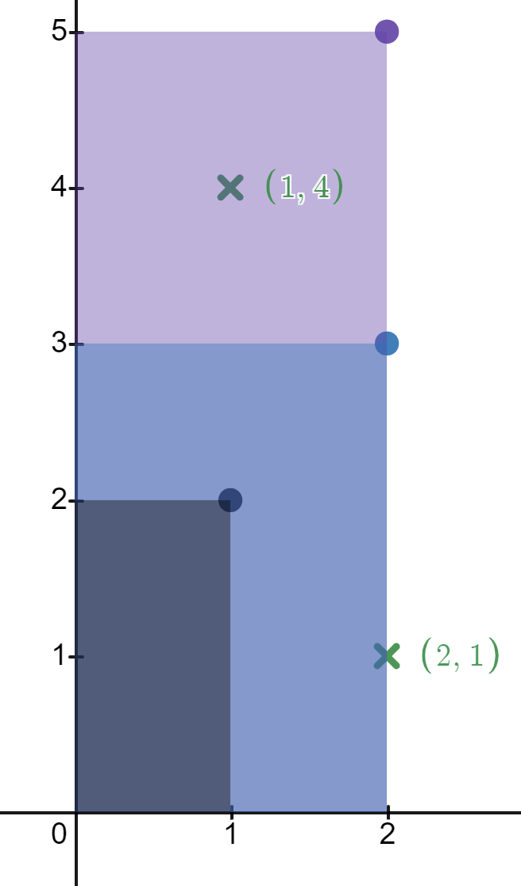
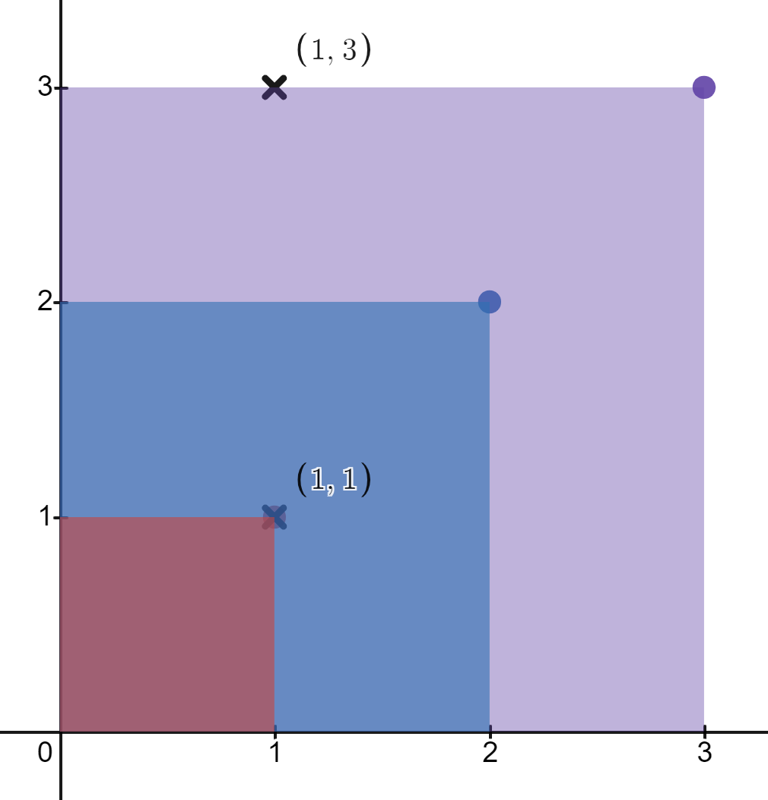

# 2250. Count Number of Rectangles Containing Each Point

## Problem Statement

You are given a 2D integer array `rectangles` where:

```
rectangles[i] = [li, hi]
```

represents a rectangle with:

- bottom-left corner at `(0, 0)`
- top-right corner at `(li, hi)`

You are also given a 2D integer array `points` where:

```
points[j] = [xj, yj]
```

represents a point at coordinates `(xj, yj)`.

For each point, determine **how many rectangles contain that point**.

A rectangle contains a point if:

```
0 <= xj <= li
0 <= yj <= hi
```

Points on the **edges of the rectangle** are considered inside.

Return an integer array `count` such that:

```
count[j] = number of rectangles that contain points[j]
```

---

# Example 1



## Input

```
rectangles = [[1,2],[2,3],[2,5]]
points = [[2,1],[1,4]]
```

## Output

```
[2,1]
```

## Explanation

Rectangles:

```
[1,2]
[2,3]
[2,5]
```

Points:

```
(2,1)
(1,4)
```

- Rectangle `[1,2]` contains no points.
- Rectangle `[2,3]` contains `(2,1)`.
- Rectangle `[2,5]` contains `(2,1)` and `(1,4)`.

Thus:

```
point (2,1) → 2 rectangles
point (1,4) → 1 rectangle
```

Result:

```
[2,1]
```

---

# Example 2



## Input

```
rectangles = [[1,1],[2,2],[3,3]]
points = [[1,3],[1,1]]
```

## Output

```
[1,3]
```

## Explanation

Rectangles:

```
[1,1]
[2,2]
[3,3]
```

Points:

```
(1,3)
(1,1)
```

- Rectangle `[1,1]` contains `(1,1)`.
- Rectangle `[2,2]` contains `(1,1)`.
- Rectangle `[3,3]` contains `(1,3)` and `(1,1)`.

Thus:

```
point (1,3) → 1 rectangle
point (1,1) → 3 rectangles
```

Result:

```
[1,3]
```

---

# Constraints

```
1 <= rectangles.length, points.length <= 5 * 10^4
rectangles[i].length == points[j].length == 2
1 <= li, xj <= 10^9
1 <= hi, yj <= 100
All rectangles are unique
All points are unique
```
