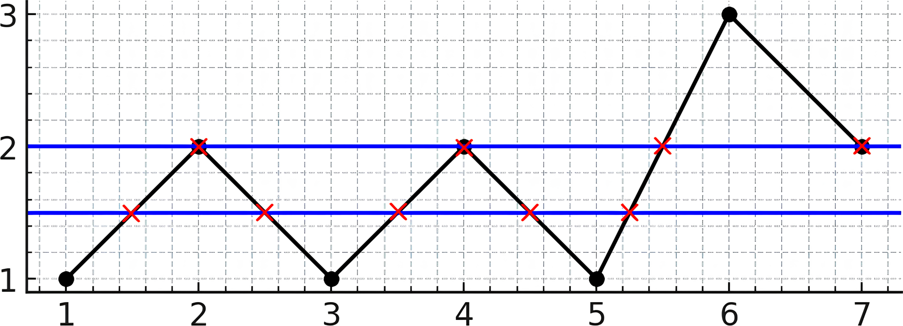
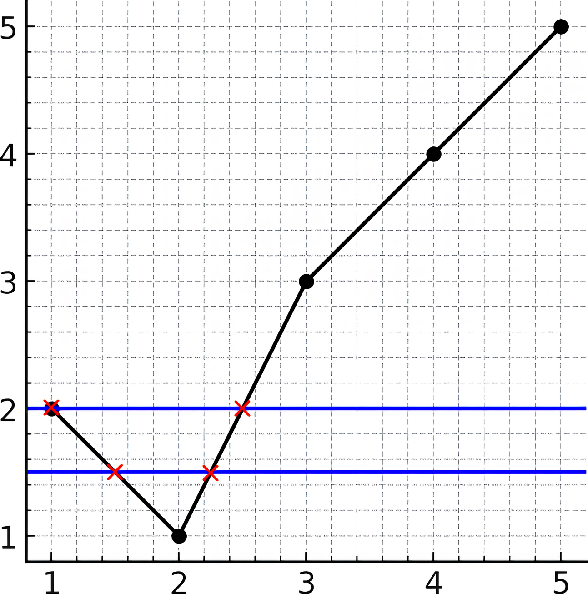

# 3009. Maximum Number of Intersections on the Chart

## Problem Statement

There is a line chart consisting of **n points** connected by line segments.

You are given a **1-indexed integer array** `y`.

The **k-th point** has coordinates:

```
(k, y[k])
```

Adjacent points are connected with straight line segments.

Important constraint:

```
No horizontal segments exist.
y[i] != y[i+1]
```

We can draw an **infinitely long horizontal line**.

Your task is to determine the **maximum number of intersections** between this horizontal line and the chart.

Return the **maximum possible number of intersection points**.

---

# Example 1



## Input

```
y = [1,2,1,2,1,3,2]
```

## Output

```
5
```

## Explanation

The horizontal line:

```
y = 1.5
```

intersects the chart **5 times**.

Another example line:

```
y = 2
```

intersects the chart **4 times**.

It can be shown that **no horizontal line intersects more than 5 times**, so the answer is:

```
5
```

---

# Example 2



## Input

```
y = [2,1,3,4,5]
```

## Output

```
2
```

## Explanation

The horizontal line:

```
y = 1.5
```

intersects the chart **2 times**.

Another horizontal line:

```
y = 2
```

also intersects **2 times**.

Thus the maximum number of intersections is:

```
2
```

---

# Constraints

```
2 <= y.length <= 10^5
1 <= y[i] <= 10^9

y[i] != y[i+1]
```
