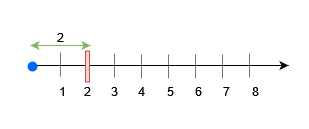
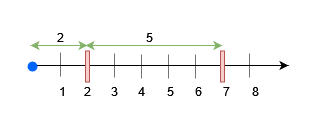

# 3161. Block Placement Queries

## Problem Statement

There exists an **infinite number line** starting at `0` and extending toward the positive x‑axis.

You are given a **2D array `queries`** containing two types of queries.

### Query Types

#### Type 1 — Build Obstacle

```
queries[i] = [1, x]
```

Build an **obstacle** at position `x` on the number line.

It is guaranteed that **no obstacle already exists** at position `x` when the query is asked.

---

#### Type 2 — Block Placement Check

```
queries[i] = [2, x, sz]
```

Check whether it is possible to place a **block of size `sz`** somewhere in the interval:

```
[0, x]
```

Conditions:

- The entire block must lie inside `[0, x]`
- The block **cannot intersect any obstacle**
- The block **may touch obstacles**
- The block is **not actually placed** — queries are independent checks

---

## Output

Return a boolean array `results`.

For each **type‑2 query**, append:

```
true  → block can be placed
false → block cannot be placed
```

Queries of type‑1 do **not** produce output.

---

# Example 1



### Input

```
queries = [[1,2],[2,3,3],[2,3,1],[2,2,2]]
```

### Output

```
[false,true,true]
```

### Explanation

1. Query `[1,2]`
   → Place obstacle at `x = 2`

2. Query `[2,3,3]`
   → Maximum free segment in `[0,3]` is length `2`
   → Block size `3` cannot fit
   → `false`

3. Query `[2,3,1]`
   → Block size `1` fits
   → `true`

4. Query `[2,2,2]`
   → Free segment `[0,2]` length = `2`
   → Block size `2` fits
   → `true`

---

# Example 2



### Input

```
queries = [[1,7],[2,7,6],[1,2],[2,7,5],[2,7,6]]
```

### Output

```
[true,true,false]
```

### Explanation

1. `[1,7]` → obstacle at `7`

2. `[2,7,6]`
   Free segment `[0,7]` length `7`
   Block size `6` fits → `true`

3. `[1,2]` → obstacle at `2`

4. `[2,7,5]`
   Largest free segment `[2,7]` length `5`
   Block size `5` fits → `true`

5. `[2,7,6]`
   Largest free segment `[2,7]` length `5`
   Block size `6` does not fit → `false`

---

# Constraints

```
1 ≤ queries.length ≤ 150000
2 ≤ queries[i].length ≤ 3
1 ≤ queries[i][0] ≤ 2
1 ≤ x, sz ≤ min(5 * 10^4, 3 * queries.length)
```

Additional guarantees:

- For type‑1 queries, there is **no existing obstacle at x**
- There is **at least one type‑2 query**
