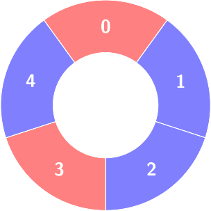
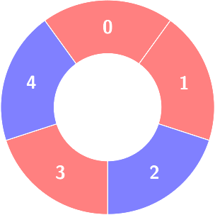
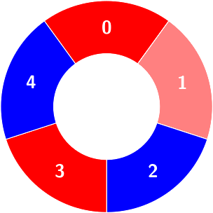
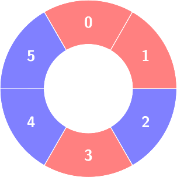
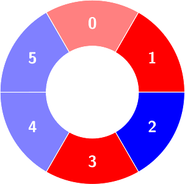

# 3245. Alternating Groups III

## Problem Statement

There are **red and blue tiles arranged in a circle**.

You are given:

- An integer array `colors`
- A 2D array `queries`

### Tile Colors

```
colors[i] == 0  → tile i is red
colors[i] == 1  → tile i is blue
```

Because the tiles form a **circle**, the **first and last tiles are adjacent**.

---

# Alternating Group Definition

An **alternating group** is a **contiguous subset of tiles** where colors strictly alternate.

That means for every internal tile in the group:

```
colors[i] != colors[i-1]
colors[i] != colors[i+1]
```

In other words:

```
0,1,0,1,0...
or
1,0,1,0,1...
```

---

# Queries

You must process two types of queries.

### Type 1 — Count Alternating Groups

```
queries[i] = [1, size]
```

Return the **number of alternating groups of length `size`**.

---

### Type 2 — Update Tile Color

```
queries[i] = [2, index, color]
```

Update the color of the tile:

```
colors[index] = color
```

---

# Output

Return an array containing the answers to **all type‑1 queries** in order.

---

# Example 1

### Input

```
colors = [0,1,1,0,1]
queries = [[2,1,0],[1,4]]
```

### Output

```
[2]
```

### Explanation

Query 1:




```
colors[1] = 0
```

New array:

```
[0,0,1,0,1]
```

Query 2:



Count alternating groups of size `4`.

There are **2 such groups** in the circular arrangement.

---

# Example 2

### Input

```
colors = [0,0,1,0,1,1]
queries = [[1,3],[2,3,0],[1,5]]
```

### Output

```
[2,0]
```

### Explanation



Query 1:

Count alternating groups of size `3` → **2 groups**.

Query 2:

```
colors[3] = 0
```

No actual change occurs.



Query 3:

No alternating group of size `5` exists.

Result → **0**.

---

# Constraints

```
4 <= colors.length <= 5 * 10^4
0 <= colors[i] <= 1
1 <= queries.length <= 5 * 10^4
```

Query types:

```
queries[i][0] == 1 or 2
```

For **type‑1 queries**:

```
queries[i].length == 2
3 <= size <= colors.length - 1
```

For **type‑2 queries**:

```
queries[i].length == 3
0 <= index <= colors.length - 1
0 <= color <= 1
```
