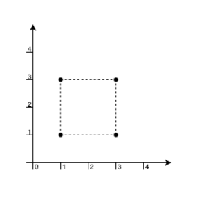
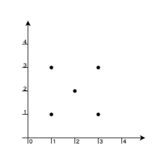
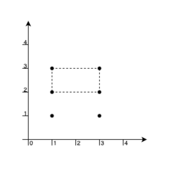

# 3380. Maximum Area Rectangle With Point Constraints I

## Problem

You are given an array `points` where:

```
points[i] = [xi, yi]
```

represents the coordinates of a point on an infinite plane.

Your task is to find the **maximum area of a rectangle** that satisfies the following conditions:

- The rectangle must be formed using **four of the given points as its corners**.
- The rectangle must have **edges parallel to the coordinate axes**.
- The rectangle must **not contain any other point inside or on its border**.

Return the **maximum possible area** of such a rectangle.

If no valid rectangle exists, return:

```
-1
```

---

# Example 1



## Input

```
points = [[1,1],[1,3],[3,1],[3,3]]
```

## Output

```
4
```

## Explanation

The four points form a rectangle:

```
(1,1) ---- (3,1)
  |          |
  |          |
(1,3) ---- (3,3)
```

Width:

```
3 - 1 = 2
```

Height:

```
3 - 1 = 2
```

Area:

```
2 * 2 = 4
```

No other point lies inside or on the border.

So the answer is:

```
4
```

---

# Example 2



## Input

```
points = [[1,1],[1,3],[3,1],[3,3],[2,2]]
```

## Output

```
-1
```

## Explanation

The only possible rectangle uses the points:

```
[1,1], [1,3], [3,1], [3,3]
```

However, the point:

```
[2,2]
```

lies **inside the rectangle**, which violates the constraint.

Therefore no valid rectangle exists.

Return:

```
-1
```

---

# Example 3



## Input

```
points = [[1,1],[1,3],[3,1],[3,3],[1,2],[3,2]]
```

## Output

```
2
```

## Explanation

Possible valid rectangles:

### Rectangle 1

Corners:

```
[1,3], [1,2], [3,2], [3,3]
```

Width:

```
3 - 1 = 2
```

Height:

```
3 - 2 = 1
```

Area:

```
2
```

### Rectangle 2

Corners:

```
[1,1], [1,2], [3,1], [3,2]
```

Area:

```
2
```

Maximum area:

```
2
```

---

# Constraints

```
1 <= points.length <= 10
points[i].length == 2
0 <= xi, yi <= 100
All points are unique
```
