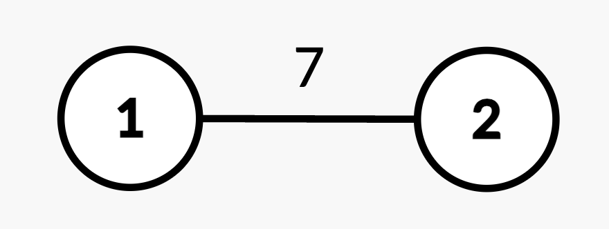
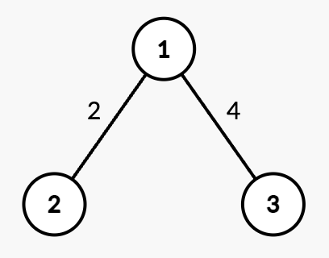
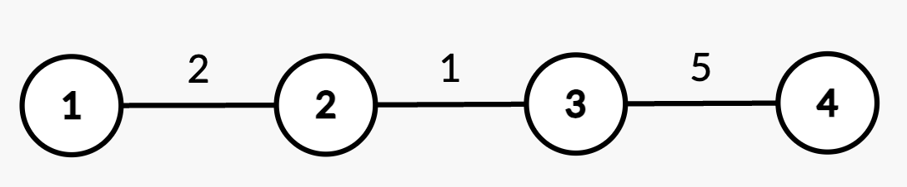

# 3515. Shortest Path in a Weighted Tree

You are given an integer **n** and an undirected, weighted tree rooted at node **1** with **n** nodes numbered from **1 to n**.

The tree is represented by a 2D array:

```
edges[i] = [ui, vi, wi]
```

This indicates an undirected edge between nodes `ui` and `vi` with weight `wi`.

You are also given a 2D array **queries** where each query is one of the following:

```
[1, u, v, w']
```

Update the weight of the edge between nodes `u` and `v` to `w'`.
It is guaranteed that `(u, v)` is an existing edge.

```
[2, x]
```

Return the **shortest path distance from root node 1 to node x**.

Return an integer array:

```
answer[i]
```

where `answer[i]` is the result for the **i‑th query of type `[2, x]`**.

---

# Example 1



Input

```
n = 2
edges = [[1,2,7]]
queries = [[2,2],[1,1,2,4],[2,2]]
```

Output

```
[7,4]
```

Explanation

- Query `[2,2]`: shortest path from node **1 → 2** is **7**
- Query `[1,1,2,4]`: edge weight becomes **4**
- Query `[2,2]`: shortest path becomes **4**

---

# Example 2



Input

```
n = 3
edges = [[1,2,2],[1,3,4]]
queries = [[2,1],[2,3],[1,1,3,7],[2,2],[2,3]]
```

Output

```
[0,4,2,7]
```

Explanation

- `[2,1]` → distance from root to itself = **0**
- `[2,3]` → path `1 → 3` = **4**
- `[1,1,3,7]` → update edge weight
- `[2,2]` → path `1 → 2` = **2**
- `[2,3]` → path `1 → 3` = **7**

---

# Example 3



Input

```
n = 4
edges = [[1,2,2],[2,3,1],[3,4,5]]
queries = [[2,4],[2,3],[1,2,3,3],[2,2],[2,3]]
```

Output

```
[8,3,2,5]
```

Explanation

- `[2,4]` → path `1 → 2 → 3 → 4` = `2 + 1 + 5 = 8`
- `[2,3]` → path `1 → 2 → 3` = `3`
- `[1,2,3,3]` → update weight
- `[2,2]` → distance = `2`
- `[2,3]` → new distance = `2 + 3 = 5`

---

# Constraints

```
1 <= n <= 10^5
edges.length == n - 1
edges[i] = [ui, vi, wi]
1 <= ui, vi <= n
1 <= wi <= 10^4

The input edges always form a valid tree.

1 <= queries.length = q <= 10^5

queries[i] is either:
[1, u, v, w']
or
[2, x]

1 <= u, v, x <= n
(u, v) is always an edge
1 <= w' <= 10^4
```
