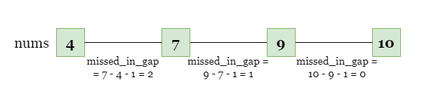
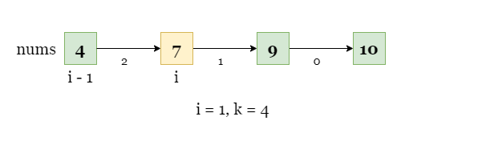
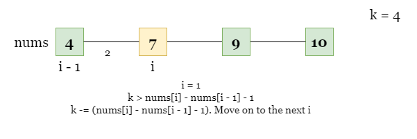
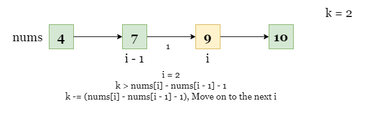
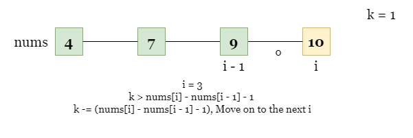
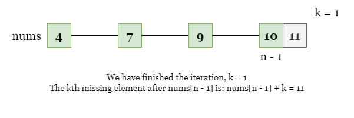
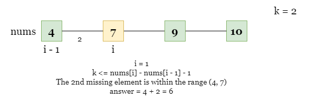

# 1060. Missing Element in Sorted Array — Overview and Approaches

## Overview

We have filled in the missing numbers and can see that the third missing number is **8**. However, we need to pay attention to the size of **k** (potentially up to \\(10^8\\)) in the problem.

Because of this constraint, we **cannot traverse the numbers one by one**, as that could lead to a **Time Limit Exceeded (TLE)** error.

---

# Approach 1: Iteration

## Intuition

Instead of iterating through every integer value, we iterate through the **`nums` array**.

The difference between two adjacent numbers may be greater than `1`, meaning there are missing numbers between them.

For each index `i`, the number of missing elements between:



```
nums[i-1] and nums[i]
```

is:

```
missed_in_gap = nums[i] - nums[i - 1] - 1
```



### Key Idea

For each gap:

- If the gap contains **at least k missing numbers**, then the kth missing number lies **within that gap**.
- Otherwise, subtract the missing count from `k` and continue searching in the next gap.







---

## Example

```
nums = [4,7,9,10], k = 2
```

Gap between:

```
4 and 7
```

Missing numbers:

```
5,6
```

Here:

```
missed_in_gap = 7 - 4 - 1 = 2
```

Since `missed_in_gap >= k`, the kth missing number lies in this interval.

Answer:

```
nums[i-1] + k
```

```
4 + 2 = 6
```





---

## Algorithm

Let `n` be the size of `nums`.

1. Iterate `i` from `1` to `n-1`
2. Compute

```
missed_in_gap = nums[i] - nums[i-1] - 1
```

3. If

```
missed_in_gap >= k
```

return

```
nums[i-1] + k
```

4. Otherwise

```
k -= missed_in_gap
```

5. Continue to next interval.

6. If iteration finishes and `k` is still positive:

```
return nums[n-1] + k
```

---

## Implementation

```java
class Solution {
    public int missingElement(int[] nums, int k) {
        int n = nums.length;

        for (int i = 1; i < n; ++i) {
            int missedInGap = nums[i] - nums[i - 1] - 1;
            if (missedInGap >= k) {
                return nums[i - 1] + k;
            }
            k -= missedInGap;
        }

        return nums[n - 1] + k;
    }
}
```

---

## Complexity Analysis

Let `n` be the length of the array.

### Time Complexity

```
O(n)
```

We iterate through the array once.

### Space Complexity

```
O(1)
```

Only constant extra variables are used.

---

# Approach 2: Binary Search

## Intuition

Instead of examining gaps between adjacent numbers, we analyze **how many numbers are missing before index `i`**.

For an index `i`, the number of missing elements before it is:

```
missing(i) = nums[i] - nums[0] - i
```

Explanation:

Total integers between:

```
[nums[0], nums[i]]
```

are:

```
nums[i] - nums[0] + 1
```

But there are:

```
i + 1
```

actual elements in the array.

So missing elements are:

```
(nums[i] - nums[0] + 1) - (i + 1)
= nums[i] - nums[0] - i
```

### Observation

As `i` increases:

```
missing(i)
```

is **monotonically increasing**.

This allows the use of **Binary Search**.

---

## Binary Search Idea

If

```
missing(mid) < k
```

then the kth missing element lies **to the right**.

Otherwise it lies **to the left**.

---

## Algorithm

1. Initialize:

```
left = 0
right = n - 1
```

2. While

```
left < right
```

3. Compute midpoint

```
mid = right - (right - left) / 2
```

4. Calculate missing elements:

```
missing = nums[mid] - nums[0] - mid
```

5. If

```
missing < k
```

set

```
left = mid
```

else

```
right = mid - 1
```

6. After binary search, the answer is:

```
nums[0] + k + left
```

---

## Implementation

```java
class Solution {
    public int missingElement(int[] nums, int k) {
        int n = nums.length;
        int left = 0, right = n - 1;

        while (left < right) {
            int mid = right - (right - left) / 2;
            if (nums[mid] - nums[0] - mid < k) {
                left = mid;
            } else {
                right = mid - 1;
            }
        }

        return nums[0] + k + left;
    }
}
```

---

## Complexity Analysis

Let `n` be the length of the array.

### Time Complexity

```
O(log n)
```

Binary search repeatedly halves the search space.

### Space Complexity

```
O(1)
```

Only constant extra variables are used.
