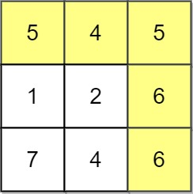
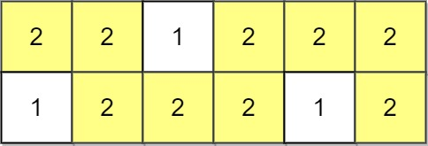
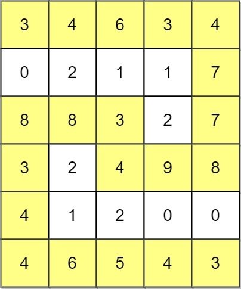

# 1102. Path With Maximum Minimum Value

## Problem Description

Given an **m x n integer matrix `grid`**, return the **maximum score** of a path starting at:

```
(0, 0)
```

and ending at:

```
(m - 1, n - 1)
```

You may move in the **four cardinal directions**:

- Up
- Down
- Left
- Right

---

## Path Score Definition

The **score of a path** is defined as the **minimum value along that path**.

Example:

```
Path: 8 → 4 → 5 → 9
```

Score:

```
min(8,4,5,9) = 4
```

---

## Example 1



```
Input:
grid = [[5,4,5],
        [1,2,6],
        [7,4,6]]

Output:
4
```

Explanation:

The highlighted path yields the **maximum possible minimum value** along the path.

---

## Example 2



```
Input:
grid = [[2,2,1,2,2,2],
        [1,2,2,2,1,2]]

Output:
2
```

---

## Example 3



```
Input:
grid = [[3,4,6,3,4],
        [0,2,1,1,7],
        [8,8,3,2,7],
        [3,2,4,9,8],
        [4,1,2,0,0],
        [4,6,5,4,3]]

Output:
3
```

---

## Constraints

```
m == grid.length
n == grid[i].length
```

```
1 <= m, n <= 100
```

```
0 <= grid[i][j] <= 10^9
```
