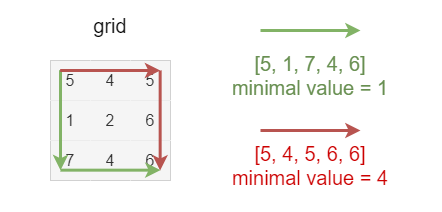
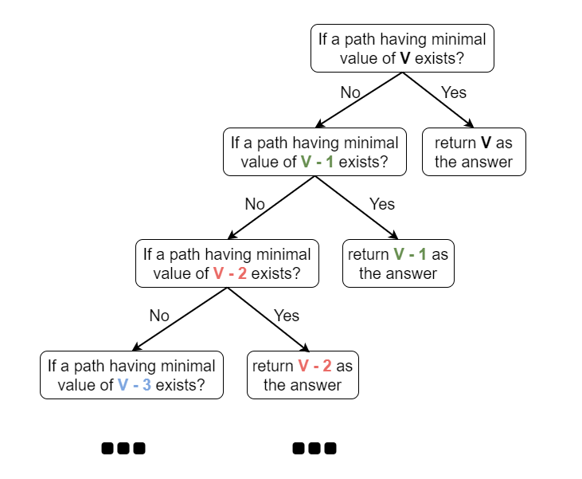
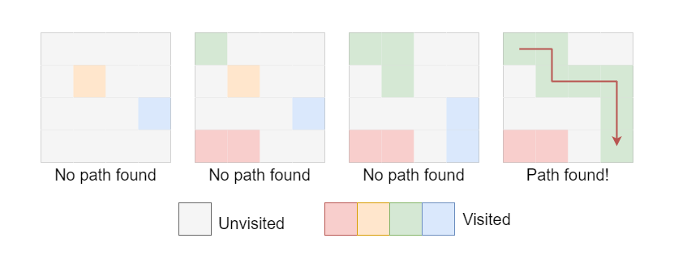

# 1102. Path With Maximum Minimum Value — Overview and Approaches

## Overview

In this problem we are given a **2D integer matrix**. The goal is to find a path from:

```
(0,0) → (m-1,n-1)
```

moving in the **four cardinal directions**.

The **score of a path** is defined as:

```
minimum value in that path
```


### Example

Green Path:

```
[5,1,7,4,6]
Score = min(...) = 1
```

Red Path:

```
[5,4,5,6,6]
Score = min(...) = 4
```

The red path is better because its **minimum value is larger**.

The task is to **maximize the minimum value** among all possible paths.

---

# Approach 1: Iteration + BFS (Brute Force)

## Intuition

Instead of directly searching for the optimal path, we convert the problem into a **decision problem**.

Given a value `S`:

> Can we find a path where every cell value ≥ S ?

Example:

```
S = 100 → Impossible
S = 4   → Possible
```



So we try decreasing values of `S` until a valid path exists.

### Optimization

We start from:

```
S = min(grid[0][0], grid[m-1][n-1])
```

because the path must include both cells.



---

## Algorithm

1. Initialize

```
curScore = min(grid[0][0], grid[R-1][C-1])
```

2. While `curScore ≥ 0`

- Run **BFS**
- Only visit cells where

```
grid[row][col] ≥ curScore
```

3. If BFS reaches bottom‑right → return `curScore`

4. Otherwise decrease

```
curScore--
```

---

## Complexity

Time Complexity

```
O(n * m * k)
```

Space Complexity

```
O(n * m)
```

Where:

- `n,m` = matrix dimensions
- `k` = maximum grid value

---

# Approach 2: Binary Search + BFS

## Intuition

Observe the monotonic property:

If a path exists for score `N`, then it also exists for:

```
N-1
```

If a path **does not exist** for score `N`, then it cannot exist for:

```
N+1
```

Therefore we can apply **Binary Search**.

---

## Algorithm

Search range:

```
0 → min(grid[0][0], grid[m-1][n-1])
```

Steps:

1. Compute

```
mid = (left + right + 1) / 2
```

2. Run BFS to check if a path exists with values ≥ mid.

3. If path exists

```
left = mid
```

else

```
right = mid - 1
```

4. Continue until

```
left == right
```

Return `left`.

---

## Complexity

Time Complexity

```
O(n * m * log(k))
```

Space Complexity

```
O(n * m)
```

---

# Approach 3: Binary Search + DFS

## Intuition

This is identical to Approach 2 except that **DFS** is used instead of BFS for path validation.

Binary search still locates the maximum minimum score.

---

## Algorithm

1. Binary search on possible score.
2. Use **DFS** to verify if a path exists.
3. Adjust boundaries accordingly.

---

## Complexity

Time Complexity

```
O(n * m * log(k))
```

Space Complexity

```
O(n * m)
```

---

# Approach 4: BFS + Priority Queue (Greedy)

## Intuition

At each step:

- Visit the **neighbor with the largest value** first.

This greedy strategy maximizes the minimum value encountered along the path.

We use a **Max Heap (PriorityQueue)** to always expand the largest available cell.

This is conceptually similar to **Dijkstra**, but instead of minimizing distance we maximize the minimum value.

---

## Algorithm

1. Initialize

```
priority queue
visited array
ans = grid[0][0]
```

2. Push `(0,0)` into max heap.

3. While queue not empty:

- Pop cell with **largest value**
- Update

```
ans = min(ans, grid[row][col])
```

- Add unvisited neighbors.

4. When reaching `(m-1,n-1)` return `ans`.

---

## Complexity

Time Complexity

```
O(n * m * log(n * m))
```

Space Complexity

```
O(n * m)
```

---

# Approach 5: Union Find

## Intuition



Imagine gradually **activating cells from highest value to lowest value**.

Each time we activate a cell:

- Connect it with **already activated neighbors** using **Union-Find**.

When the **top-left cell and bottom-right cell become connected**, a valid path exists.

Because we activate cells in **descending order**, the current cell value is the maximum possible minimum score.

---

## Algorithm

1. Create list of all cells.
2. Sort cells **descending by value**.
3. For each cell:

- Mark visited
- Union with visited neighbors

4. If

```
start connected to end
```

return current cell value.

---

## Complexity

Time Complexity

```
O(n * m * log(n * m))
```

Sorting dominates the runtime.

Space Complexity

```
O(n * m)
```

Used for:

- visited array
- union find structure
- sorted cell list
