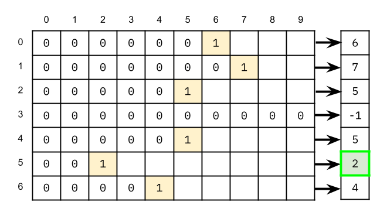
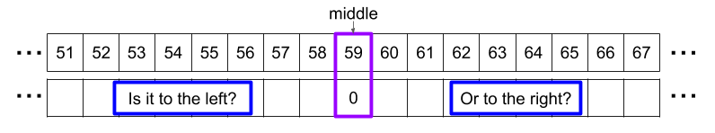
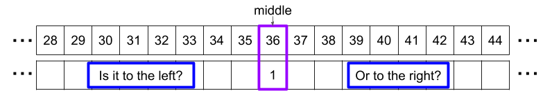
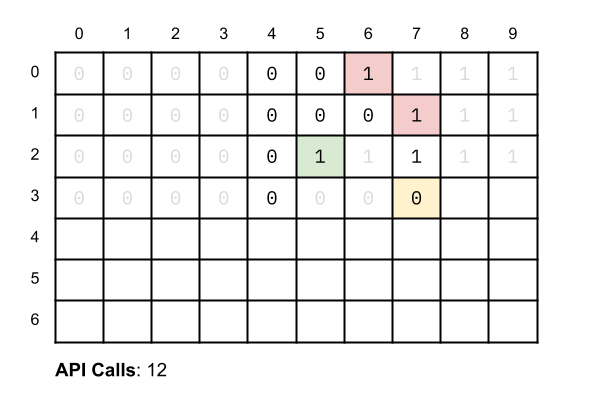
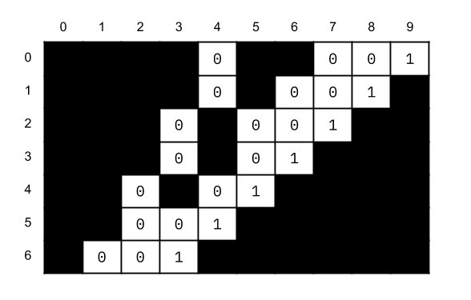

# 1428. Leftmost Column with at Least a One — Solution Approaches

## Approach 1: Linear Search Each Row

### Intuition

This approach is a simple starting point but **does not satisfy the API call limit**.

The **leftmost 1** is the `1` with the **lowest column index**.

We can solve the problem by:

1. Finding the **first 1 in each row**
2. Taking the **minimum column index** among those positions

The simplest implementation is to **scan each row linearly**.



---

### Algorithm

```java
class Solution {
    public int leftMostColumnWithOne(BinaryMatrix binaryMatrix) {
        int rows = binaryMatrix.dimensions().get(0);
        int cols = binaryMatrix.dimensions().get(1);
        int smallestIndex = cols;

        for (int row = 0; row < rows; row++) {
            for (int col = 0; col < cols; col++) {
                if (binaryMatrix.get(row, col) == 1) {
                    smallestIndex = Math.min(smallestIndex, col);
                    break;
                }
            }
        }

        return smallestIndex == cols ? -1 : smallestIndex;
    }
}
```

---

### Complexity Analysis

Let:

```
N = number of rows
M = number of columns
```

**Time Complexity**

```
O(N × M)
```

Worst case checks every cell.

**Space Complexity**

```
O(1)
```

Only constant extra space.

This approach fails because the grid can have **10,000 cells**, while we are limited to **1000 API calls**.

---

# Approach 2: Binary Search Each Row

## Intuition

Since each row is **sorted (all 0s followed by 1s)**, we can use **Binary Search** to find the first `1` in each row.

Key observations:

- If `mid` is **0** → the first `1` must be **to the right**
- If `mid` is **1** → the first `1` is **either mid or to the left**

---

### Binary Search Logic

```
lo = 0
hi = cols - 1

while lo < hi:
    mid = (lo + hi) / 2

    if value(mid) == 0:
        lo = mid + 1
    else:
        hi = mid
```

When the loop ends:

- If `arr[lo] == 1` → we found the first `1`
- Otherwise the row contains **no 1s**





---

### Implementation

```java
class Solution {
    public int leftMostColumnWithOne(BinaryMatrix binaryMatrix) {

        int rows = binaryMatrix.dimensions().get(0);
        int cols = binaryMatrix.dimensions().get(1);

        int smallestIndex = cols;

        for (int row = 0; row < rows; row++) {

            int lo = 0;
            int hi = cols - 1;

            while (lo < hi) {

                int mid = (lo + hi) / 2;

                if (binaryMatrix.get(row, mid) == 0) {
                    lo = mid + 1;
                } else {
                    hi = mid;
                }
            }

            if (binaryMatrix.get(row, lo) == 1) {
                smallestIndex = Math.min(smallestIndex, lo);
            }
        }

        return smallestIndex == cols ? -1 : smallestIndex;
    }
}
```

---

### Complexity Analysis

```
Time Complexity: O(N log M)
```

Binary search per row.

```
Space Complexity: O(1)
```

Constant extra memory.

---

# Approach 3: Start at Top‑Right (Optimal)

## Intuition

Because rows are sorted:

- If we see a **0**, everything **to the left is also 0**
- If we see a **1**, we should check if there's a **smaller column index**

The optimal strategy:

```
Start at the top‑right corner
```

Then:

- If value == **0** → move **down**
- If value == **1** → move **left**

This works because each step **eliminates an entire row or column**.





---

## Algorithm

1. Start at `(row=0, col=cols-1)`
2. While inside the grid:

```
if matrix[row][col] == 0
    row++
else
    col--
```

3. When traversal finishes:

```
if never moved left → return -1
else return col + 1
```

---

## Implementation

```java
class Solution {

    public int leftMostColumnWithOne(BinaryMatrix binaryMatrix) {

        int rows = binaryMatrix.dimensions().get(0);
        int cols = binaryMatrix.dimensions().get(1);

        int currentRow = 0;
        int currentCol = cols - 1;

        while (currentRow < rows && currentCol >= 0) {

            if (binaryMatrix.get(currentRow, currentCol) == 0) {
                currentRow++;
            } else {
                currentCol--;
            }
        }

        return (currentCol == cols - 1) ? -1 : currentCol + 1;
    }
}
```

---

## Complexity Analysis

Let:

```
N = rows
M = columns
```

**Time Complexity**

```
O(N + M)
```

Each step moves either **one row down** or **one column left**.

**Space Complexity**

```
O(1)
```

Constant extra space.

---

# Key Insight

The **top‑right traversal** is optimal because:

- Every move removes **one full row or column**
- Maximum number of steps:

```
rows + columns
```

Which guarantees:

```
O(N + M)
```

API calls — safely under the **1000 limit**.
