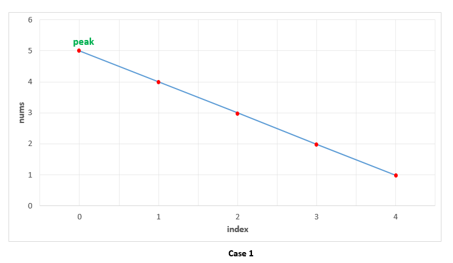
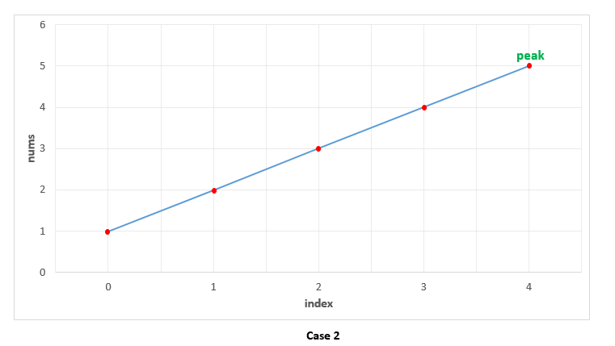
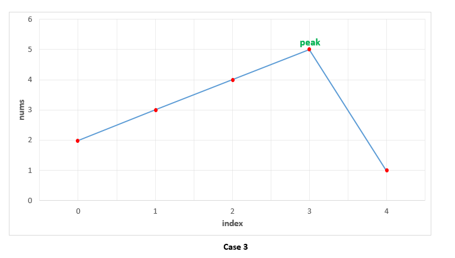
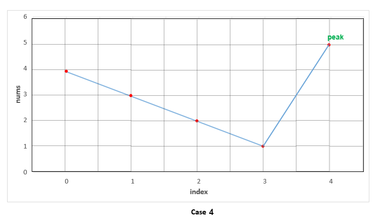

# 162. Find Peak Element — Approaches

## Approach 1: Linear Scan

### Idea

Two consecutive numbers `nums[j]` and `nums[j+1]` are never equal.
Therefore, while scanning the array from left to right, if we find:

```
nums[i] > nums[i + 1]
```

then `nums[i]` must be a peak.

### Reasoning

#### Case 1 — Descending Order

Example:

```
[5,4,3,2,1]
```

The first element is greater than the next element, therefore it is a peak.

We detect it immediately because:

```
nums[0] > nums[1]
```



#### Case 2 — Ascending Order

Example:

```
[1,2,3,4,5]
```

Every element is smaller than the next, so the loop never finds:

```
nums[i] > nums[i+1]
```

Thus the last element must be the peak.



#### Case 3 — Peak in the Middle

Example:

```
[1,3,5,4,2]
```

While climbing the slope:

```
1 < 3 < 5
```

We reach `5`, where:

```
5 > 4
```

Thus index of `5` is returned.



### Java Implementation

```java
public class Solution {
    public int findPeakElement(int[] nums) {
        for (int i = 0; i < nums.length - 1; i++) {
            if (nums[i] > nums[i + 1]) return i;
        }
        return nums.length - 1;
    }
}
```

### Complexity

Time Complexity

```
O(n)
```

Space Complexity

```
O(1)
```

---

# Approach 2: Recursive Binary Search

### Core Insight

A peak always exists because the edges are treated as:

```
nums[-1] = nums[n] = -∞
```

At any point we check the slope at `mid`.

If:

```
nums[mid] > nums[mid + 1]
```

We are on a **descending slope**, so a peak must exist on the **left side**.

Otherwise we are on a **rising slope**, so the peak must exist on the **right side**.

Thus we eliminate half the search space each step.

### Algorithm

1. Compute middle index
2. Compare `nums[mid]` with `nums[mid+1]`
3. Move search space toward the direction of the peak



### Java Implementation

```java
public class Solution {
    public int findPeakElement(int[] nums) {
        return search(nums, 0, nums.length - 1);
    }

    public int search(int[] nums, int l, int r) {
        if (l == r) return l;

        int mid = (l + r) / 2;

        if (nums[mid] > nums[mid + 1])
            return search(nums, l, mid);
        else
            return search(nums, mid + 1, r);
    }
}
```

### Complexity

Time Complexity

```
O(log n)
```

Space Complexity

```
O(log n)
```

(recursion stack)

---

# Approach 3: Iterative Binary Search

The recursive solution can be rewritten iteratively to remove recursion overhead.

### Algorithm

1. Maintain two pointers `l` and `r`
2. Compute `mid`
3. If on descending slope move left
4. If on rising slope move right
5. Continue until `l == r`

### Java Implementation

```java
public class Solution {
    public int findPeakElement(int[] nums) {
        int l = 0, r = nums.length - 1;

        while (l < r) {
            int mid = (l + r) / 2;

            if (nums[mid] > nums[mid + 1])
                r = mid;
            else
                l = mid + 1;
        }

        return l;
    }
}
```

### Complexity

Time Complexity

```
O(log n)
```

Space Complexity

```
O(1)
```
