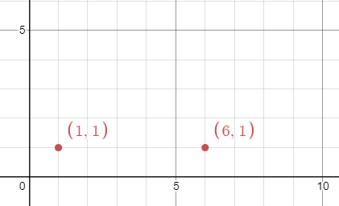
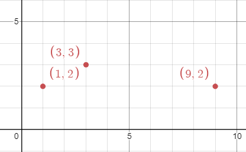

# 1956. Minimum Time For K Virus Variants to Spread

## Problem Description

There are **n unique virus variants** on an **infinite 2D grid**.

You are given a 2D array:

```
points[i] = [xi, yi]
```

This means that a virus variant **originates at position (xi, yi) on day 0**.

Note:

- Multiple virus variants may originate from the **same position**.
- Each virus spreads **independently**.

---

## Virus Spread Rules

Every day:

- Each infected cell spreads the virus to its **four neighboring cells**:

```
up
down
left
right
```

If multiple variants reach the same cell:

```
all variants coexist and spread independently
```

---

## Goal

Given an integer `k`, return:

```
the minimum number of days required
for any grid cell to contain at least k virus variants
```

---

## Example 1



Input:

```
points = [[1,1],[6,1]]
k = 2
```

Output:

```
3
```

Explanation:

On **day 3**, points such as:

```
(3,1)
(4,1)
```

will contain **both virus variants**.

---

## Example 2


Input:

```
points = [[3,3],[1,2],[9,2]]
k = 2
```

Output:

```
2
```

Explanation:

On **day 2**, points such as:

```
(1,3)
(2,3)
(2,2)
(3,2)
```

will contain **the first two viruses**.

---

## Example 3



Input:

```
points = [[3,3],[1,2],[9,2]]
k = 3
```

Output:

```
4
```

Explanation:

On **day 4**, point:

```
(5,2)
```

will contain **all 3 virus variants**.

---

## Constraints

```
n == points.length
```

```
2 <= n <= 50
```

```
points[i].length == 2
```

```
1 <= xi, yi <= 100
```

```
2 <= k <= n
```
