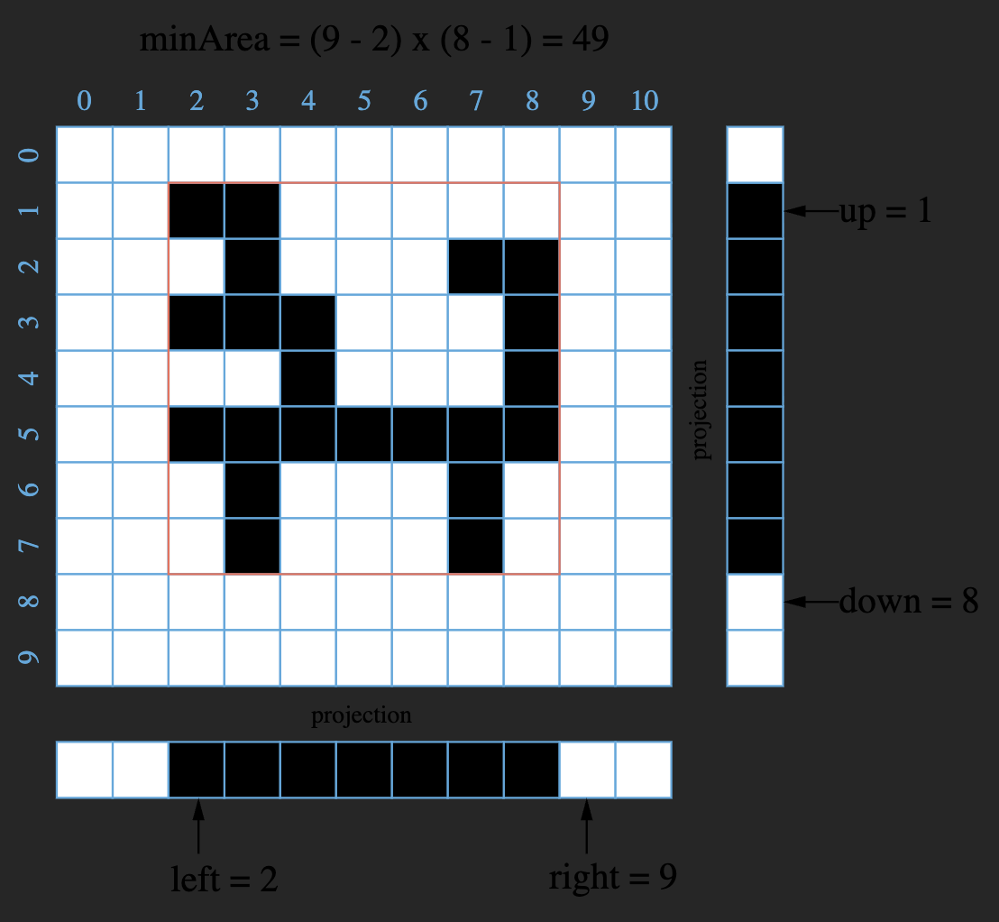

# 302. Smallest Rectangle Enclosing Black Pixels — Approaches

## Summary

This discussion introduces several algorithmic techniques:

- Depth First Search (DFS)
- Breadth First Search (BFS)
- Binary Search

The goal is to compute the smallest axis-aligned rectangle enclosing all black pixels in a binary image.

---

# Approach 1: Naive Linear Search

## Intuition

Traverse all pixels in the image and track the minimum and maximum coordinates of black pixels.

## Algorithm

Maintain four boundaries of the rectangle:

- `left`
- `right`
- `top`
- `bottom`

Note:

- `left` and `top` are **inclusive**
- `right` and `bottom` are **exclusive**

Steps:

1. Initialize the boundaries.
2. Traverse every `(x, y)` coordinate.
3. If the pixel is black (`'1'`), update the boundaries.

Pseudo-process:

```
Initialize left, right, top, bottom

For each pixel (x, y):
    if image[x][y] == '1':
        left   = min(left, x)
        right  = max(right, x + 1)
        top    = min(top, y)
        bottom = max(bottom, y + 1)

Return (right - left) * (bottom - top)
```

### Java Implementation

```java
public class Solution {
    public int minArea(char[][] image, int x, int y) {
        int top = x, bottom = x;
        int left = y, right = y;

        for (x = 0; x < image.length; ++x) {
            for (y = 0; y < image[0].length; ++y) {
                if (image[x][y] == '1') {
                    top = Math.min(top, x);
                    bottom = Math.max(bottom, x + 1);
                    left = Math.min(left, y);
                    right = Math.max(right, y + 1);
                }
            }
        }

        return (right - left) * (bottom - top);
    }
}
```

## Complexity Analysis

Time Complexity

```
O(mn)
```

Space Complexity

```
O(1)
```

### Comment

Even if we add early stopping optimizations, the asymptotic complexity does not change.

This approach provides a useful baseline for evaluating better algorithms.

---

# Approach 2: DFS or BFS

## Intuition

All black pixels form **one connected component**, and one of them is given.

Therefore we can perform **DFS or BFS starting from that pixel** to explore all black pixels.

This is similar to solving **Number of Islands**, except here there is exactly **one island**.

## Algorithm

1. Start DFS from the given black pixel `(x, y)`.
2. Visit connected black pixels.
3. Update rectangle boundaries during traversal.
4. Mark visited pixels to avoid revisiting.

### Java Implementation

```java
public class Solution {

    private int top, bottom, left, right;

    public int minArea(char[][] image, int x, int y) {
        if (image.length == 0 || image[0].length == 0) return 0;

        top = bottom = x;
        left = right = y;

        dfs(image, x, y);

        return (right - left) * (bottom - top);
    }

    private void dfs(char[][] image, int x, int y) {

        if (x < 0 || y < 0 ||
            x >= image.length || y >= image[0].length ||
            image[x][y] == '0')
            return;

        image[x][y] = '0';

        top = Math.min(top, x);
        bottom = Math.max(bottom, x + 1);
        left = Math.min(left, y);
        right = Math.max(right, y + 1);

        dfs(image, x + 1, y);
        dfs(image, x - 1, y);
        dfs(image, x, y - 1);
        dfs(image, x, y + 1);
    }
}
```

## Complexity Analysis

Time Complexity

```
O(E) = O(B) = O(mn)
```

Where:

- `E` = number of edges
- `B` = number of black pixels

Each pixel has at most four edges.

Worst case:

```
B = mn
```

Space Complexity

```
O(V) = O(B) = O(mn)
```

Where `V` is the number of vertices visited.

### Comment

This approach is faster when the number of black pixels `B` is much smaller than `mn`, but in the worst case it matches the naive approach.

It also requires additional recursion stack or queue space.

---

# Approach 3: Binary Search

## Intuition

We can **project the 2D image into a 1D array** and apply binary search to locate the rectangle boundaries.



### Column Projection

For each column `i`:

```
v[i] = 1 if there exists x such that image[x][i] == 1
v[i] = 0 otherwise
```

Meaning:

If a column contains any black pixel, its projection is black.

Similarly we can project rows.

---

## Key Lemma

If there is only **one black region**, then in the projected **1D array all black pixels are contiguous**.

### Proof Idea

Assume two black projections exist at `i` and `j` but a white column exists between them.

That implies the 2D image contains two disconnected black regions, contradicting the problem constraint.

Thus the projection must contain a **single continuous segment of black values**.

---

## Algorithm

1. Binary search for the **left boundary** in `[0, y)`.
2. Binary search for the **right boundary** in `[y + 1, n)`.
3. Binary search for the **top boundary** in `[0, x)`.
4. Binary search for the **bottom boundary** in `[x + 1, m)`.
5. Compute area.

Instead of explicitly building projection arrays, we **check rows or columns on demand during binary search**.

---

## Java Implementation

```java
public class Solution {

    public int minArea(char[][] image, int x, int y) {

        int m = image.length;
        int n = image[0].length;

        int left = searchColumns(image, 0, y, 0, m, true);
        int right = searchColumns(image, y + 1, n, 0, m, false);

        int top = searchRows(image, 0, x, left, right, true);
        int bottom = searchRows(image, x + 1, m, left, right, false);

        return (right - left) * (bottom - top);
    }

    private int searchColumns(char[][] image, int i, int j, int top, int bottom, boolean whiteToBlack) {

        while (i != j) {

            int mid = (i + j) / 2;
            int k = top;

            while (k < bottom && image[k][mid] == '0') k++;

            if ((k < bottom) == whiteToBlack)
                j = mid;
            else
                i = mid + 1;
        }

        return i;
    }

    private int searchRows(char[][] image, int i, int j, int left, int right, boolean whiteToBlack) {

        while (i != j) {

            int mid = (i + j) / 2;
            int k = left;

            while (k < right && image[mid][k] == '0') k++;

            if ((k < right) == whiteToBlack)
                j = mid;
            else
                i = mid + 1;
        }

        return i;
    }
}
```

---

## Complexity Analysis

Time Complexity

```
O(m log n + n log m)
```

Explanation:

- Binary search runs `O(log n)` times for columns.
- Each step scans `m` rows.

Similarly:

- Binary search runs `O(log m)` times for rows.
- Each step scans `n` columns.

Space Complexity

```
O(1)
```

Both binary search and scanning require constant extra memory.
