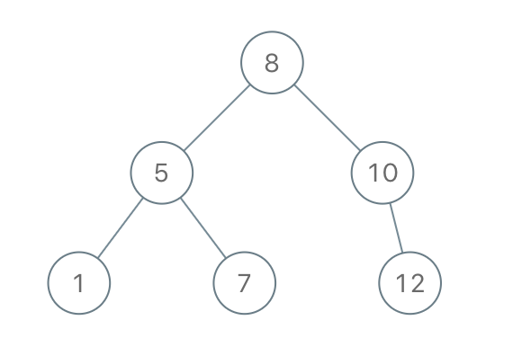

# 1008. Construct Binary Search Tree from Preorder Traversal

## Problem

Given an array of integers `preorder`, which represents the **preorder traversal of a Binary Search Tree (BST)**, construct the tree and return its root.

It is guaranteed that a valid BST can always be constructed from the given preorder traversal.

---

## Binary Search Tree Definition

A **Binary Search Tree (BST)** is a binary tree where:

- All values in the **left subtree** of a node are **strictly less** than the node's value.
- All values in the **right subtree** of a node are **strictly greater** than the node's value.

---

## Preorder Traversal Definition

A **preorder traversal** visits nodes in the following order:

```
root → left subtree → right subtree
```

This means:

1. Visit the root node.
2. Traverse the left subtree recursively.
3. Traverse the right subtree recursively.

---

# Objective

Given the preorder traversal of a BST, reconstruct the original tree and return the root.

---

# Example 1



## Input

```
preorder = [8,5,1,7,10,12]
```

## Output

```
[8,5,10,1,7,null,12]
```

## Explanation

The constructed BST is:

```
        8
       / \\
      5   10
     / \\    \\
    1   7    12
```

The preorder traversal of this tree is:

```
8 → 5 → 1 → 7 → 10 → 12
```

---

# Example 2

## Input

```
preorder = [1,3]
```

## Output

```
[1,null,3]
```

## Explanation

The BST becomes:

```
1
 \\
  3
```

---

# Constraints

```
1 <= preorder.length <= 100

1 <= preorder[i] <= 1000

All values in preorder are unique.
```
