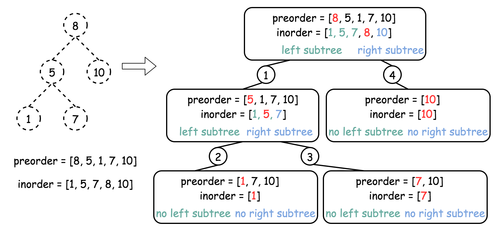
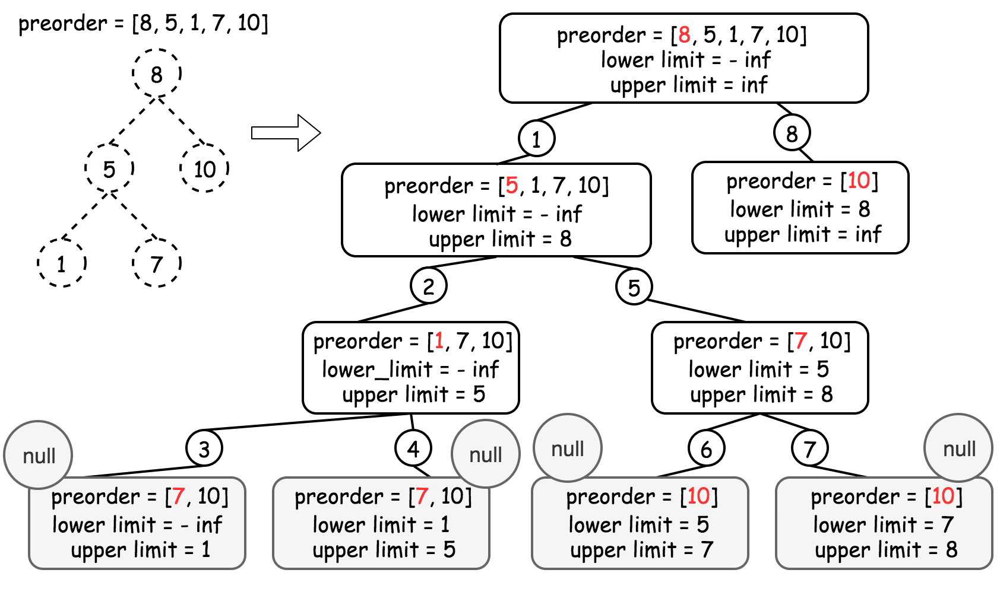

# 1008. Construct Binary Search Tree from Preorder Traversal

## Detailed Notes on Multiple Approaches

## Overview

We are given an array `preorder` that represents the **preorder traversal** of a Binary Search Tree (BST).

Our task is to reconstruct the BST and return its root.

This document explains three approaches in detail:

1. **Construct Binary Tree from Preorder and Inorder Traversal**
2. **Recursion with Lower and Upper Bounds**
3. **Iteration with a Stack**

---

# Core Definitions

## Binary Search Tree (BST)

A BST satisfies:

- every value in the left subtree is strictly smaller than the current node
- every value in the right subtree is strictly greater than the current node

---

## Preorder Traversal

A preorder traversal visits nodes in this order:

```text
root -> left subtree -> right subtree
```

So if the preorder array is:

```text
[8, 5, 1, 7, 10, 12]
```

then:

- `8` is the root
- after that comes the preorder traversal of the left subtree
- then comes the preorder traversal of the right subtree

The challenge is figuring out exactly where the left subtree ends and the right subtree begins.

---

# High-Level Insight

The main difficulty is this:

> preorder gives us the root first, but it does not explicitly tell us how to split the remaining values into left and right subtrees.

All three approaches solve that problem differently.

---

# Approach 1: Construct Binary Tree from Preorder and Inorder Traversal

## Intuition

This approach is not the optimal one, but it is very straightforward.

It uses two well-known facts:

1. A binary tree can be reconstructed from its preorder and inorder traversals.
2. The inorder traversal of a BST is just the sorted order of its values.

So the idea is:

- take the preorder array as given
- create the inorder traversal by sorting that array
- reconstruct the binary tree using the classic preorder + inorder reconstruction method

Because the tree is a BST, the sorted preorder values give the inorder traversal automatically.

---

## Why This Works

Suppose the preorder array is:

```text
[8, 5, 1, 7, 10, 12]
```

Then the inorder traversal of the BST must be:

```text
[1, 5, 7, 8, 10, 12]
```

Now we have both:

- preorder
- inorder

And a binary tree is uniquely reconstructible from these two traversals when values are unique.

So even though this approach is a bit indirect, it is correct.



---

## Algorithm

### Step 1: Construct inorder traversal

Copy the preorder array and sort it.

### Step 2: Build a map from value to inorder index

This helps us quickly find the root position in inorder.

### Step 3: Reconstruct recursively

For each recursive call:

- if the current inorder range is empty, return `null`
- take the current preorder element as the root
- find its position in the inorder array
- recursively build:
  - left subtree from inorder left part
  - right subtree from inorder right part

---

## Java Code

```java
class Solution {
  // Start from the first preorder element
  int pre_idx = 0;
  int[] preorder;
  HashMap<Integer, Integer> idx_map = new HashMap<Integer, Integer>();

  public TreeNode helper(int in_left, int in_right) {
    // If there is no elements to construct subtrees
    if (in_left == in_right)
      return null;

    // pick up pre_idx element as a root
    int root_val = preorder[pre_idx];
    TreeNode root = new TreeNode(root_val);

    // root splits inorder list
    // into left and right subtrees
    int index = idx_map.get(root_val);

    // recursion
    pre_idx++;
    // build the left subtree
    root.left = helper(in_left, index);
    // build the right subtree
    root.right = helper(index + 1, in_right);
    return root;
  }

  public TreeNode bstFromPreorder(int[] preorder) {
    this.preorder = preorder;
    int[] inorder = Arrays.copyOf(preorder, preorder.length);
    Arrays.sort(inorder);

    // build a hashmap value -> its index
    int idx = 0;
    for (Integer val : inorder)
      idx_map.put(val, idx++);
    return helper(0, inorder.length);
  }
}
```

---

## Detailed Walkthrough

### 1. `pre_idx`

```java
int pre_idx = 0;
```

This points to the current root candidate in the preorder array.

Because preorder is:

```text
root -> left -> right
```

every time we create a node, we consume the next preorder value.

---

### 2. Sorted inorder traversal

```java
int[] inorder = Arrays.copyOf(preorder, preorder.length);
Arrays.sort(inorder);
```

This works because inorder traversal of a BST is sorted ascending.

---

### 3. Map value to inorder index

```java
for (Integer val : inorder)
    idx_map.put(val, idx++);
```

This allows `O(1)` lookup of where the root splits the inorder range.

---

### 4. Recursive helper

```java
public TreeNode helper(int in_left, int in_right)
```

This constructs the subtree using the inorder subarray:

```text
[in_left, in_right)
```

If this range is empty, the subtree is empty.

---

### 5. Root from preorder

```java
int root_val = preorder[pre_idx];
TreeNode root = new TreeNode(root_val);
```

Preorder always gives the current subtree root first.

---

### 6. Split inorder into left and right parts

```java
int index = idx_map.get(root_val);
```

Everything left of `index` belongs to the left subtree.
Everything right of `index` belongs to the right subtree.

---

### 7. Recurse on subtrees

```java
pre_idx++;
root.left = helper(in_left, index);
root.right = helper(index + 1, in_right);
```

Because preorder visits left subtree before right subtree, we recursively build left first.

---

## Complexity Analysis

Let `N` be the number of nodes.

### Time Complexity

```text
O(N log N)
```

Why?

- sorting preorder to get inorder costs `O(N log N)`
- constructing the tree costs `O(N)`

So total is dominated by sorting.

---

### Space Complexity

```text
O(N)
```

Why?

- the inorder array takes `O(N)`
- the hashmap takes `O(N)`
- recursion stack also uses space

So total auxiliary space is linear.

---

## Strengths and Weaknesses

### Strengths

- conceptually straightforward
- directly uses classic traversal reconstruction logic

### Weaknesses

- not optimal
- sorting is unnecessary overhead
- does not fully exploit the BST property

That leads to a better solution.

---

# Approach 2: Recursion with Lower and Upper Bounds

## Intuition

The previous approach used inorder only to check whether a value could belong in a subtree.

But because the tree is a BST, we do not actually need the inorder array.

Instead, for any subtree, we can determine whether the next preorder value belongs there using **value bounds**.

For a subtree:

- all values must lie within some interval `(lower, upper)`

If the next preorder value is outside that range, then it cannot belong in this subtree.

This gives a clean `O(N)` recursive solution.

---

## Why Bounds Work

Suppose we are building a subtree whose root must satisfy:

```text
lower < value < upper
```

Then:

- if the next preorder value lies outside these bounds, it does not belong here
- if it lies inside the bounds, it becomes the root of this subtree

Once we place a root `val`:

- left subtree must lie in `(lower, val)`
- right subtree must lie in `(val, upper)`

This is exactly the BST rule.

---

## Algorithm

1. Maintain an index `idx` into preorder.
2. Start with the widest possible range:
   - lower = negative infinity
   - upper = positive infinity
3. In helper(lower, upper):
   - if all preorder elements are used, return null
   - let `val = preorder[idx]`
   - if `val` is outside `[lower, upper]`, return null
   - otherwise:
     - create the root with `val`
     - increment `idx`
     - recursively build:
       - left subtree with `(lower, val)`
       - right subtree with `(val, upper)`
4. Return the constructed root



---

## Java Code

```java
class Solution {
  int idx = 0;
  int[] preorder;
  int n;

  public TreeNode helper(int lower, int upper) {
    // If all elements from preorder are used
    // then the tree is constructed
    if (idx == n) return null;

    int val = preorder[idx];
    // If the current element
    // couldn't be placed here to meet BST requirements
    if (val < lower || val > upper) return null;

    // Place the current element
    // and recursively construct subtrees
    idx++;
    TreeNode root = new TreeNode(val);
    root.left = helper(lower, val);
    root.right = helper(val, upper);
    return root;
  }

  public TreeNode bstFromPreorder(int[] preorder) {
    this.preorder = preorder;
    n = preorder.length;
    return helper(Integer.MIN_VALUE, Integer.MAX_VALUE);
  }
}
```

---

## Detailed Walkthrough

### 1. Shared preorder index

```java
int idx = 0;
```

This tracks the next unused value in preorder.

Every valid node consumes exactly one preorder entry.

---

### 2. Bounds

```java
helper(Integer.MIN_VALUE, Integer.MAX_VALUE)
```

Initially, the root can be any value, so we start with the broadest possible interval.

---

### 3. Stop if preorder is exhausted

```java
if (idx == n) return null;
```

No more nodes remain to construct.

---

### 4. Check if current value fits this subtree

```java
int val = preorder[idx];
if (val < lower || val > upper) return null;
```

If the next preorder value does not satisfy the subtree bounds, it does not belong here.

So this subtree is empty.

---

### 5. Place the current value

```java
idx++;
TreeNode root = new TreeNode(val);
```

Now we commit to using this preorder value as the root of the current subtree.

---

### 6. Construct left and right recursively

```java
root.left = helper(lower, val);
root.right = helper(val, upper);
```

This enforces BST ordering:

- left subtree values must be smaller than `val`
- right subtree values must be larger than `val`

---

## Example Walkthrough

Take:

```text
preorder = [8, 5, 1, 7, 10, 12]
```

### Start

Bounds: `(-∞, +∞)`

- `8` fits → root = 8

### Build left of 8

Bounds: `(-∞, 8)`

- `5` fits → left child = 5

### Build left of 5

Bounds: `(-∞, 5)`

- `1` fits → left child = 1

### Build left of 1

Bounds: `(-∞, 1)`

- next value is `7`, which does not fit → null

### Build right of 1

Bounds: `(1, 5)`

- `7` does not fit → null

So subtree rooted at 1 is done.

### Build right of 5

Bounds: `(5, 8)`

- `7` fits → right child = 7

Continue similarly:

- `10` becomes right child of 8
- `12` becomes right child of 10

Final BST is correct.

---

## Complexity Analysis

### Time Complexity

```text
O(N)
```

Why?

Each preorder value is processed exactly once.

There is no sorting, and no repeated scanning.

---

### Space Complexity

```text
O(N)
```

Why?

- recursion stack in worst case can grow to `N`
- the tree itself also stores `N` nodes

More precisely, auxiliary recursion space is `O(H)`, where `H` is tree height.

Worst case skewed tree gives `O(N)`.

---

## Strengths and Weaknesses

### Strengths

- optimal time complexity
- elegant use of BST bounds
- does not need sorting or extra map

### Weaknesses

- recursion depth may be large in skewed trees
- the lower/upper bound idea may feel subtle at first

This leads naturally to an iterative translation.

---

# Approach 3: Iteration with a Stack

## Intuition

The recursive bounds approach is elegant, but it can also be converted into an iterative solution using a stack.

The main idea is:

- preorder always gives the root of the current subtree first
- a stack can keep track of the path from the root to the current insertion location
- when the next preorder value is larger than stack top, we pop until we find its correct parent

This works because preorder visits:

```text
root -> left subtree -> right subtree
```

So values first descend left, then eventually move right. The stack tracks that ancestry.

---

## Algorithm

1. If preorder is empty, return null.
2. Create root from `preorder[0]`.
3. Push root onto a stack.
4. For every next preorder value:
   - create a child node
   - let `node` initially be the top of stack
   - while stack is not empty and stack top value is smaller than child value:
     - pop from stack
     - update `node` to the popped node
   - after popping:
     - if `child.val` is greater than `node.val`, attach as `node.right`
     - otherwise attach as `node.left`
   - push child onto stack
5. Return root

---

## Why the Stack Logic Works

The stack stores a path of ancestors whose right child has not yet been assigned.

When a new value is smaller than the stack top:

- it must be the left child of the stack top

When a new value is larger than the stack top:

- it cannot belong in that node’s left subtree
- so we pop until we find the correct ancestor whose right child should be this new node

This exactly matches how preorder unfolds in a BST.

---

## Java Code

```java
class Solution {
  public TreeNode bstFromPreorder(int[] preorder) {
    int n = preorder.length;
    if (n == 0) return null;

    TreeNode root = new TreeNode(preorder[0]);
    Deque<TreeNode> deque = new ArrayDeque<TreeNode>();
    deque.push(root);

    for (int i = 1; i < n; i++) {
      // Take the last element of the deque as a parent
      // and create a child from the next preorder element
      TreeNode node = deque.peek();
      TreeNode child = new TreeNode(preorder[i]);

      // Adjust the parent
      while (!deque.isEmpty() && deque.peek().val < child.val)
        node = deque.pop();

      // follow BST logic to create a parent-child link
      if (node.val < child.val) node.right = child;
      else node.left = child;

      // add the child into deque
      deque.push(child);
    }
    return root;
  }
}
```

---

## Detailed Walkthrough

### 1. Create the root

```java
TreeNode root = new TreeNode(preorder[0]);
deque.push(root);
```

The first preorder value is always the root.

---

### 2. Process each next value

```java
for (int i = 1; i < n; i++) {
    TreeNode node = deque.peek();
    TreeNode child = new TreeNode(preorder[i]);
```

We create a new node for the current preorder value.

---

### 3. Pop smaller ancestors

```java
while (!deque.isEmpty() && deque.peek().val < child.val)
    node = deque.pop();
```

If the current value is larger than the stack top, it belongs somewhere in the right direction of popped nodes.

We keep popping until we find the correct parent.

The last popped node becomes the parent candidate.

---

### 4. Attach left or right

```java
if (node.val < child.val) node.right = child;
else node.left = child;
```

Now we can attach the child correctly:

- larger value → right child
- smaller value → left child

---

### 5. Push the child

```java
deque.push(child);
```

This child may itself become the parent for future nodes.

---

## Example Walkthrough

Take:

```text
preorder = [8, 5, 1, 7, 10, 12]
```

### Start

- root = 8
- stack = [8]

### Insert 5

- top = 8
- `5 < 8` → attach as left child of 8
- push 5
- stack = [5, 8]

### Insert 1

- top = 5
- `1 < 5` → attach as left child of 5
- push 1
- stack = [1, 5, 8]

### Insert 7

- `7 > 1` → pop 1
- `7 > 5` → pop 5
- `7 < 8` so stop
- last popped node = 5
- attach 7 as right child of 5
- push 7

### Insert 10

- `10 > 7` pop 7
- `10 > 8` pop 8
- attach 10 as right child of 8
- push 10

### Insert 12

- `12 > 10` pop 10
- attach 12 as right child of 10
- push 12

Final BST is correct.

---

## Complexity Analysis

### Time Complexity

```text
O(N)
```

Why?

Each node is pushed once and popped at most once.

So even though the while-loop may pop multiple elements in one step, across the whole algorithm total pops are `O(N)`.

---

### Space Complexity

```text
O(N)
```

Why?

- the stack may hold up to `N` nodes in the worst case
- the constructed tree also uses `N` nodes

Auxiliary stack space is linear in the worst case.

---

## Strengths and Weaknesses

### Strengths

- optimal linear time
- iterative, so no recursion depth issues
- elegant once the stack invariant is understood

### Weaknesses

- less immediately intuitive than recursion
- stack-parent adjustment logic needs careful understanding

---

# Comparing the Approaches

## Approach 1: Preorder + Sorted Inorder Reconstruction

### Idea

Sort preorder to get inorder, then reconstruct like a general binary tree.

### Time

```text
O(N log N)
```

### Space

```text
O(N)
```

### Best For

Straightforward reasoning.

### Main Weakness

Not optimal.

---

## Approach 2: Recursion with Bounds

### Idea

Use BST lower/upper limits to decide whether a preorder value belongs in the current subtree.

### Time

```text
O(N)
```

### Space

```text
O(N)` worst case
```

### Best For

Elegant optimal recursive solution.

### Main Weakness

Recursion depth in skewed cases.

---

## Approach 3: Iteration with Stack

### Idea

Use stack to track ancestors and place each preorder value as left or right child.

### Time

```text
O(N)
```

### Space

```text
O(N)
```

### Best For

Optimal iterative solution.

### Main Weakness

A bit trickier to derive.

---

# Which Approach Should You Prefer?

## For easiest conceptual entry

Use **Approach 1**.

It is not optimal, but very easy to connect with classic traversal reconstruction.

## For the best recursive solution

Use **Approach 2**.

It fully exploits the BST property and runs in linear time.

## For the best iterative solution

Use **Approach 3**.

It is efficient and avoids recursion depth concerns.

---

# Final Takeaway

The real challenge is identifying where each preorder value belongs.

There are three ways to think about that:

1. reconstruct using preorder + inorder
2. use BST bounds recursively
3. use a stack of ancestors iteratively

The cleanest optimal insight is:

> a preorder value belongs in the current subtree only if it lies within that subtree’s valid BST bounds.

That gives the elegant `O(N)` recursive solution.

The stack method is essentially the iterative form of the same structural reasoning.

---

# Summary

## Main Problem

Construct a BST from its preorder traversal.

## Approach 1: Preorder + Inorder Reconstruction

- sort preorder to get inorder
- reconstruct using classic preorder/inorder tree construction
- **Time:** `O(N log N)`
- **Space:** `O(N)`

## Approach 2: Recursion with Bounds

- track valid `(lower, upper)` range for each subtree
- place preorder values only if they fit
- **Time:** `O(N)`
- **Space:** `O(N)` worst case

## Approach 3: Iteration with Stack

- use stack to track ancestor path
- pop smaller ancestors until correct parent is found
- attach node as left or right child accordingly
- **Time:** `O(N)`
- **Space:** `O(N)`

## Recommended

- Use **Approach 2** for the cleanest optimal recursive solution
- Use **Approach 3** if you prefer an iterative solution
