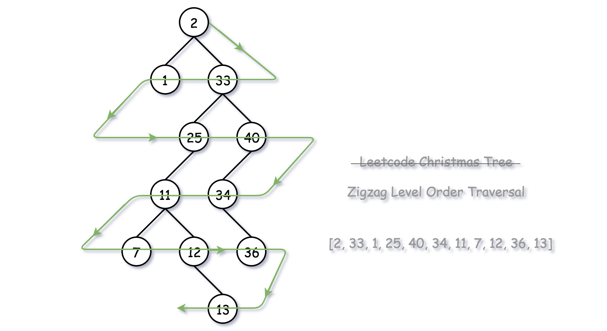
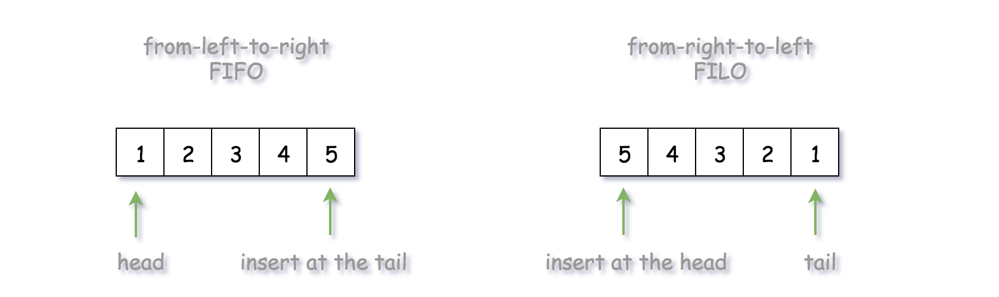
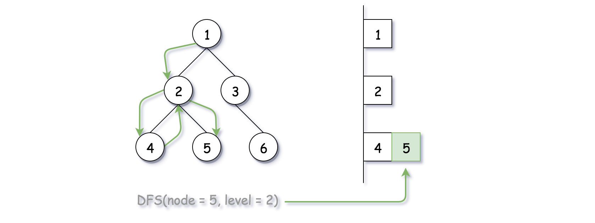

# 103. Binary Tree Zigzag Level Order Traversal — Detailed Approaches

## Approach 1: BFS (Breadth-First Search)

### Intuition



The most intuitive way to solve the problem is using **Breadth-First Search (BFS)**, where the tree is traversed **level by level**.

In a normal BFS traversal:

```
Level order = Left → Right
```

However, this problem requires:

```
Level 1 → Left → Right
Level 2 → Right → Left
Level 3 → Left → Right
...
```

So we modify the BFS traversal to support **zigzag ordering**.

The key idea is to use a **deque (double-ended queue)** to store values of each level.

Using a deque allows:

```
FIFO  (append to tail) → normal order
FILO  (insert at head) → reversed order
```



Thus:

- Left → Right level → addLast()
- Right → Left level → addFirst()

---

## Algorithm

1. Use a queue to perform BFS traversal.
2. Insert a **delimiter (null)** to mark the end of each level.
3. Maintain a boolean flag:

```
is_order_left
```

to determine insertion direction.

4. For each node:
   - Add children to the queue
   - Insert node value to either head or tail of the deque
5. When delimiter appears:
   - Finish the current level
   - Toggle zigzag direction

---

## Java Implementation

```java
class Solution {
    public List<List<Integer>> zigzagLevelOrder(TreeNode root) {

        if (root == null) {
            return new ArrayList<List<Integer>>();
        }

        List<List<Integer>> results = new ArrayList<>();

        LinkedList<TreeNode> node_queue = new LinkedList<>();
        node_queue.addLast(root);
        node_queue.addLast(null);

        LinkedList<Integer> level_list = new LinkedList<>();
        boolean is_order_left = true;

        while (node_queue.size() > 0) {

            TreeNode curr_node = node_queue.pollFirst();

            if (curr_node != null) {

                if (is_order_left)
                    level_list.addLast(curr_node.val);
                else
                    level_list.addFirst(curr_node.val);

                if (curr_node.left != null)
                    node_queue.addLast(curr_node.left);

                if (curr_node.right != null)
                    node_queue.addLast(curr_node.right);

            } else {

                results.add(level_list);
                level_list = new LinkedList<>();

                if (node_queue.size() > 0)
                    node_queue.addLast(null);

                is_order_left = !is_order_left;
            }
        }

        return results;
    }
}
```

---

## Alternative BFS Idea

Another simple method:

1. Perform normal BFS (Left → Right)
2. Reverse the order of nodes for every alternate level.

This also produces the zigzag traversal.

---

## Complexity Analysis

### Time Complexity

```
O(N)
```

Each node is visited exactly once.

Deque insertions are constant time.

### Space Complexity

```
O(N)
```

The queue stores nodes of at most **two levels at any time**.

In the worst case (complete binary tree), the largest level contains:

```
N / 2 nodes
```

Thus total queue size is approximately:

```
2 × (N/2) = N
```

---

# Approach 2: DFS (Depth-First Search)

### Intuition



Although BFS naturally processes trees level-by-level, we can also generate the same result using **DFS traversal**.

The key trick:

Maintain a **global result list indexed by level**.

```
results[level] → contains nodes of that level
```

During DFS traversal we:

1. Track the current level.
2. Insert node values into the correct level list.
3. Alternate insertion direction based on level.

---

## Algorithm

Define a recursive function:

```
DFS(node, level)
```

Steps:

1. If visiting this level for the first time:
   - create a new list
2. Otherwise:
   - append node value to the correct side
3. Recursively visit children with level+1

---

## Java Implementation

```java
class Solution {

    protected void DFS(TreeNode node, int level, List<List<Integer>> results) {

        if (level >= results.size()) {
            LinkedList<Integer> newLevel = new LinkedList<>();
            newLevel.add(node.val);
            results.add(newLevel);
        }
        else {
            if (level % 2 == 0)
                results.get(level).add(node.val);
            else
                results.get(level).add(0, node.val);
        }

        if (node.left != null)
            DFS(node.left, level + 1, results);

        if (node.right != null)
            DFS(node.right, level + 1, results);
    }

    public List<List<Integer>> zigzagLevelOrder(TreeNode root) {

        if (root == null) {
            return new ArrayList<>();
        }

        List<List<Integer>> results = new ArrayList<>();
        DFS(root, 0, results);

        return results;
    }
}
```

---

## Complexity Analysis

### Time Complexity

```
O(N)
```

Every node is visited once.

### Space Complexity

```
O(N)
```

DFS recursion stack consumes:

```
O(H)
```

Where:

```
H = height of tree
```

Worst case (skewed tree):

```
H = N
```

Balanced tree:

```
H = log N
```

---

# Comparison of Approaches

| Approach | Technique                | Time | Space | Notes               |
| -------- | ------------------------ | ---- | ----- | ------------------- |
| BFS      | Level order traversal    | O(N) | O(N)  | Most intuitive      |
| DFS      | Recursive level tracking | O(N) | O(H)  | Elegant alternative |

---

# Recommended Approach

Most implementations use:

```
BFS + Deque
```

because it naturally matches **level order traversal** and requires minimal logic to alternate direction.
