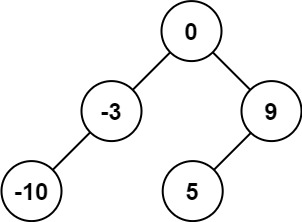

# 108. Convert Sorted Array to Binary Search Tree

## Problem Description

Given an integer array `nums` where the elements are **sorted in ascending order**, convert it into a **height-balanced binary search tree (BST)**.

A **height-balanced BST** is defined as a binary tree in which the depth of the two subtrees of every node never differs by more than one.

---

## Example 1



### Input

```
nums = [-10,-3,0,5,9]
```

### Output

```
[0,-3,9,-10,null,5]
```

### Explanation

Another valid answer is:

```
[0,-10,5,null,-3,null,9]
```

Both represent valid **height-balanced BSTs**.

---

## Example 2


### Input

```
nums = [1,3]
```

### Output

```
[3,1]
```

### Explanation

The following trees are also valid:

```
[1,null,3]
[3,1]
```

Both satisfy the **height-balanced BST property**.

---

## Constraints

```
1 <= nums.length <= 10^4
-10^4 <= nums[i] <= 10^4
nums is sorted in strictly increasing order
```
