# 114. Flatten Binary Tree to Linked List — Approaches

## Approach 1: Recursion

### Intuition

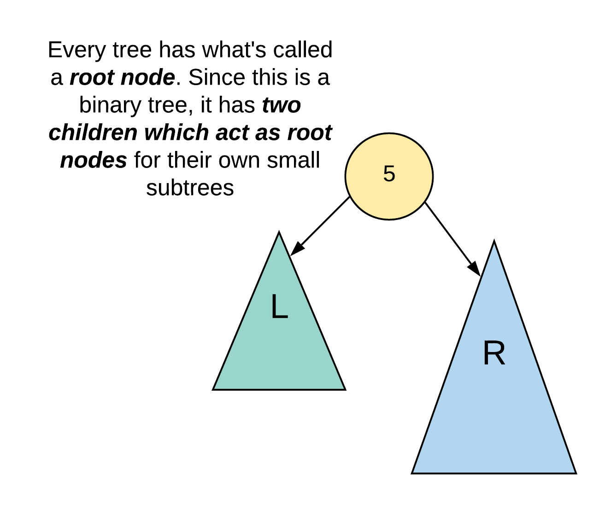

A common strategy for tree modification problems is **recursion**. A tree is inherently a recursive structure: every node can be viewed as the root of a smaller tree with its own left and right subtrees.

The core idea:

1. Assume recursion has already **flattened the left subtree**.
2. Assume recursion has already **flattened the right subtree**.
3. Rewire the pointers so the current node forms a **right-skewed structure**.

After flattening both subtrees:

- The left subtree becomes a linked list.
- The right subtree becomes a linked list.

To connect them:

1. Attach the **tail of the left subtree** to the original right subtree.
2. Move the left subtree to the right side of the current node.
3. Set the left pointer to `null`.

This preserves **preorder traversal order**.

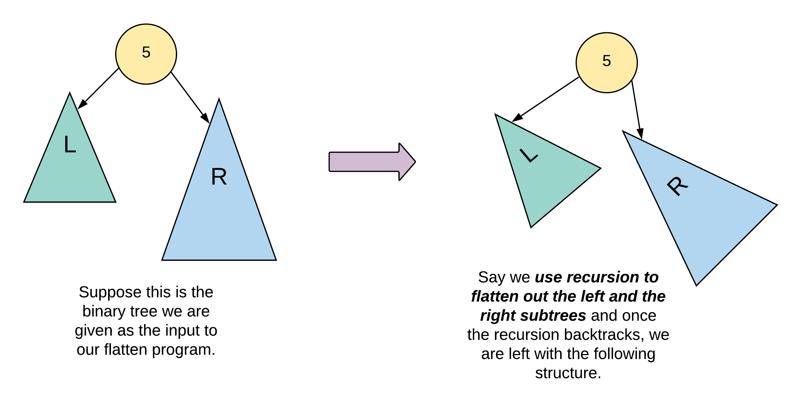

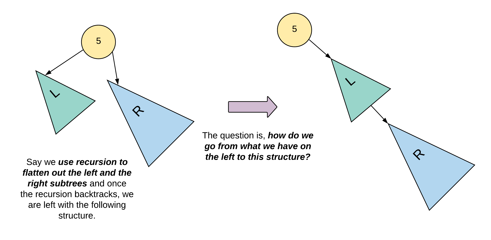

### Important Nodes

- `node` → current node
- `leftChild` → node.left
- `rightChild` → node.right
- `leftTail` → tail node of flattened left subtree
- `rightTail` → tail node of flattened right subtree

The recursive function returns the **tail of the flattened subtree**.

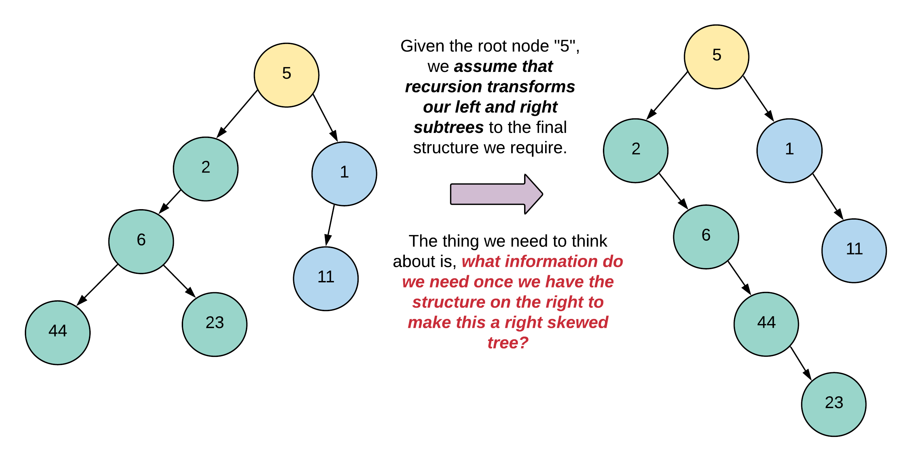

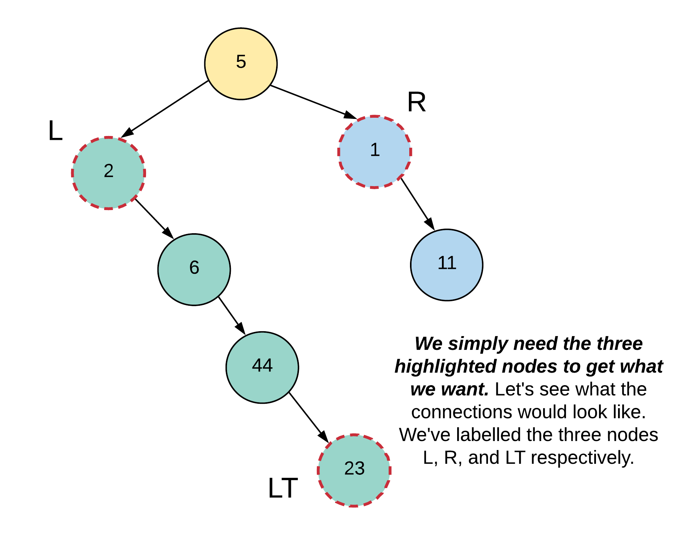

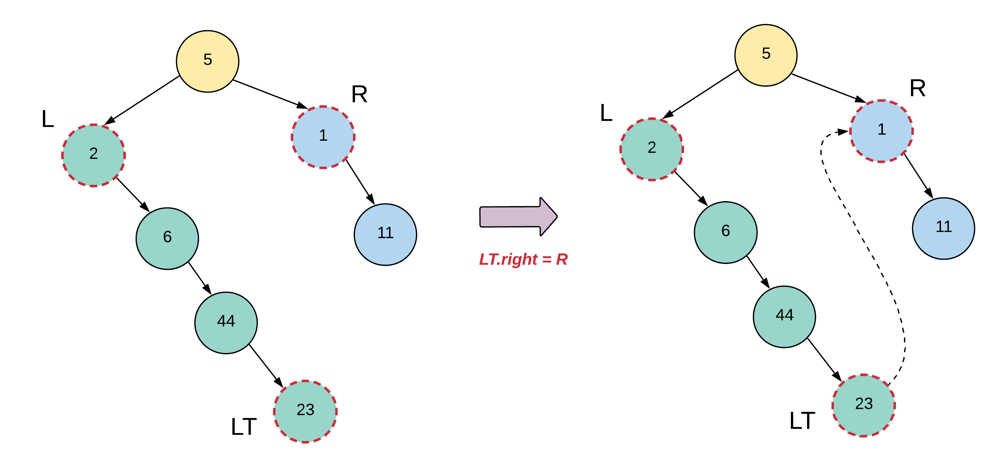

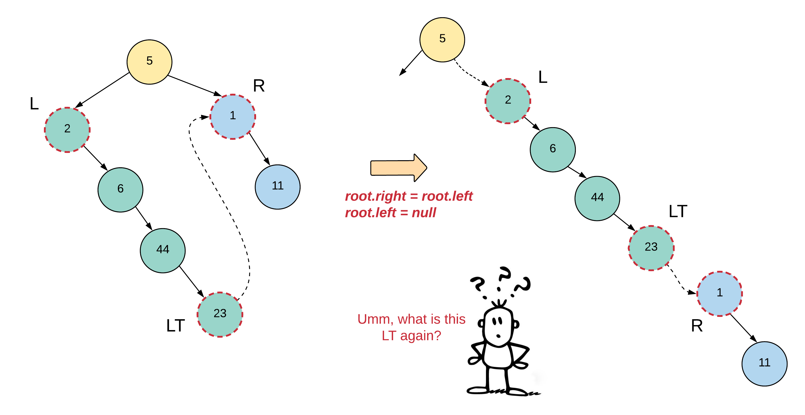

### Algorithm

1. If node is `null`, return `null`.
2. If node is a **leaf**, return the node.
3. Recursively flatten left subtree → `leftTail`
4. Recursively flatten right subtree → `rightTail`
5. If left subtree exists:
   - `leftTail.right = node.right`
   - `node.right = node.left`
   - `node.left = null`
6. Return the **rightmost tail**.

### Code

```java
class Solution {
    private TreeNode flattenTree(TreeNode node) {
        if (node == null) {
            return null;
        }

        if (node.left == null && node.right == null) {
            return node;
        }

        TreeNode leftTail = flattenTree(node.left);
        TreeNode rightTail = flattenTree(node.right);

        if (leftTail != null) {
            leftTail.right = node.right;
            node.right = node.left;
            node.left = null;
        }

        return rightTail == null ? leftTail : rightTail;
    }

    public void flatten(TreeNode root) {
        flattenTree(root);
    }
}
```

### Complexity

Time Complexity: **O(N)**
Each node is processed once.

Space Complexity: **O(N)**
Recursion stack may grow to N in worst-case (skewed tree).

---

# Approach 2: Iterative Solution Using Stack

### Intuition

Instead of relying on the **system recursion stack**, we simulate recursion using our own **explicit stack**.

This prevents stack overflow in extremely deep trees.

We simulate recursion states:

- `START` → Node processing begins.
- `END` → Node left subtree processed; ready for rewiring.

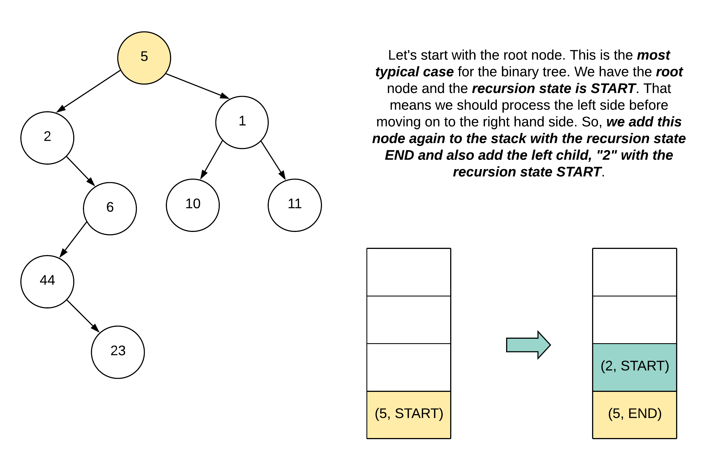

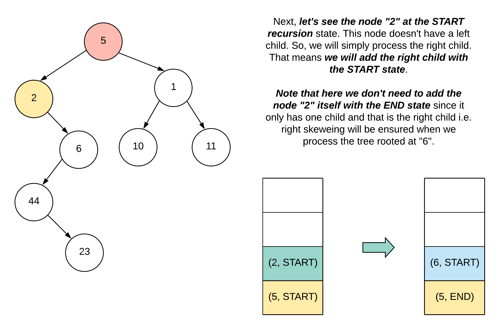

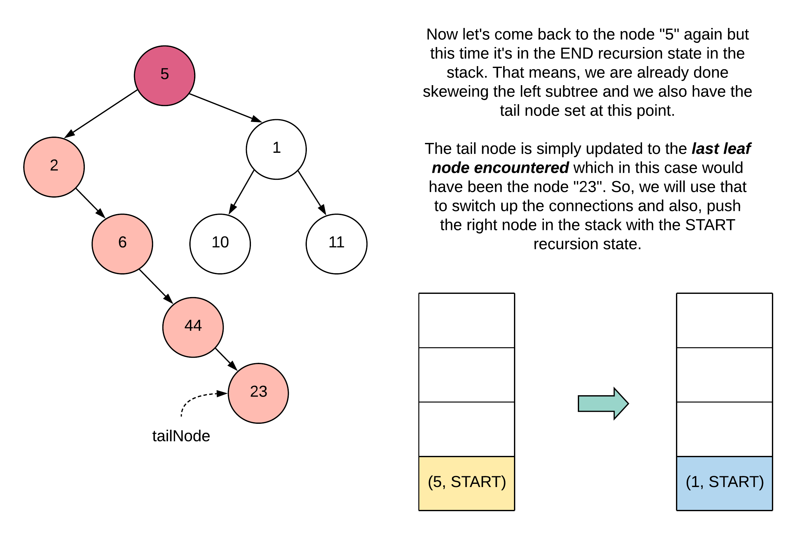

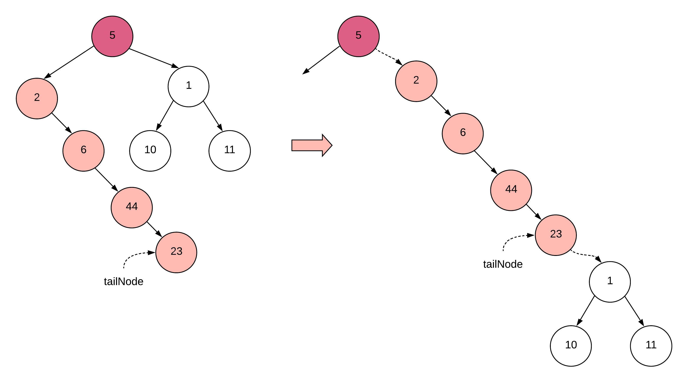

### Algorithm

1. Push `(root, START)` onto stack.
2. Maintain `tailNode` for flattened subtree.
3. Pop node from stack:

#### Case 1: Leaf Node

Set `tailNode = node`.

#### Case 2: START State

- If left child exists:
  - Push `(node, END)`
  - Push `(node.left, START)`
- Else if right child exists:
  - Push `(node.right, START)`

#### Case 3: END State

- Rewire connections using `tailNode`
- Push right subtree for processing.

### Code

```java
class Pair<K, V> {
    K key;
    V value;

    Pair(K a, V b) {
        key = a;
        value = b;
    }

    public K getKey() {
        return key;
    }

    public V getValue() {
        return value;
    }
}

class Solution {
    public void flatten(TreeNode root) {
        if (root == null) return;

        int START = 1, END = 2;

        TreeNode tailNode = null;
        Stack<Pair<TreeNode, Integer>> stack = new Stack<>();

        stack.push(new Pair<>(root, START));

        while (!stack.isEmpty()) {
            Pair<TreeNode, Integer> nodeData = stack.pop();
            TreeNode currentNode = nodeData.getKey();
            int recursionState = nodeData.getValue();

            if (currentNode.left == null && currentNode.right == null) {
                tailNode = currentNode;
                continue;
            }

            if (recursionState == START) {
                if (currentNode.left != null) {
                    stack.push(new Pair<>(currentNode, END));
                    stack.push(new Pair<>(currentNode.left, START));
                } else if (currentNode.right != null) {
                    stack.push(new Pair<>(currentNode.right, START));
                }
            } else {
                TreeNode rightNode = currentNode.right;

                if (tailNode != null) {
                    tailNode.right = currentNode.right;
                    currentNode.right = currentNode.left;
                    currentNode.left = null;
                    rightNode = tailNode.right;
                }

                if (rightNode != null) {
                    stack.push(new Pair<>(rightNode, START));
                }
            }
        }
    }
}
```

### Complexity

Time Complexity: **O(N)**

Space Complexity: **O(N)**
Stack may hold up to N nodes.

---

# Approach 3: O(1) Iterative Solution (Morris-style)

### Intuition

This approach removes both:

- recursion stack
- explicit stack

It is inspired by **Morris Traversal**.

Instead of waiting until recursion finishes processing the left subtree, we **greedily restructure the tree while traversing**.

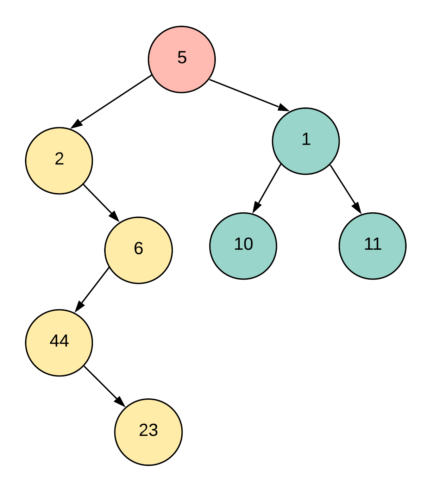

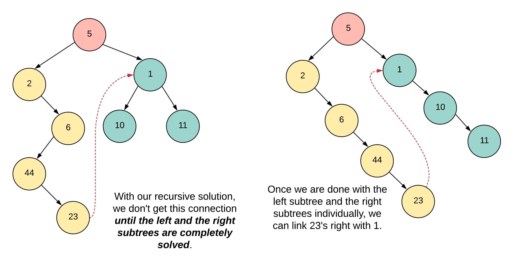

For each node:

1. If it has a left subtree
2. Find the **rightmost node of that left subtree**
3. Attach the original right subtree to that node
4. Move left subtree to the right
5. Nullify the left pointer

This progressively converts the tree into a **right-skewed list**.

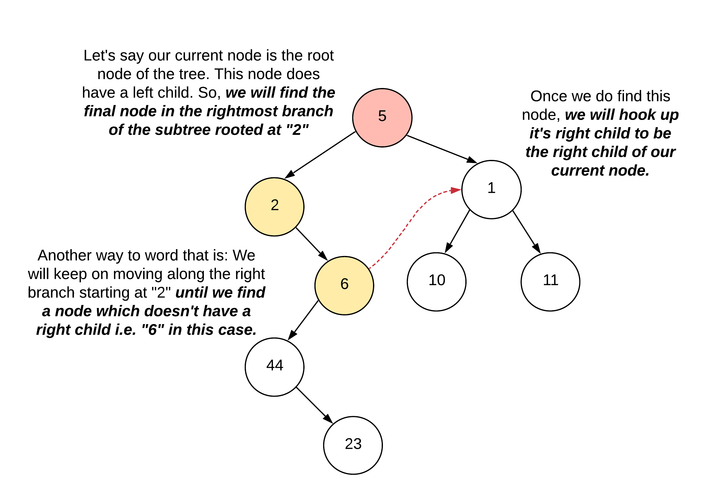

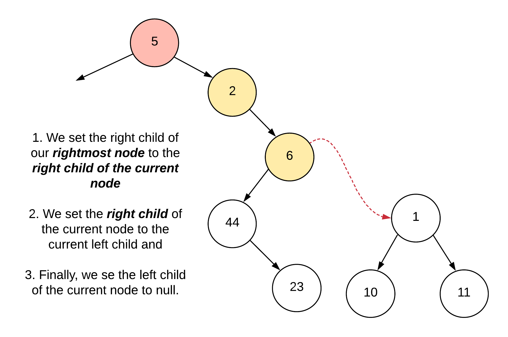

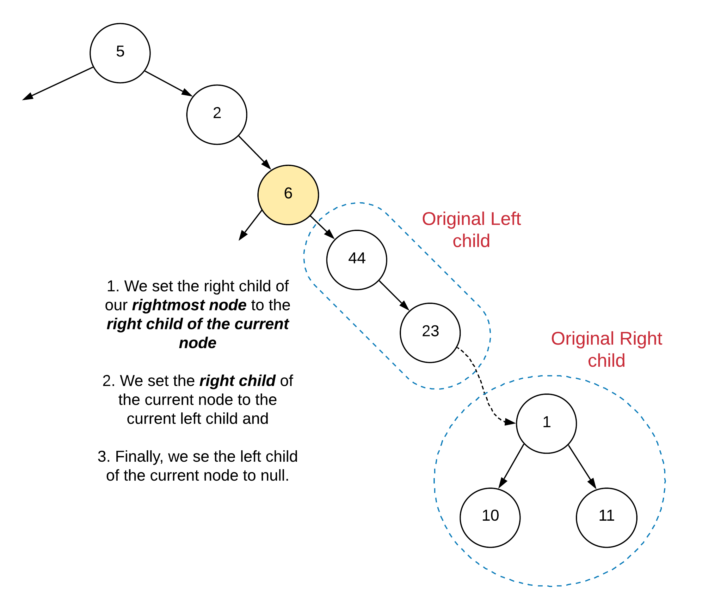

### Algorithm

For each node:

1. If `node.left == null`
   move to `node.right`

2. Otherwise

```
rightmost = node.left
while rightmost.right != null:
    rightmost = rightmost.right
```

Then rewire:

```
rightmost.right = node.right
node.right = node.left
node.left = null
```

Continue traversal.

### Code

```java
class Solution {
    public void flatten(TreeNode root) {
        if (root == null) return;

        TreeNode node = root;

        while (node != null) {

            if (node.left != null) {

                TreeNode rightmost = node.left;

                while (rightmost.right != null) {
                    rightmost = rightmost.right;
                }

                rightmost.right = node.right;
                node.right = node.left;
                node.left = null;
            }

            node = node.right;
        }
    }
}
```

### Complexity

Time Complexity: **O(N)**
Each node visited at most twice.

Space Complexity: **O(1)**

No extra memory used.
