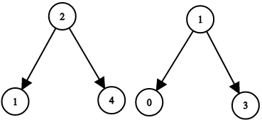
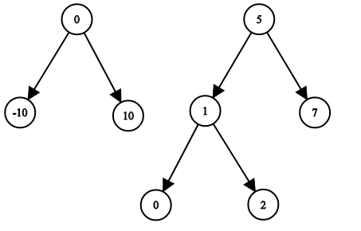

# 1214. Two Sum BSTs

## Problem

Given the roots of two **Binary Search Trees** `root1` and `root2`, determine whether there exists:

- a node from the **first tree**
- a node from the **second tree**

such that their values add up to a given **target**.

Return **true** if such a pair exists, otherwise return **false**.

---

## Example 1



Input

```
root1 = [2,1,4]
root2 = [1,0,3]
target = 5
```

Output

```
true
```

Explanation

```
2 (from tree1) + 3 (from tree2) = 5
```

---

## Example 2



Input

```
root1 = [0,-10,10]
root2 = [5,1,7,0,2]
target = 18
```

Output

```
false
```

Explanation

No pair of nodes from the two trees adds up to `18`.

---

## Constraints

```
1 ≤ number of nodes in each tree ≤ 5000
-10^9 ≤ Node.val ≤ 10^9
-10^9 ≤ target ≤ 10^9
```

Additional guarantees:

- Both input trees are **valid Binary Search Trees (BSTs)**.
