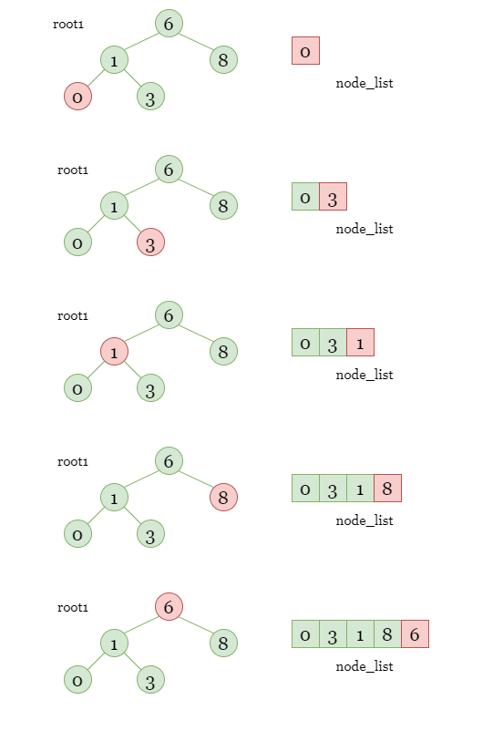
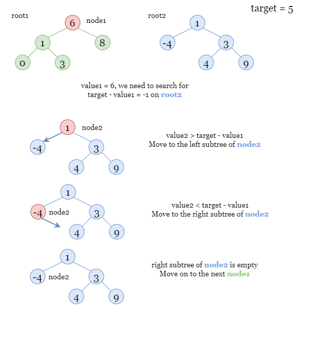
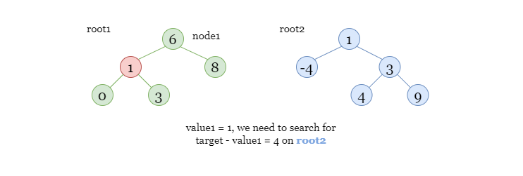
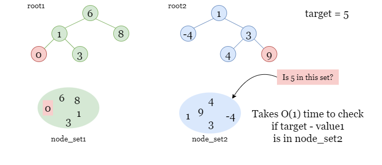
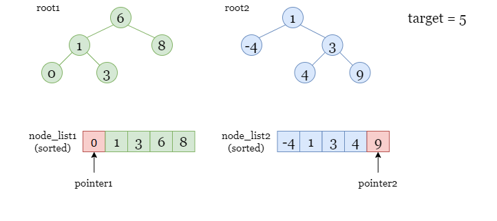
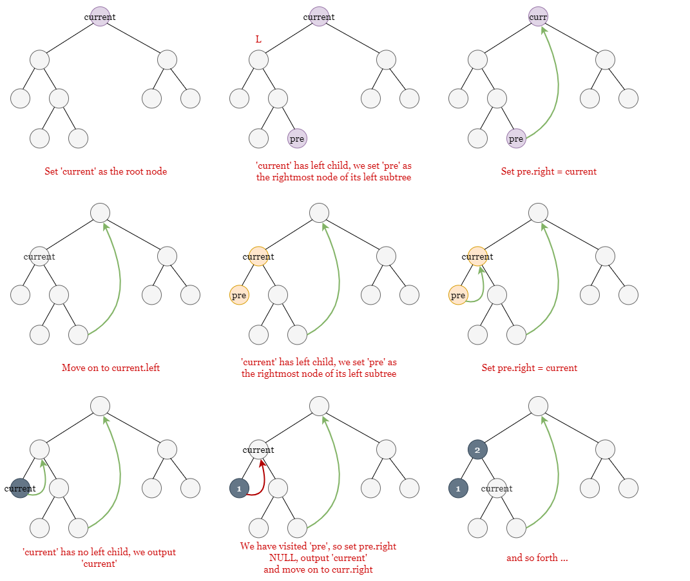

# Two Sum BSTs – Detailed Approaches

This document explains multiple approaches for solving the **Two Sum BSTs** problem.

Given two Binary Search Trees (BSTs), determine whether there exists a node from each tree whose values sum to a given target.

Let:

- `m` = number of nodes in tree1
- `n` = number of nodes in tree2



---

# Approach 1: Brute Force

## Intuition

The simplest idea is to collect all node values from both trees and try **every possible pair**.

Steps:

1. Traverse both trees using DFS.
2. Store values in two lists.
3. Use nested loops to test all combinations.

## Algorithm

1. Create two lists `node_list1` and `node_list2`.
2. Perform DFS on `root1` → fill `node_list1`.
3. Perform DFS on `root2` → fill `node_list2`.
4. For each value in list1:
   - For each value in list2:
     - If `value1 + value2 == target` → return true.
5. If no pair found → return false.

## Complexity

Time:

```
O(m * n)
```

Space:

```
O(m + n)
```

---

# Approach 2: Binary Search

## Intuition



BST property:

```
left subtree < node < right subtree
```

Instead of checking all pairs, we:

1. Traverse tree1.
2. For each value `v`, search `target - v` in tree2 using BST search.



## Algorithm

1. DFS through `root1`.
2. For each node value `v`:
   - search for `target - v` in `root2` using binary search.
3. If found → return true.

## Complexity

Time:

```
O(m log n)
```

(assuming balanced BST)

Space:

```
O(log m + log n)
```

---

# Approach 3: Hash Set

## Intuition



Hash sets allow **O(1) lookup**.

Steps:

1. Store all values from tree2 in a hash set.
2. Traverse tree1.
3. For each value `v`, check if `target - v` exists in set.

## Algorithm

1. Create sets `set1`, `set2`.
2. DFS tree1 → fill set1.
3. DFS tree2 → fill set2.
4. For each value `v` in set1:
   - if `target - v` in set2 → return true.

## Complexity

Time:

```
O(m + n)
```

Space:

```
O(m + n)
```

---

# Approach 4: Two Pointers

## Intuition



Inorder traversal of a BST produces a **sorted list**.

So:

1. Convert both trees into sorted lists.
2. Use the classic **two-pointer technique**.

Pointer setup:

```
pointer1 -> start of list1 (smallest)
pointer2 -> end of list2 (largest)
```

Adjust pointers depending on sum.

## Algorithm

1. Inorder traverse tree1 → list1.
2. Inorder traverse tree2 → list2.
3. Set `i = 0`, `j = list2.length - 1`.
4. While `i < len(list1)` and `j >= 0`:
   - if `list1[i] + list2[j] == target` → true
   - if sum < target → `i++`
   - if sum > target → `j--`
5. Return false.



## Complexity

Time:

```
O(m + n)
```

Space:

```
O(m + n)
```

---

# Approach 5: Morris Traversal (Advanced)

## Intuition

Standard inorder traversal requires:

```
O(h) stack space
```

Morris Traversal eliminates this by temporarily modifying the tree structure.

Key idea:

The predecessor node of a subtree can be used to create temporary links that allow returning to parent nodes without recursion or stack.

Thus traversal becomes:

```
O(1) space
```

### Strategy

Use two iterators:

- Iterator1 → inorder traversal (ascending)
- Iterator2 → reverse inorder traversal (descending)

Then apply **two-pointer logic**:

```
if sum == target → return true
if sum < target → move iterator1
if sum > target → move iterator2
```

## Complexity

Time:

```
O(m + n)
```

Each edge visited at most twice.

Space:

```
O(1)
```

No stack or recursion used.
