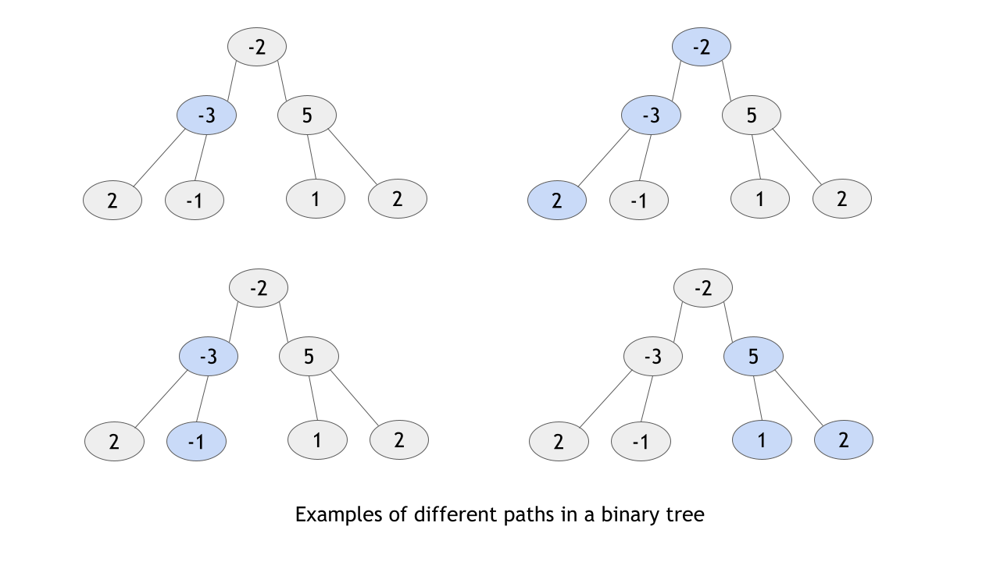
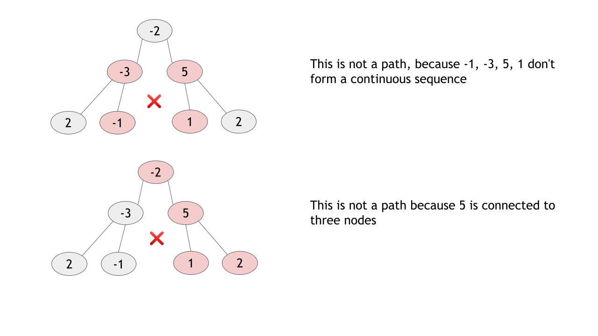
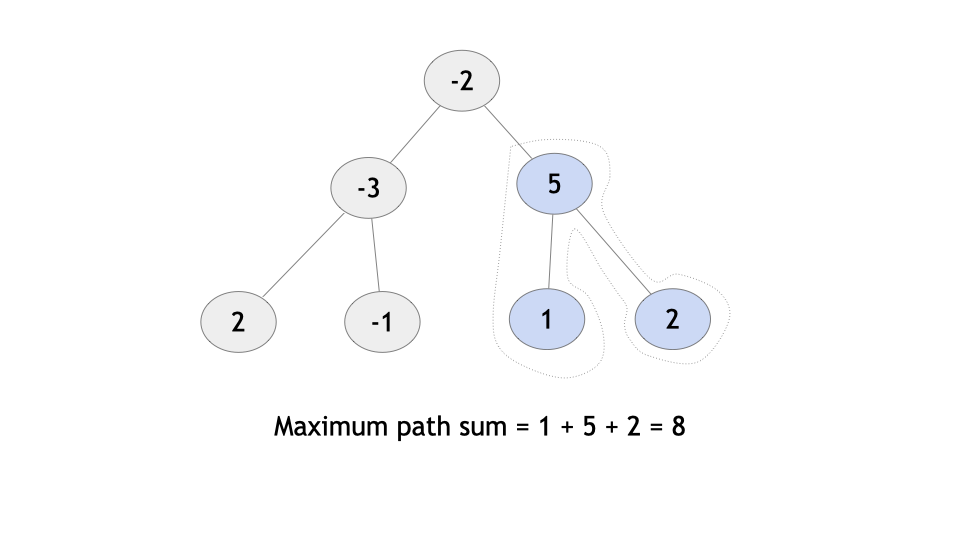

# Binary Tree Maximum Path Sum — Solution Explanation

## Overview

In this problem, we are given the **root of a binary tree** and must compute the **maximum path sum**.

### What is a Path?

A **path** is a continuous sequence of nodes connected by edges.

Rules:

- A path must contain **at least one node**.
- Each node can appear **only once** in a path.
- A node can connect to **at most two nodes in the path** (except start/end).
- The path **does not need to pass through the root**.

Nodes may have **negative, zero, or positive values**, meaning path sums may also be negative or positive.

Since every pair of nodes can form a path through their connecting nodes, the number of possible paths can be very large. Our goal is to find the **maximum possible path sum**.

To explore all paths efficiently, we use **Depth‑First Search (DFS)** rather than BFS.





---

# Approach: Postorder DFS

## Intuition

A brute‑force approach would generate all possible paths and compute their sums.

This would take:

```
O(n²)
```

because there could be many node pairs forming paths.

Instead, we can compute the maximum path **while traversing the tree once**.

Consider the case where the **maximum path passes through a node**.

There are four possibilities:

1. The path goes from the node down into the **left subtree**.
2. The path goes from the node down into the **right subtree**.
3. The path goes **through the node**, including both left and right subtrees.
4. The path includes **only the node itself**.

Because subtree contributions can be negative, we **ignore negative gains**.

Thus we only add subtree contributions if they increase the sum.

This means:

```
left_gain = max(gain_from_left_subtree, 0)
right_gain = max(gain_from_right_subtree, 0)
```

We process children **before their parent**, which corresponds to **postorder traversal**.



---

# Recursive Strategy

We define a function:

```
gain_from_subtree(node)
```

This function has **two responsibilities**:

### 1. Return the maximum gain from this subtree

The gain represents the maximum sum we can contribute **upward to the parent**.

Important rule:

A valid path **cannot fork upward**.
If we include both children, the node would connect to:

- parent
- left child
- right child

which creates **three connections**, violating path rules.

Therefore, the upward gain includes **only one child**.

```
gain_from_subtree = node.val + max(left_gain, right_gain)
```

---

### 2. Update the global maximum path sum

While the gain returned upward includes only one child, the **maximum path may include both children**.

Thus we evaluate:

```
max_path_sum = left_gain + right_gain + node.val
```

This represents a path:

```
left subtree → node → right subtree
```

We update the global maximum if this value is larger.

---

# Algorithm

### Main Function

1. Initialize global variable:

```
max_sum = -∞
```

2. Call:

```
gain_from_subtree(root)
```

3. Return `max_sum`.

---

### Recursive Function

```
gain_from_subtree(node)
```

Steps:

1. If node is `null`, return `0`.
2. Recursively compute gains from left and right children.
3. Ignore negative gains:

```
left_gain = max(gain_from_left, 0)
right_gain = max(gain_from_right, 0)
```

4. Update global maximum:

```
max_sum = max(max_sum, left_gain + right_gain + node.val)
```

5. Return gain for parent:

```
node.val + max(left_gain, right_gain)
```

---

# Base Case Explanation

When recursion reaches a **null child**, there is no subtree contribution.

Thus:

```
gain = 0
```

This cleanly handles nodes without children.

---

# Implementation (Java)

```java
class Solution {

    private int maxSum;

    public int maxPathSum(TreeNode root) {
        maxSum = Integer.MIN_VALUE;
        gainFromSubtree(root);
        return maxSum;
    }

    private int gainFromSubtree(TreeNode root) {

        if (root == null) {
            return 0;
        }

        int gainFromLeft = Math.max(gainFromSubtree(root.left), 0);

        int gainFromRight = Math.max(gainFromSubtree(root.right), 0);

        maxSum = Math.max(maxSum, gainFromLeft + gainFromRight + root.val);

        return Math.max(gainFromLeft + root.val, gainFromRight + root.val);
    }
}
```

---

# Complexity Analysis

Let **n** be the number of nodes.

### Time Complexity

```
O(n)
```

Each node is visited **exactly once**.

During each visit we perform constant work.

---

### Space Complexity

```
O(n)
```

The recursion stack depth equals the **height of the tree**.

Worst case:

```
skewed tree → height = n
```

Thus the space complexity is **O(n)**.
