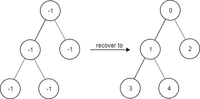
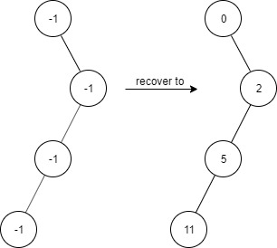

# 1261. Find Elements in a Contaminated Binary Tree

## Problem

You are given a binary tree that originally followed these rules:

- `root.val == 0`
- For any node with value `x`:
  - If `node.left != null` → `node.left.val = 2 * x + 1`
  - If `node.right != null` → `node.right.val = 2 * x + 2`

However, the tree has been **contaminated**, meaning:

```
All node values have been changed to -1
```

Your task is to **recover the tree** and support efficient lookup queries.

---

## Class Design

Implement the **FindElements** class.

### Constructor

```
FindElements(TreeNode* root)
```

- Initializes the object using the contaminated tree.
- Recovers the tree values based on the rules.

### Method

```
bool find(int target)
```

- Returns **true** if the target value exists in the recovered tree.
- Otherwise returns **false**.

---

## Example 1

### Input

```
["FindElements","find","find"]
[[[-1,null,-1]],[1],[2]]
```

### Output

```
[null,false,true]
```

### Explanation

```
FindElements findElements = new FindElements([-1,null,-1]);

findElements.find(1); // false
findElements.find(2); // true
```

---

## Example 2



### Input

```
["FindElements","find","find","find"]
[[[-1,-1,-1,-1,-1]],[1],[3],[5]]
```

### Output

```
[null,true,true,false]
```

### Explanation

```
FindElements findElements = new FindElements([-1,-1,-1,-1,-1]);

findElements.find(1); // true
findElements.find(3); // true
findElements.find(5); // false
```

---

## Example 3



### Input

```
["FindElements","find","find","find","find"]
[[[-1,null,-1,-1,null,-1]],[2],[3],[4],[5]]
```

### Output

```
[null,true,false,false,true]
```

### Explanation

```
FindElements findElements = new FindElements([-1,null,-1,-1,null,-1]);

findElements.find(2); // true
findElements.find(3); // false
findElements.find(4); // false
findElements.find(5); // true
```

---

## Constraints

```
TreeNode.val == -1
Tree height ≤ 20
1 ≤ number of nodes ≤ 10^4
1 ≤ number of find() calls ≤ 10^4
0 ≤ target ≤ 10^6
```

---

## Key Insight

Once the tree is recovered:

- Root → `0`
- Left child → `2x + 1`
- Right child → `2x + 2`

This structure allows efficient recovery and lookup.
