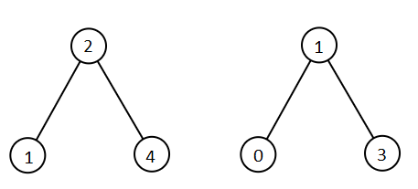
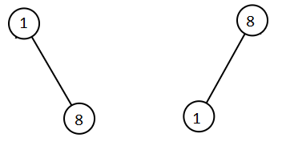

# 1305. All Elements in Two Binary Search Trees

## Problem

You are given two **Binary Search Trees (BSTs)**:

- `root1`
- `root2`

Your task is to **return a list containing all integers from both trees sorted in ascending order**.

---

## Example 1



### Input

```
root1 = [2,1,4]
root2 = [1,0,3]
```

### Output

```
[0,1,1,2,3,4]
```

---

## Example 2



### Input

```
root1 = [1,null,8]
root2 = [8,1]
```

### Output

```
[1,1,8,8]
```

---

## Constraints

```
0 ≤ number of nodes in each tree ≤ 5000
-10^5 ≤ Node.val ≤ 10^5
```

---

## Notes

- Both input structures are **Binary Search Trees**, meaning:

```
Left subtree values  <  Node value  <  Right subtree values
```

- An **inorder traversal** of a BST produces values in **sorted order**.
